# OpenCode Integration

This toolkit can make a host-installed [OpenCode](https://opencode.ai) reuse the
**entire Claude Code ecosystem** already present on the machine — every plugin's
Skills, every MCP server definition, and the user-scope `CLAUDE.md` — without
re-installing or duplicating anything.

It is driven by one command:

```bash
claude-opencode-sync          # after install.sh puts it on PATH
# or, from a checkout:
bash scripts/claude-opencode-sync.sh
```

## Why this is not "just copy the plugins"

Claude Code **plugins** are bundles of hooks + JavaScript that only the Claude
Code runtime can execute — OpenCode cannot run them. But the *valuable,
portable contents* of those plugins are open standards that OpenCode supports
natively:

| Claude Code artifact            | OpenCode config key | Portable? |
|---------------------------------|---------------------|-----------|
| Skills (`SKILL.md` folders)     | `skills.paths`      | ✅ directly |
| MCP servers (`.mcp.json`)       | `mcp{}`             | ✅ translated |
| User memory (`CLAUDE.md`)       | `instructions[]`    | ✅ directly |
| Plugin hooks / JS               | —                   | ❌ runtime-specific |
| Agents / commands (frontmatter) | `agent` / `command` | ⚠️ different schema (not auto-ported) |

So the sync exposes Skills, MCP servers, and instructions — the parts that map
cleanly — and leaves OpenCode's own config (providers, existing MCP servers)
untouched.

## Architecture




## How the sync works


1. **Scan** every plugin under `CLAUDE_PLUGINS_DIR`
   (default `~/.claude/plugins/cache/claude-plugins-official`), picking the
   newest version directory of each.
2. **Collect** each plugin's `skills/` folder (if it holds at least one
   `SKILL.md`) and parse its `.mcp.json`. Two on-disk shapes are handled: the
   wrapped form `{"mcpServers": {…}}` and the bare form `{name: {…}}`.
3. **Translate** each MCP server to OpenCode's schema — `type: local` (with
   `command[]` + `environment{}`) or `type: remote` (with `url` + `headers`).
   `${CLAUDE_PLUGIN_ROOT}` is expanded to the plugin's real install path.
4. **Dedup** servers with identical transport identity (e.g. the AWS knowledge
   server shipped by four plugins) and **rename** genuine name collisions by
   qualifying with the plugin name.
5. **Enable policy** (below) decides which servers start automatically.
6. **Merge** into the existing `opencode.json` — additive only. Your providers
   and any pre-existing MCP keys are never clobbered; skill paths and
   instructions are unioned.
7. **Backup** the prior config to `opencode.json.bak.<timestamp>` and write
   atomically.

## Enable policy

OpenCode connects to every *enabled* MCP server at startup, so enabling 100+
servers (most needing OAuth or secrets) would cripple startup. The sync
therefore configures **all** servers but enables only a safe, verified subset
by default; everything else is written `enabled: false`, ready to flip on once
you supply credentials.




The default allowlist enables only zero-friction servers: public documentation
servers needing no auth (`context7`, `microsoft-learn`, `cloudflare-docs`,
`mintlify`, `qt-docs`, `awsknowledge`, `appwrite-docs`, `mapbox-docs`) and a
few local servers whose runtime is present and which need no secret
(`awsiac`, `awspricing`, `shopify-mcp`).

## Usage

```bash
# Default: sync skills + MCP + instructions, enable the safe allowlist.
claude-opencode-sync

# Preview the resulting config without writing anything.
claude-opencode-sync --dry-run --stats

# Power-user knobs:
claude-opencode-sync --enable-all-local-runnable   # every runnable local MCP
claude-opencode-sync --enable-all                  # everything (heavy startup)
```

Environment knobs:

| Variable                    | Default                                              |
|-----------------------------|------------------------------------------------------|
| `OPENCODE_CONFIG`           | `~/.config/opencode/opencode.json`                   |
| `CLAUDE_PLUGINS_DIR`        | `~/.claude/plugins/cache/claude-plugins-official`    |
| `SHARED_DIR`                | `~/.claude-shared` (source of `CLAUDE.md`)           |
| `OPENCODE_ALLOWLIST`        | built-in curated list (`plugin/server` per line)     |
| `OPENCODE_EXTRA_SKILL_DIRS` | extra skill roots (space-separated)                  |

### Enabling more MCP servers later

A server written `enabled: false` is fully configured — just turn it on and
authenticate:

```bash
# Remote OAuth servers (notion, slack, atlassian, linear, …):
opencode mcp auth <name>
# then set "enabled": true for that server in opencode.json (or re-run with a
# wider allowlist), and confirm:
opencode mcp list
```

Local servers needing secrets (e.g. `pinecone`, `resend`) need their env vars
filled into the server's `environment{}` block before enabling.

## Testing & physical proof

Two layers, both reproducible:

```bash
# Hermetic unit/integration suite (fake plugin tree in a temp $HOME):
bash scripts/tests/run-all.sh opencode

# Live end-to-end proof against the real opencode binary + real config:
bash scripts/tests/verify_opencode_live.sh

# Both at once, writing a dated evidence bundle to scripts/tests/proof/:
bash scripts/tests/run-proof.sh
```

`run-proof.sh` writes [`scripts/tests/proof/PROOF.md`](scripts/tests/proof/PROOF.md)
plus raw artifacts: the resolved OpenCode config, the sorted list of every
resolved skill name, and the MCP connection report. These are physical,
inspectable evidence — not just a green checkmark.

## Troubleshooting

- **`opencode debug skill` shows a low number** — it streams a large JSON
  array; count only after it finishes (the live verifier captures the full
  stream before counting).
- **A remote server is `connected` but tools fail** — it likely needs
  `opencode mcp auth <name>`.
- **A local server won't start** — its runtime may be missing. The sync only
  auto-enables locals whose runtime (`npx`, `uvx`, …) it found on the host.
- **Re-running changed nothing** — the sync is idempotent and additive by
  design; use `--enable-all*` flags or edit the allowlist to widen coverage.
