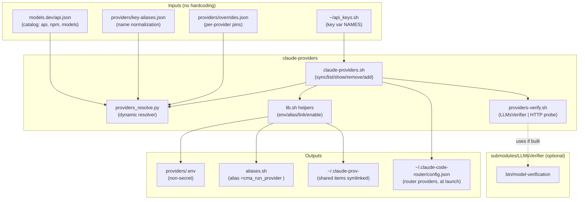
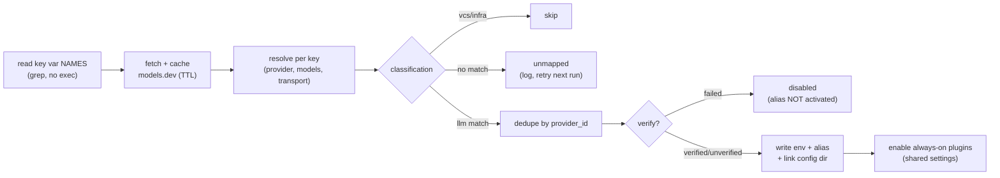
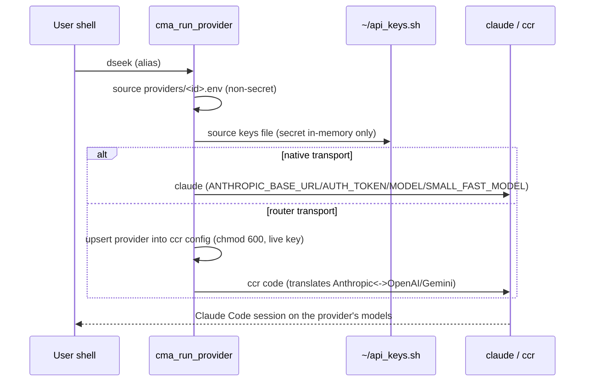

# Provider Aliases — Diagrams

Mermaid sources for the `claude-providers` feature. Render with any Mermaid
tool (e.g. `mmdc`, the GitHub viewer, or the doc export pipeline).

## 1. Component architecture

## 2. `sync` pipeline

## 3. Launch data flow (`cma_run_provider`)

