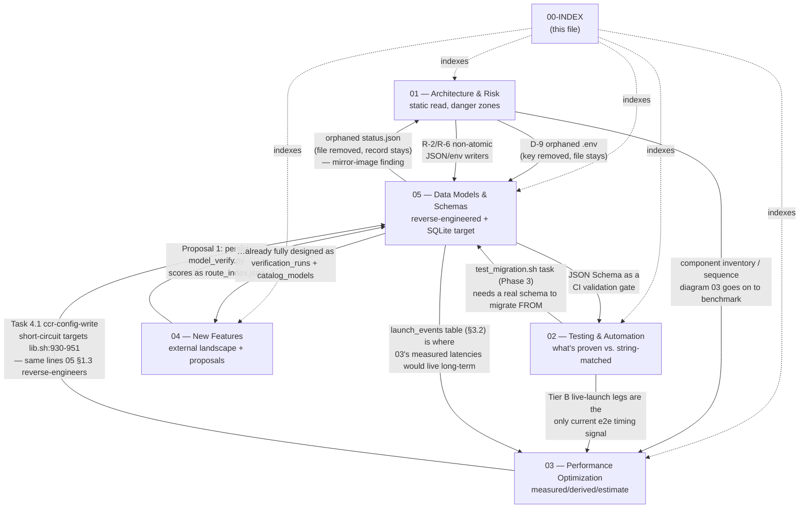

# 00 — Research Index: `docs/research/innovations/`

**What this directory is:** a five-part research programme on `claude_toolkit`'s provider-alias
subsystem (`scripts/lib.sh`, `scripts/claude-providers.sh`, the `providers_*.py` resolvers,
`scripts/proxy/*`, `scripts/tests/*`), commissioned as parallel deep-dives rather than one
monolithic report. Each document was written independently, grounded in the *same* live repo
snapshot (`main` around commit `a64eec1`/`245ed80`, v1.19.0, 2026-07-19) and, where applicable,
this host's real runtime state (`~/.local/share/claude-multi-account/`, `~/.claude-code-router/`).
Every claim in every document is expected to carry a `file:line` citation or be marked
**UNVERIFIED** — that discipline is what lets the documents be read independently and still agree
with each other where their scopes overlap.

**Why five separate documents instead of one:** the four analytical lenses (risk, testing,
features, data) are different enough in method (static code reading vs. live-execution proof vs.
external landscape research vs. schema validation) that combining them would force one document
to constantly context-switch. Splitting them lets each stay rigorous in its own register, at the
cost of some deliberate overlap — which turns out to be useful (see §3, "Where the documents
agree").

---

## 1. Document map

| # | File | Title | Status | Size | One-line scope |
|---|---|---|---|---:|---|
| 00 | `00-INDEX.md` | Research Index | **COMPLETE** (this file) | — | Navigation, cross-references, consolidated roadmap |
| 01 | `01-architecture-and-risk-audit.md` | Architecture and Risk Audit | **COMPLETE** | 62 KB | Component inventory, state model, 15 concurrency/atomicity/security "danger zones" (D-1…D-15), prioritized remediation backlog (R-1…R-15) |
| 02 | `02-testing-automation-strategy.md` | Testing & Automation Strategy | **COMPLETE** | 67 KB | What the 27-file test harness actually proves vs. merely string-matches; a 4-tier test architecture (hermetic/live/constitution/chaos); mutation-testing infra; HelixQA integration design; 6-phase implementation plan |
| 03 | `03-performance-optimization.md` | Performance Optimization: An Evidence-Based Plan | **COMPLETE** | 44 KB | Every number measured with `time`/`strace`/`du`/`find` on this host and explicitly tagged MEASURED/DERIVED/ESTIMATE (never invented): the full hermetic suite's 112.77s wall / 48% CPU breakdown, `cma_merge_claude_json`'s 191-execve/1.54s cost for 26 accounts, `lsof` (0.765s/call) vs `/dev/tcp` (0.0005s/call) for the proxy port-check, `claude-providers list`'s quadratic status-dump pattern, and a 2.9 GB stale-backup finding — followed by a 4-phase, code-ready fix plan with regression tests for each. |
| 04 | `04-new-features-and-technologies.md` | New Features & Technologies | **COMPLETE** | 71 KB | Baseline of what's already half-built (latency scoring, ccr's unused `fallback`/`Router` keys, an already-shared-but-unwritten-to `telemetry` dir); external landscape (Anthropic API surface, ccr, LiteLLM/OpenRouter, OTel GenAI semconv); 12 feature proposals; 4-phase roadmap; Anthropic-parity matrix |
| 05 | `05-data-models-and-schemas.md` | Data Models and Schemas | **COMPLETE** | 81 KB | Reverse-engineered schemas for all 6 provider-state files (real data, `file:line`-cited); 6 validated JSON Schemas (Draft 2020-12); a full SQLite migration-target DDL + ER diagram + example queries (tested against real `sqlite3`); a phased, reversible flat-JSON→SQLite migration plan with a real, executed migration+parity script; UML class + state diagrams; 3 copy-paste templates |

**All five documents are now complete.** (Note on process: `03` landed mid-way through this
index being written, after 01/02/04/05 — earlier drafts of this file carried a PENDING row for it
with an inferred scope, since the policy for an in-progress sibling is to mark it PENDING and
describe its *intended* scope rather than invent content. That inferred scope — launch-path
performance, rsync-unify cost at scale, `.claude.json` merge growth — turned out to match `03`'s
actual content closely, which is recorded here only as a sanity check, not as a substitute for
reading `03` itself.)

---

## 2. How the documents relate

### Where the documents agree (convergent, independently-found evidence)

- **The provider-record reconciliation gap.** `01`'s **D-9** (`.env` files outlive a revoked key —
  live-confirmed via a coexisting `zhipuai`/`zhipuai-coding-plan` pair) and `05`'s **§1.1 finding**
  (`status.json` records outlive a `claude-providers remove`d `.env` file — live-confirmed via 3
  orphaned Kimi OAuth records) are the same root cause approached from opposite ends: neither
  document knew about the other's finding while being written, and both landed on "no code path
  reconciles `api_keys.sh` presence, `.env` files, and `status.json` against each other." `05`'s
  §3 SQLite design (`providers` table + `ON DELETE CASCADE` foreign keys, §3.2) is a structural fix
  for *both* directions at once — see `05`'s own cross-reference note at the end of its §1.1.
- **Non-atomic writes on hot paths.** `01`'s **R-2** (the `.env` writer, `scripts/lib.sh:1306-1359`,
  uses `cat >` not mktemp+mv) and **R-6** (`model_verify.py`'s verification cache, same pattern) are
  exactly the two files `05` reverse-engineers schemas for in §1.2 and §1.7. `05` doesn't re-litigate
  the atomicity risk (that's `01`'s job), but any future writer of these files — including a
  phase-1 dual-write shim per `05`'s migration plan §4.1 — inherits `01`'s R-2/R-6 finding as a
  reason to use the mktemp+mv idiom from day one rather than copying the current non-atomic pattern.
- **Schema-version discipline already exists, narrowly.** `05`'s §1.7 notes `model_verify.py`'s
  `CACHE_VERSION = 2` gate (`model_verify.py:47`) as the one place the toolkit already refuses to
  replay data written by older logic. `02`'s Phase 3 independently proposes `test_migration.sh`
  (`02` line ~682), which "simulates upgrading from a PRE-schema-versioned `providers/status.json`
  … to the current one, and asserts old-schema entries are never silently trusted" — this is
  *exactly* the discipline `05`'s §2.1 JSON Schema and §4 migration-parity gate are built to
  provide generally, not just for the one file `model_verify.py` already covers. **Sequencing
  implication:** `05`'s §2 schemas should land before `02`'s Phase 3 `test_migration.sh` task, so
  the test has a real schema to assert against instead of an ad hoc shape check.

### Where a proposal in one document is already solved (in more detail) by another

`04`'s **Proposal 1** (§3.1: "Cost & latency-aware routing," a new `scripts/providers_route_index.py`
building a `route_index.json` from `model_verify.py`'s per-model score/latency data, which is
otherwise "discarded after `cmd_sync_multi` finishes") describes, at the flat-JSON level, precisely
the gap `05`'s §3 `verification_runs` + `catalog_models` SQLite tables were designed to close. Where
they differ: `04`'s proposal is scoped narrowly (one new JSON file, read by `cma_run_provider`
before the ccr upsert) as an incremental step; `05`'s design is the durable, queryable, historical
version of the same data (§3.3's "which layer fails most often" and "p95 launch latency" queries
are exactly the class of question a flat `route_index.json` cannot answer, because it has no
history — only the latest snapshot). **Recommendation for whoever scopes implementation:** treat
`04`'s Proposal 1 as `05`'s migration phase 1 (§4.1, "shadow write") pulled forward — write
`route_index.json` in the interim (cheap, unblocks `04`'s Phase 1 roadmap immediately) with an
explicit note in its header that it is the phase-0/1 placeholder for `05`'s `catalog_models` table,
not a permanent second source of truth to maintain alongside SQLite once phase 3 lands.

---

## 3. Reading order

There is no single correct order — pick based on your goal:

**"I'm about to touch provider-alias code and want to know what will bite me"**
→ `01` (danger zones) → `05` §1 (the exact shapes of every file you might be reading/writing) →
`02` §1–2 (what the test suite will and won't catch if you get it wrong).

**"I'm planning the next few releases"**
→ this file, §4 (consolidated roadmap) → `01` §5 (remediation backlog, severity-sorted) → `04` §5
(feature roadmap) → `02` §6 (testing roadmap) → `05` §4.1 (migration phases) — all four have their
own phase numbering; §4 below is the attempt to merge them into one sequence.

**"I want to understand the system before changing anything"**
→ `01` §1–2 (component inventory + state model) → `05` §1 (what the state actually looks like on
disk) → `02` §1 (what's proven about it today) → `04` §1 (what's already half-built).

**"I'm deciding whether to invest in SQLite/queryable history"**
→ `05` in full (it's self-contained) → cross-check against `04`'s Proposal 1 (§2 above) and `01`'s
R-2/R-6/R-8/R-9 (atomicity and pruning findings that a database structurally resolves) before
committing effort.

**Linear, cover-to-cover order** (if you want all of it): `01` → `02` → `03` → `04` → `05`, then
back to this file's §4 for the merged roadmap. This order goes
static-structure-first, then proof-of-correctness, then performance, then external-comparison/
proposals, then the data layer those proposals would need — each document's baseline section
leans lightly on the previous one without requiring it.

---

## 4. Consolidated roadmap

Each source document has its own phase numbering (`01`'s backlog is severity-sorted, not
phase-sorted; `02` has 6 phases; `04` has 4 phases; `05` has 5 migration phases). This table
merges them into one proposed sequence, grouped by what has to be true before the next group makes
sense. **This is this index's own synthesis, not a verbatim copy of any one document's plan** — it
exists to answer "given all four documents, what order should work actually happen in," which no
single document could answer on its own since none had visibility into the others' phase numbering
while being written.

| Stage | Goal | Pulls from | Key tasks |
|---|---|---|---|
| **S0 — Safety-critical fixes** | Stop active data-loss/misrouting risk before adding anything new on top of it | `01` R-1, R-2, R-3 | R-1 (CRITICAL): serialize or otherwise fix concurrent router-transport launches racing the shared `ccr` daemon/config. R-2 (CRITICAL): mktemp+mv the `.env` writer (`cma_provider_write_env`, `providers_generate.py`) — currently sits on the hot `source` path with no atomicity. R-3 (HIGH): same fix for the `cma_run`/`cma_run_provider` alias-file append. |
| **S1 — Schema-as-gate** | Give every writer touched in S0 (and beyond) something to validate against, and close the "24h background sync silently races a launch" class of bug with structure, not just atomicity | `05` §2 (all 6 schemas), `05` §4.1 Phase 0 | Land `05`'s JSON Schemas as an actual `jsonschema`-validate step, wired into `run-proof.sh` or a pre-commit hook (see `02` §5.3 for the CI-less local-automation pattern this should follow — the project has CI/CD **deliberately disabled**, verified by `02` §5.1, so this must be a local hook/timer, not a GitHub Actions workflow). |
| **S2 — Test-harness integrity** | Make sure S0/S1's fixes are provably correct, not just "looks right" | `02` Phase 1 (discover `verify_helixagent_test.sh`), `02` Phase 3's `test_migration.sh` (now unblocked by S1's real schema), `02` Phase 5 (mutation-testing infra, generalizing the real `e421dcc` false-green fix) | Run `02`'s mutation-testing harness (`scripts/tests/lib/mutate.sh` design, `02` §3.3) against the S0 atomicity fixes specifically — a mutation that reintroduces `cat >`-without-mktemp should be caught, proving the regression-test coverage is real and not just present. |
| **S3 — Reconciliation** | Close the orphaned-record gap `01` (D-9) and `05` (§1.1) independently found, using S1's schema as the validation layer | `01` R-8 (`--prune` flag), `05` §3 (`providers` table + cascading FKs), `05` §4.4 (the real, tested migration script's orphan-detection logic) | Either ship `01`'s narrow `--prune` flag as an interim flat-file fix, or treat this as the forcing function to start `05`'s migration phase 1 (shadow write) — the migration script's orphan detection (§4.3's real run found 3 live orphans on this host) is already a working implementation of the diff `01`'s R-8 asks for. |
| **S4 — Capability + reliability features** | Build the features `04` proposes, informed by S1's schema and (where it overlaps) S3's data layer | `04` Phase 1 (route index, telemetry span emitter, vision/cache capability probes) and Phase 2 (ccr fallback population, budget guardrail, local-model provider) | Per §2 above: implement `04`'s Proposal 1 (route index) as the phase-1 "shadow write" into `05`'s `catalog_models`/`verification_runs` shape from day one, not as a throwaway flat file to be migrated later. `04`'s Task 1.2 (OTel-shaped `router-events` span emitter) is a natural producer for `05`'s proposed `launch_events`/`cost_ledger` tables (§3.2 design notes) — scope them together rather than as two unrelated new-data-source efforts. |
| **S5 — Migration cutover** | If S4's usage volume justifies it, complete `05`'s SQLite migration | `05` §4.1 Phases 2–4 (dual-write parity gate, read cutover, write cutover) | Gate phase 2→3 on the parity script (`05` §4.4) running clean across a full release cycle, per `05`'s own phase table — this is the one irreversible step in the whole roadmap and should not be rushed ahead of S0-S3 landing first. |
| **S6 — Performance fixes + validation** | Land `03`'s already-measured, code-ready fixes, then confirm S0-S5 didn't regress what `03` just improved | `03` Phase 1 (per-launch hot path: sync-state mtime short-circuit, `/dev/tcp` port-check, alias-file migration version-stamp), Phase 2 (quadratic `_list_rows` status-dump fix), Phase 3 (test-suite speed) | `03`'s Phase 1/Task 1.2 (`/dev/tcp` port-check replacing `lsof`, targeting `scripts/lib.sh:900-921`) and Phase 4 (ccr-config-write short-circuit, targeting `scripts/lib.sh:930-951`) touch the **exact same launch path** S0's R-1 fix (concurrent router-transport launches) has to change — sequence Phase-4 after S0 lands, not in parallel, so the two changes to `lib.sh:825-952` don't collide. `03`'s Phase 2 fix (`scripts/claude-providers.sh:602-629`, one status dump instead of one-`jq`-per-provider) is a flat-file optimization that S5's SQLite cutover would make moot (an indexed `current_status` view, `05` §3.2, is O(1) per lookup already) — if S5 is scheduled, deprioritize Phase 2 rather than double-investing. `03`'s own Phase 4 is explicitly **not fully coded** (the `ccr restart` cost was never measured — out of scope for a research pass that must not touch the live router) and should be measured for real before merging. |

**Dependency notes not visible in the table:** S1 must precede S2's `test_migration.sh` task (see
§3's "where the documents agree"); S4's route-index work should not start before S1 lands a schema
for it to conform to (§2's synthesis recommendation); S5 must not start before S3 proves the
reconciliation problem is understood well enough that a migration script can correctly classify
every orphan it finds (§4.3 of `05` already demonstrates this working, but only against one host's
snapshot — S3 should broaden that before S5 treats it as load-bearing).

---

## 5. Status table

| Document | Findings/proposals count | Live-verified claims | Explicitly marked UNVERIFIED | Real code/data reproduced |
|---|---|---|---|---|
| `01` | 15 danger zones (D-1…D-15), 15-row remediation backlog (R-1…R-15) | Yes — e.g. the live zhipuai orphan pair (D-9), quoted real file listings | External `claude-code-router` binary's internal reload semantics, explicitly flagged | Real code excerpts throughout §3 |
| `02` | 1 tier model (A/B/C existing + proposed D), 6-phase plan | Yes — the `133ec53`/`e421dcc` false-green fix and its hand-rolled mutation proof, reproduced from real commits | HelixQA/HelixDevelopment submodule confirmed **absent** (not a false claim — a verified negative) | Real `run-all.sh`/`test_coverage.sh` excerpts, real commit messages |
| `03` | 4-phase fix plan (Phase 1: 3 tasks; Phase 2: 1 task; Phase 3: 2 tasks + 1 flagged not-code-ready; Phase 4: 1 task flagged not-fully-coded) | Yes — every headline number tagged MEASURED (`time`/`strace`/`du`/`find` on this host, captured 2026-07-19T09:15:09Z) with DERIVED/ESTIMATE used only where a number was arithmetic from a measured one or genuinely not measured | `ccr restart` cost — explicitly named as never measured (touching the live router was out of scope); post-fix "after" timings — explicitly flagged as TODO since no code was changed to produce the document | Real `strace -c`/`time` output reproduced verbatim throughout §1; a MEASURED/DERIVED/ESTIMATE summary table at the document's end classifies every single finding |
| `04` | 12 feature proposals (§3.1–3.12), Anthropic-parity matrix | Partial — external landscape claims cited with retrieval date 2026-07-19; 2 items self-flagged UNVERIFIED (ccr's exact fallback-trigger codes, `thinking.signature` safety) | ccr fallback-trigger HTTP codes; thinking-block signature placeholder safety — both named explicitly in `04` §6 | Real baseline-table citations to `scripts/lib.sh`/`claude-providers.sh`/proxies |
| `05` | 6 reverse-engineered schemas, 1 SQLite DDL (9 objects), 1 migration script (executed), 2 UML diagrams, 3 templates | Yes — every JSON Schema validated against real files with `jsonschema` 4.26 (0 errors on final versions); SQLite DDL executed against real `sqlite3` 3.50.4; migration script run read-only against real host state, found 3 real orphaned records | None outstanding — `launch_events`/`cost_ledger` are explicitly labeled as forward design (no real data exists yet), not claimed as reverse-engineered | `jsonschema` validation runs, `sqlite3` DDL execution, migration-script stdout, all reproduced verbatim in the document |

**Overall programme status:** 5 of 5 documents complete (`01`, `02`, `03`, `04`, `05`). No document
depended on another to be individually useful — each is self-contained and independently grounded,
which is exactly what let them be commissioned and written in parallel (§0). The consolidated
roadmap in §4 sequences them by leverage and dependency (S0 safety fixes first, S6 performance
fixes last), not by the order they happened to finish in.
