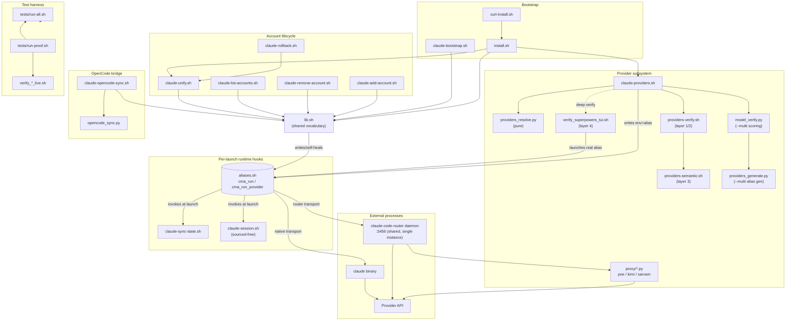

# Architecture and Risk Audit — claude-toolkit

**Scope:** `scripts/` at commit `629acb9` (HEAD, branch `main`, 2026-07-19). Every claim below is grounded in a `file:line` citation to code actually read in this session, or in `git log`/`git show` output. Where I could not verify a claim against code in this repo (e.g. the internal reload semantics of the external `claude-code-router` binary), it is marked **UNVERIFIED** explicitly rather than assumed.

Severity scale used throughout: **CRITICAL** = realistic trigger, silent correctness loss or data corruption/security exposure; **HIGH** = realistic-but-less-common trigger, significant malfunction; **MEDIUM** = narrow trigger or contained impact; **LOW** = cosmetic, hardening, or hard-to-trigger.

---

## 1. System map

### 1.1 Component inventory

| Script | Lines | Responsibility | Reads | Writes | Coupled to |
|---|---:|---|---|---|---|
| `scripts/lib.sh` | 1442 | Shared vocabulary: path resolution, account detection, alias-file lifecycle (`cma_run`/`cma_run_provider` wrapper generation + self-heal migrations), `.claude.json` merge, shared-item symlinking, provider status cache, provider `.env` writer, daemon-roster union. `set -euo pipefail`. | `$ALIAS_FILE`, every account's `.claude.json`, `$SHARED_DIR/settings.json` | `$ALIAS_FILE`, `$SHARED_DIR/*`, `$pdir/status.json`, `$pdir/<id>.env`, `~/.claude-code-router/config.json` (embedded in the `cma_run_provider` heredoc it emits) | Sourced by every other `.sh` **except** `claude-session.sh` (deliberately sourced-free, see §1.3) |
| `scripts/install.sh` | 174 | One-shot bootstrap: tool check, symlink scripts to `~/.local/bin`, PATH line, alias-file init, inline-alias migration, proxy copy, session hook, install-time provider sync, unify, doc export. | `$LIB_DIR`, `~/.bashrc`/`~/.zshrc`, existing account dirs | `~/.local/bin/*` symlinks, rc files, `$SHARED_DIR/proxy/*.py` | `lib.sh`, `claude-unify.sh`, `claude-providers.sh`, `claude-export-docs.sh` |
| `scripts/curl-install.sh` | 127 | One-line remote bootstrap: clone/pull repo + submodules, delegate to `install.sh`. | network, package manager | `~/claude-toolkit` clone | `install.sh` |
| `scripts/claude-add-account.sh` | 107 | Create one new account dir, link shared items, register alias. | `$ALIAS_FILE` (existence check) | new `~/.claude-<name>/`, `$ALIAS_FILE` | `lib.sh` |
| `scripts/claude-remove-account.sh` | 100 | Remove one account's alias + optionally archive its dir. | `$ALIAS_FILE` | `$ALIAS_FILE`, `.preunify.*` archive | `lib.sh` |
| `scripts/claude-list-accounts.sh` | 69 | Read-only status report per detected account. | every account dir | stdout only | `lib.sh` |
| `scripts/claude-unify.sh` | 519 | One-shot heavy merge of every `~/.claude-*` account into `$SHARED_DIR`, then symlink-replace. `--rollback` restores `.preunify.*` backups. | every account dir, `$SHARED_DIR`, `$DEFAULT_DIR` | `$SHARED_DIR/*`, `.preunify.*` backups, `$ALIAS_FILE` | `lib.sh` (`cma_merge_claude_json`, `cma_union_rosters`, `cma_own_settings_seed`) |
| `scripts/claude-rollback.sh` | 19 | `exec claude-unify.sh --rollback "$@"`. | — | — | `claude-unify.sh` |
| `scripts/claude-bootstrap.sh` | 242 | Fresh-machine N-account creation from nothing (no merge). | — | new account dirs, `$ALIAS_FILE` | `lib.sh` |
| `scripts/claude-sync-state.sh` | 104 | Lightweight per-launch `.claude.json` sync (pull before launch, push after exit) — the runtime cross-alias session-visibility mechanism. | every detected account + provider dir's `.claude.json` | every detected account + provider dir's `.claude.json` | `lib.sh` (`cma_merge_claude_json`, `cma_detect_accounts`); invoked from the `cma_run`/`cma_run_provider` bodies `lib.sh` emits |
| `scripts/claude-session.sh` | 202 | Per-project session id/name derivation, trust-marking, color hinting. Explicitly **not** sourced — "a normal PATH script with a shebang, so it runs under a known bash regardless of the user's interactive shell" (header comment). | `$CLAUDE_CONFIG_DIR/.claude.json`, `$CLAUDE_CONFIG_DIR/projects/<slug>/*.jsonl` | `$CLAUDE_CONFIG_DIR/.claude.json` (trust flag), session `.jsonl` (color marker append) | Invoked (not sourced) from the `cma_run`/`cma_run_provider` bodies |
| `scripts/claude-providers.sh` | 901 | Provider alias lifecycle: `sync`/`sync --multi`/`list*`/`show`/`verify`/`remove`/`add`. Discovers keys, resolves via catalog, verifies, writes env+alias+config-dir. | `~/api_keys.sh`, `models.dev` catalog, `providers/key-aliases.json`, `providers/overrides.json`, `providers/helixagent.json`, `~/.kimi-code/credentials/kimi-code.json` | `$pdir/*.env`, `$pdir/status.json`, `$pdir/*.token`, `$ALIAS_FILE`, provider config dirs | `lib.sh`, `providers_resolve.py`, `providers-verify.sh`, `providers-semantic.sh`, `model_verify.py`, `providers_generate.py` |
| `scripts/providers_resolve.py` | 244 | Pure, offline resolver: key-var name → provider record (alias/base_url/transport/models). No network, no side effects. | `--models-dev` cache file, `--key-aliases`, `--overrides` (argv paths) | stdout JSON | none (deliberately pure) |
| `scripts/providers-verify.sh` | 210 | Layer 1/2 verification adapter: LLMsVerifier binary if built, else two live HTTP probes (sentinel echo, tool-calling). | provider API (network), `${!KEYVAR}` | stdout verdict word + stderr reason | `submodules/LLMsVerifier/bin/model-verification` (optional) |
| `scripts/providers-semantic.sh` | 143 | Layer 3 verification adapter: two-round semantic code-visibility via LLMsVerifier's Go `semantic-code-visibility` command. | `providers/fixture/*`, `providers/judge.env`, provider + judge API | `$REPO_ROOT/.local-cache/semantic-last.{json,err}` | `claude-semantic-visibility.sh` |
| `scripts/model_verify.py` | 671 | `--multi` path: probes + scores every catalog model for a provider (existence, tool-call, reasoning, streaming, latency, context). | `CMA_PROBE_KEY` env, provider API, `--catalog` | `--cache-file` (verification cache), `--output` | called by `cmd_sync_multi` in `claude-providers.sh` |
| `scripts/providers_generate.py` | 263 | `--multi` path: turns `model_verify.py` output into N paired (strong+fast) alias configs. | `--verified` JSON | per-alias `.env` files under `--output-dir` | called by `cmd_sync_multi` |
| `scripts/claude-verify-providers.sh` | 66 | Thin driver for LLMsVerifier's `code-verification` Go command (build-if-needed + exec). | `submodules/LLMsVerifier` | stdout | LLMsVerifier submodule |
| `scripts/claude-semantic-visibility.sh` | 52 | Thin driver for LLMsVerifier's `semantic-code-visibility` Go command. | `submodules/LLMsVerifier` | stdout | LLMsVerifier submodule |
| `scripts/verify_superpowers_tui.sh` | 100 | Layer 4: launches **real** Claude Code through an alias with a scrubbed env + throwaway cwd, checks for trust prompts / API errors / superpowers engagement markers. | live alias, network | `$OUT` transcript file (raw, unredacted — see §3, D8) | `claude-providers.sh`'s alias file, `cma_run_provider` |
| `scripts/proxy/poe_proxy.py` | 232 | Local HTTP shim: injects missing `parameters` in tool defs, resolves `$ref`, caps tool count (~216 Poe limit), strips `cache_control`. | inbound HTTP (loopback) | forwards to `api.poe.com` | started by `cma_run_provider` (lib.sh) for `poe*` aliases |
| `scripts/proxy/kimi_proxy.py` | 182 | Local HTTP shim: normalizes JSON-schema `$ref`s to the moonshot `#/$defs/` flavor. | inbound HTTP (loopback) | forwards to `api.kimi.com/coding` | started for `kimi-*` aliases (family-proxy discovery) |
| `scripts/proxy/sarvam_proxy.py` | 145 | Local HTTP shim: flattens array-shaped `system` message content to a string. | inbound HTTP (loopback) | forwards to Sarvam API | started for `sarvam*` aliases |
| `scripts/claude-opencode-sync.sh` + `scripts/opencode_sync.py` | 137 + 263 | Maps the Claude plugin cache's Skills/MCP/CLAUDE.md into OpenCode's `opencode.json`, additive + idempotent. | `$CLAUDE_PLUGINS_DIR`, `$SHARED_DIR/CLAUDE.md` | `$OPENCODE_CONFIG`, `.bak.*` backups | `lib.sh` (bash wrapper only) |
| `scripts/claude-export-docs.sh` | 156 | Markdown → self-contained HTML/PDF doc pipeline. | `~/Documents/Claude_Multi_Account_Fine_Tuning.md` | `.html`, `.pdf` siblings | `pandoc`/`weasyprint`/`wkhtmltopdf`/headless chromium |
| `scripts/alias_e2e_test.py` | 568 | Standalone e2e prober: exercises every installed alias's real endpoint via `ccr`'s config, classifies genuine-fail vs quota-skip vs transient-skip. | `$pdir/*.env`, `~/.claude-code-router/config.json` | stdout / exit code (consumed by `run-proof.sh` leg 44) | none (independent of `lib.sh`) |
| `scripts/tests/run-all.sh` | 71 | Discovers and runs every `test_*.sh`, tallies pass/fail from **exit code**, cross-checks against printed `[FAIL]` (harness-integrity guard, see §4). | `test_*.sh` files | stdout | `tests/lib/assert.sh`, `tests/lib/sandbox.sh` (via each test file) |
| `scripts/tests/run-proof.sh` | 146 | Six-leg live proof: sandbox suite, OpenCode live, providers live, aliases live, alias e2e, constitution. | all of the above | `scripts/tests/proof/*` (126+ files, **git-tracked**) | every `verify_*_live.sh` |

### 1.2 Component diagram



### 1.3 Sequence diagram — a provider alias launch

```mermaid
sequenceDiagram
    actor User
    participant Shell as Interactive shell
    participant Wrap as cma_run_provider<br/>(in aliases.sh, emitted by lib.sh)
    participant EnvF as providers/&lt;id&gt;.env
    participant Status as providers/status.json
    participant Keys as ~/api_keys.sh
    participant Sess as claude-session.sh
    participant Sync as claude-sync-state.sh
    participant CCRConf as ~/.claude-code-router/config.json
    participant Proxy as proxy/&lt;family&gt;_proxy.py
    participant CCR as ccr daemon (shared, :3456)
    participant Claude as claude binary
    participant API as Provider API

    User->>Shell: <alias> [-p "..."]
    Shell->>Wrap: cma_run_provider <id> [args]
    Wrap->>EnvF: source $id.env
    EnvF-->>Wrap: CMA_PROVIDER_* vars
    Wrap->>Wrap: unset ANTHROPIC_*/CLAUDE_CODE_* leftover from a prior alias in this shell
    Wrap->>Status: jq -r .[id].status
    Status-->>Wrap: verified | unverified | failed | pending
    alt status != verified and no --force
        Wrap-->>User: refuse, exit 3
    end
    Wrap->>Keys: set -a +u; source api_keys.sh; set +a
    Keys-->>Wrap: ${!CMA_PROVIDER_KEYVAR} (never on argv)
    Wrap->>Sync: claude-sync-state pull $CLAUDE_CONFIG_DIR
    Sync->>Sync: cma_merge_claude_json across EVERY account+provider dir
    Wrap->>Sess: claude-session flags / hint / apply-color
    Sess-->>Wrap: --resume <uuid>  OR  --session-id <uuid> --name <kebab>
    alt transport = router
        Wrap->>CCRConf: mktemp+jq upsert THIS provider,<br/>set .Router.default/.background to self (mv -f, chmod 600)
        opt proxy needed (poe/kimi/sarvam)
            Wrap->>Proxy: scan free port from 3457, spawn, confirm own-pid bind
        end
        Wrap->>CCR: ccr restart
        Wrap->>CCR: ccr default-claude-code -- <args>
        CCR->>Proxy: forward (if proxied)
        Proxy->>API: schema-fixed request
        CCR->>API: forward request (direct, if no proxy)
    else transport = native
        Wrap->>Wrap: export ANTHROPIC_BASE_URL/AUTH_TOKEN/MODEL/DEFAULT_*_MODEL
        Wrap->>Claude: exec "$CLAUDE_BIN" "$@"
        Claude->>API: POST /v1/messages (or /anthropic/v1/messages)
    end
    API-->>User: streamed completion
    Wrap->>Sync: claude-sync-state push $CLAUDE_CONFIG_DIR
    Wrap->>Sess: apply-color (post-launch, session file now exists)
```

---

## 2. State model

For each state item: **who writes**, **who reads**, **concurrent-write behavior**, **corruption behavior**. Non-atomic writes are called out with quoted code (also cross-referenced into §3).

| State | Path | Writer(s) | Reader(s) | Concurrent-write behavior | Corruption behavior |
|---|---|---|---|---|---|
| Shared item dirs | `$SHARED_DIR/{projects,todos,tasks,plans,file-history,paste-cache,shell-snapshots,session-env,telemetry,sessions,backups,cache,plugins,daemon,jobs}` | `claude-unify.sh` `merge_dir_into_shared()` (one-shot, two-pass rsync); Claude Code processes writing **through the symlink** continuously thereafter | every account/provider dir via symlink; Claude Code | One-shot merge is not itself concurrent-safe against a live `unify` re-run mid-rsync, but ongoing per-file writes from N concurrently-running Claude Code processes (different aliases, same host) all land in the **same physical files** — this is a direct consequence of the unification model, not mitigated anywhere in the toolkit | rsync exit 23/24 tolerated as "partial transfer" warnings (`claude-unify.sh:129-134`); anything else fatal |
| `history.jsonl` | `$SHARED_DIR/history.jsonl` | `merge_history_jsonl()` (`claude-unify.sh:170-192`) at unify time; Claude Code appends through the symlink at runtime | Claude Code, all accounts | dedup via `awk 'NF && !seen[$0]++'` feeding files directly (not `cat`, so a missing trailing newline can't fuse two files' lines — `claude-unify.sh:179-183`); no rotation/cap — see §3 D-17 | good: written via a temp file first, `mv "$tmp" "$SHARED_DIR/history.jsonl"` (`claude-unify.sh:186`) — atomic |
| `settings.json` (per-dir) | every account/provider dir's **own** `settings.json` (deliberately NOT shared/symlinked — "§11.4 own-settings") | `cma_own_settings_seed()` (`lib.sh:1241-1262`), `union_enabled_plugins_into_template()` (`claude-unify.sh:201-259`) | Claude Code | template union explicitly excludes invalid-JSON account files rather than failing the whole merge (`claude-unify.sh:221-231`, tested as "R3") | well-handled; see previous column |
| `.claude.json` (per account/provider, PRIVATE) | every dir's own file | `cma_merge_claude_json()` (`lib.sh:63-151`) from `claude-unify.sh` (one-shot) **and** `claude-sync-state.sh` pull/push (every launch/exit) **and** `claude-session.sh cma_trust_project` (every bare launch) | Claude Code, `claude-session.sh` | **Explicitly documented, accepted race** — see quote below | per-account invalid JSON is skipped with a warning, not fatal (`lib.sh:83-94`, `129-137`) |
| `aliases.sh` (the ONE alias file, sourced by every interactive shell) | `$ALIAS_FILE` | `cma_ensure_alias_file`, `cma_write_alias`, `cma_remove_alias`, `cma_provider_write_alias`, `cma_install_session_hook` — all `lib.sh`; invoked from `install.sh`, `claude-add-account.sh`, `claude-remove-account.sh`, `claude-unify.sh`, `claude-providers.sh` | every interactive shell (bashrc/zshrc source line) | Most writers use mktemp+mv (atomic, see below); the two large function-body appends do **not** — see §3 D-3. `--refresh-aliases` (fired on **every shell startup** via the installed hook) loops `cma_provider_write_alias` once per installed provider; each call is individually atomic but N shells starting simultaneously do N×M redundant atomic replacements of the same file | Extensive self-heal machinery: stale-marker detection + `awk` function-body strip + re-append, covering ~8 historical corruption/regression classes (`lib.sh:248-260`, `288-335`, `360-380`, `528-563`) |
| `providers/status.json` | `$pdir/status.json` | `cma_status_write()` (`lib.sh:1092-1108`) | `cma_status_read`, `cma_run_provider`'s activation gate, `claude-providers list*` | mktemp+jq+`mv -f` per key — atomic **per call**, but two concurrent `claude-providers sync` runs (e.g. the 24h background auto-sync racing a manual `sync`) interleave freely; no lock anywhere | jq failure leaves the temp file discarded and warns, original untouched (`lib.sh:1103-1107`) |
| `providers/<id>.env` (per-provider, non-secret) | `$pdir/<id>.env` | `cma_provider_write_env()` (`lib.sh:1306-1358`); `providers_generate.py` (`--multi` path) | `source`d by `cma_run_provider` on **every single alias launch** — the hottest read path in the whole toolkit | **Not atomic — see §3 D-1, the top finding of this audit** | a torn write mid-`source` either aborts the `source` (leaving stale `CMA_PROVIDER_*` vars from a previous export, silently) or yields a truncated model/base-url |
| `providers/*.token` (Kimi OAuth snapshot) | `$pdir/<id>.token` | `detect_kimicode_record()` (`claude-providers.sh:341-346`) | `cma_run_provider` (fallback tier 3 of the OAuth freshness order) | `( umask 077; printf '%s' "$token" > "$tdir/$pid.token" )` — direct write, `umask 077` gives 600 perms but the write itself is not mktemp+mv | small enough (~single JWT) that a torn write is unlikely in practice but not structurally prevented |
| `~/.claude-code-router/config.json` | shared, single file for **all** router-transport aliases | `cma_run_provider` router branch (`lib.sh:930-951`) | `ccr` daemon (on `ccr restart`) | **Shared single file + shared single daemon, both mutated to point at "self" by every router-alias launch — see §3 D-2** | mktemp+jq+`>|`(noclobber-safe)+`mv -f`, `chmod 600` — the write mechanics themselves are correctly atomic; the *architectural* race is one level up |
| `providers/models.dev.cache.json`, `verification_cache.json` | `$CACHE`, `$VERIFIED_CACHE` | `ensure_catalog()` (`claude-providers.sh:88-126`); `model_verify.py save_cache()` | `providers_resolve.py`, `model_verify.py` | catalog cache: `mv "$tmp" "$CACHE"` (`claude-providers.sh:116`) — atomic *if* `$TMPDIR` and `$CACHE`'s directory share a filesystem (see §3 D-10); verification cache: **not atomic at all — see §3 D-5** | verification cache corruption self-heals: `load_cache()` catches `JSONDecodeError`/`OSError` and returns `{}`, forcing a full re-verify (`model_verify.py:507-524`) |
| `scripts/tests/proof/*` (126+ files) | git-tracked evidence directory | `verify_providers_live.sh`, `verify_superpowers_tui.sh`, `verify_aliases_live.sh`, `run-proof.sh` | humans, CI, `run-proof.sh`'s own `PROOF.md` aggregator | append-only across runs, unbounded — see §3 D-17 | redaction is **inconsistent** across writers — see §3 D-8 |
| `opencode.json` | `$OPENCODE_CONFIG` | `claude-opencode-sync.sh` | `opencode` binary | single-user file, no concurrency concern documented or observed | comment claims atomicity the implementation doesn't provide — see §3 D-6 |
| `.preunify.<timestamp>` / `.bak.<timestamp>` backups | scattered under `$HOME`, `$OPENCODE_CONFIG`'s dir | `backup_and_remove()` (`claude-unify.sh:93-97`), `install.sh:72,118`, `claude-providers.sh:658`, `lib.sh:1182`, `claude-opencode-sync.sh:120-122` | `claude-rollback.sh` / `claude-unify.sh --rollback` (partially, see §3 D-7) | each backup event is independent; no coordination needed since each is a unique timestamp | N/A — the risk is unbounded accumulation, not corruption |

**The documented, accepted `.claude.json` race** (`scripts/claude-sync-state.sh:84-92`):

```bash
    # KNOWN, ACCEPTED race: pull/push rewrite EVERY account's .claude.json, not
    # just the target's. Two claudeN launching concurrently can interleave; the
    # per-file mv is last-writer-wins, so a non-union scalar another account
    # just wrote can be lost. The projects subtree is unioned (the common case
    # is safe), and an in-flight partial write is caught by the jq guard and
    # skipped. We deliberately do NOT add a lock here: a cross-platform mutex
    # (no portable flock on macOS) with stale-lock recovery would add more
    # failure modes than the rare scalar-loss it prevents, on a hook that runs
    # on every launch.
```

This is a reasoned, self-aware tradeoff, not an oversight — I flag it in §3 as MEDIUM precisely because the authors already weighed the alternative and rejected it for good reasons; it is included here for completeness per the audit brief, not as a "gotcha."

---

## 3. Danger zones

### D-1 — [CRITICAL] Non-atomic write of the file `source`d on every alias launch, routinely rewritten by a detached background job

`scripts/lib.sh:1336-1357` (`cma_provider_write_env`):

```bash
  cat > "$pdir/$id.env" <<EOF
# generated by claude-providers — non-secret. Do not edit by hand.
# Secrets are NEVER stored here; the key is read from the keys file at launch.
CMA_PROVIDER_ID=$(_cma_q "$id")
CMA_PROVIDER_KEYVAR=$(_cma_q "$keyvar")
CMA_PROVIDER_TRANSPORT=$(_cma_q "$transport")
CMA_PROVIDER_BASE_URL=$(_cma_q "$base")
CMA_PROVIDER_MODEL=$(_cma_q "$model")
CMA_PROVIDER_FAST_MODEL=$(_cma_q "$fast")
CMA_PROVIDER_CONFIG_DIR=$(_cma_q "$cdir")
...
EOF
```

This is a **direct redirect** (`cat > "$pdir/$id.env"`), truncating the destination immediately and writing in place — the opposite of the mktemp+mv pattern used almost everywhere else in the same file (e.g. `cma_status_write`, `lib.sh:1099-1107`). The `--multi` generator does the same thing in Python, `scripts/providers_generate.py:164-165`:

```python
        with open(env_path, "w") as f:
            f.write(env_content)
```

**Why this is CRITICAL, not just a style nit:** this exact file is `source`d, unguarded, on every single alias launch — `scripts/lib.sh` line ~601 inside `cma_run_provider`: `source "$envf"`. And `claude-providers.sh sync` (which rewrites **every** installed provider's `.env`) is not a rare maintenance operation: it is triggered automatically, **detached, in the background**, on ordinary interactive shell startup once the status cache is stale:

```bash
# scripts/lib.sh:1417-1419 (inside cma_install_session_hook's HOOK heredoc)
    if [ "$age" -gt "$ttl" ]; then
      ( nohup claude-providers sync >/dev/null 2>&1 & disown ) 2>/dev/null || true
    fi
```

**Concrete failure scenario:** user A opens a new terminal (triggers the 24h-stale background `claude-providers sync`, rewriting all `.env` files one by one). Seconds later, in a different already-open terminal, user A launches `poe` while the background sync is mid-rewrite of `poe.env`. `source "$pdir/poe.env"` either (a) reads a truncated file and errors out of `source` with a syntax error — which is **not caught** (no `|| ...` around the `source` call in `cma_run_provider`), so execution falls through with **stale environment variables from whatever alias last ran in that shell**, or (b) reads a fully-truncated (0-byte, mid-truncate) file and gets an **empty** `CMA_PROVIDER_MODEL`/`CMA_PROVIDER_BASE_URL`, silently launching Claude Code against a blank base URL. Neither failure mode produces a clear error message.

**Remediation:** replace both call sites with the same mktemp+mv idiom used by `cma_status_write` — `tmp="$(mktemp ...)"; cat > "$tmp" <<EOF ... EOF; mv -f "$tmp" "$pdir/$id.env"` (bash) and `tempfile + os.replace()` (Python). This is a 10-line, zero-risk change with no behavior change on the happy path.

### D-2 — [CRITICAL] Concurrent router-transport alias launches share one daemon and one config file, each pointed at "self"

`scripts/lib.sh:930-952`:

```bash
    if (( ! _cma_ccr_self )) && command -v jq >/dev/null 2>&1; then
      local tmp; tmp="$(mktemp "${TMPDIR:-/tmp}/cma.XXXXXX")"; chmod 600 "$tmp" 2>/dev/null || true
      if CMA_TOK="$token" jq --arg n "$CMA_PROVIDER_ID" --arg u "$base" \
            --arg s "$CMA_PROVIDER_MODEL" --arg f "${CMA_PROVIDER_FAST_MODEL:-$CMA_PROVIDER_MODEL}" '
          .Providers = ([ .Providers[]? | select(.name != $n) ]
            + [{name:$n, api_base_url:$u, api_key:$ENV.CMA_TOK, models:[$s,$f],
                transformer:{use:["cleancache","streamoptions"]}}])
          | .Router.default = ($n + "," + $s)
          | .Router.background = ($n + "," + $f)
        ' "$cfg" >| "$tmp" 2>/dev/null; then
        command mv -f "$tmp" "$cfg"; chmod 600 "$cfg" 2>/dev/null || true
        ccr restart >/dev/null 2>&1 || true
      else
        rm -f "$tmp"
      fi
    fi
    ccr default-claude-code -- "$@"; rc=$?
```

Every router-transport provider (`deepseek`, `xiaomi`, `poe`, `kimi-*`, `opencode`, etc. — per `CLAUDE.md`'s "port deepseek+xiaomi to router (ccr) transport" note) shares **one** `~/.claude-code-router/config.json` and **one** `ccr` daemon bound to `:3456` (`scripts/lib.sh:849`). `.Router.default`/`.Router.background` are global, single-valued keys — not per-request, not per-session. Every launch sets them to point at **itself**, then restarts the shared daemon.

**Concrete failure scenario:** the toolkit's entire purpose is running multiple accounts/providers on one host, so two terminals with two different router-transport aliases open concurrently is not an edge case, it is the primary use case. If a user launches `deepseek` in terminal 1 and, while that session is still active, launches `poe` in terminal 2, terminal 2's launch overwrites `.Router.default` to point at `poe` and restarts the shared `ccr` daemon out from under terminal 1's in-flight session. Depending on `ccr`'s internal reconnect/session-affinity behavior (**UNVERIFIED** — `claude-code-router` is an external dependency, not part of this repo, and its source was not available to inspect), terminal 1's subsequent requests could silently be routed through `poe`'s credentials/model instead of `deepseek`'s — a silent misdirection of a live conversation with **no error surfaced to the user**. The self-loop-guard comment at `lib.sh:848-854` independently confirms `config.json` is *not always* re-imported live ("Under ccr v3.0.6 the live route is app_config (config.json is not re-imported on restart)"), which only deepens the uncertainty about what state a concurrent restart actually leaves the daemon in.

**Remediation:** this needs an upstream-level fix, not a toolkit-only patch: either (a) run one `ccr` daemon **per provider/port** instead of one shared daemon with a globally-mutated default route, or (b) confirm with the `claude-code-router` maintainers that routing can be made per-request (e.g. via a request header naming the provider) instead of via a mutable global default, or (c) at minimum, serialize `cma_run_provider`'s router branch across concurrent invocations with a lock file and accept that concurrent router-alias launches queue rather than race. Given the severity, this is the single highest-priority item in the backlog (see §5, R-1).

### D-3 — [HIGH] Non-atomic append of large function bodies into the one shared, universally-sourced alias file

`scripts/lib.sh:385` and `scripts/lib.sh:566`:

```bash
  if ! grep -q '^cma_run()' "$ALIAS_FILE"; then
    cat >> "$ALIAS_FILE" <<'EOF'
...   # ~100 lines of cma_run() body
EOF
  fi
```

```bash
  if ! grep -q '^cma_run_provider()' "$ALIAS_FILE"; then
    cat >> "$ALIAS_FILE" <<'EOF'
...   # ~260 lines of cma_run_provider() body
EOF
  fi
```

Both are plain appends (`>>`), not the mktemp+mv-then-swap pattern every *other* mutation of `$ALIAS_FILE` uses elsewhere in the same function (compare `lib.sh:294-297`, `315-317`, `327-333`, `372-378`, `554-561` — every *migration* rewrite in this same file correctly builds a temp file and does `command mv -f "$tmp_run" "$ALIAS_FILE"`; only the two **initial bootstrap appends** skip that pattern). A crash, `kill -9`, disk-full, or laptop-suspend mid-append leaves a syntactically broken `cma_run()`/`cma_run_provider()` definition in the **one file every interactive shell sources**.

**Blast radius:** unlike D-1 (which only breaks the one alias being read at that instant), a torn `$ALIAS_FILE` breaks **every** alias for **every** account and every provider on the host, since the whole file fails to `source` cleanly (an unterminated heredoc or function body is a hard bash parse error) — every new shell that sources it gets a `bash: syntax error` and none of the aliases are even defined, until an operator manually repairs or deletes the file.

**Remediation:** wrap both heredoc appends in the same mktemp+mv idiom used by the migration paths two dozen lines away in the same file — trivial, mechanical, and the pattern is already proven correct elsewhere in this exact function.

### D-4 — [MEDIUM] `.claude.json` cross-account rewrite race (documented, accepted tradeoff)

Already quoted in full in §2. Included for completeness; the authors' own reasoning (no portable cross-platform lock, narrow blast radius limited to non-`projects` scalars, runs on every launch so lock overhead would be paid constantly) is sound. **Residual suggestion, not a demand:** the `projects` subtree — the part that matters for cross-account session resume — is explicitly stated to be safe (object-key union, not last-write-wins). If a future incident report ever attributes lost UX state (not sessions) to this race, the fix is a lightweight file lock scoped only to the *write* phase (`flock` on Linux, best-effort on macOS), not a general mutex.

### D-5 — [MEDIUM] `model_verify.py`'s verification cache is written non-atomically

`scripts/model_verify.py:527-535`:

```python
def save_cache(cache_file, data):
    """Save verification cache."""
    if not cache_file:
        return
    data["_cached_at"] = time.time()
    data["_cache_version"] = CACHE_VERSION
    os.makedirs(os.path.dirname(cache_file) or ".", exist_ok=True)
    with open(cache_file, "w") as f:
        json.dump(data, f, indent=2)
```

`open(cache_file, "w")` truncates immediately, then `json.dump` streams the write — a crash mid-write leaves a truncated/invalid JSON file. **Mitigating factor, confirmed by reading the reader:** `load_cache()` (`model_verify.py:507-524`) wraps its `json.load` in `try/except (json.JSONDecodeError, OSError): return {}` — a corrupted cache degrades gracefully to a full re-verify, not a crash. Severity is capped at MEDIUM specifically because of this graceful-degradation reader, but the exposure window is real and the fix (write-to-`.tmp`-then-`os.replace`) is a 3-line change.

### D-6 — [MEDIUM] OpenCode config write claims atomicity it doesn't have

`scripts/claude-opencode-sync.sh:117-124`:

```bash
# Backup any prior config, then install atomically.
mkdir -p "$(dirname "$OPENCODE_CONFIG")"
if [[ -f "$OPENCODE_CONFIG" && $NO_BACKUP -eq 0 ]]; then
  bak="${OPENCODE_CONFIG}.bak.$(date +%Y%m%d-%H%M%S)"
  cp "$OPENCODE_CONFIG" "$bak"
  cma_log "backed up prior config -> $bak"
fi
cp "$OC_TMP" "$OPENCODE_CONFIG"
cma_log "wrote $OPENCODE_CONFIG"
```

The comment says "install atomically," but `cp "$OC_TMP" "$OPENCODE_CONFIG"` is `cp`, not `mv` — `cp` opens the destination with truncate semantics and streams the copy in, which is exactly the non-atomic pattern the rest of the codebase carefully avoids via mktemp+mv. A crash mid-`cp` leaves `$OPENCODE_CONFIG` truncated. The `.bak.<timestamp>` from the *previous* run provides a manual recovery path (unless `--no-backup`/`NO_BACKUP=1`), but nothing restores it automatically.

**Remediation:** `mv "$OC_TMP" "$OPENCODE_CONFIG"` instead of `cp` — `$OC_TMP` is already a `mktemp` file (line 94) that is going to be discarded anyway (the `trap` at line 96 removes it), so this is a strict improvement with no downside.

### D-7 — [MEDIUM] Unbounded accumulation of `.preunify.*` / `.bak.*` backups

Every destructive replacement across the toolkit creates a uniquely-timestamped backup and **nothing ever deletes an old one**:

- `scripts/claude-unify.sh:93-97` (`backup_and_remove`): `mv "$p" "${p}.preunify.$(ts)"` — fires once per real→symlink conversion, every unify run that touches previously-un-migrated content.
- `scripts/install.sh:72`: symlink target mismatch → `mv "$link" "${link}.preunify.$(date +%Y%m%d%H%M%S)"`.
- `scripts/install.sh:118`: inline-alias migration → `cp -p "$rc" "${rc}.preunify.$(date +%Y%m%d%H%M%S)"`.
- `scripts/claude-providers.sh:658`: `claude-providers remove <id>` → `mv "$cdir" "${cdir}.preunify.$(date +%Y%m%d%H%M%S)"`.
- `scripts/lib.sh:1182` (`cma_migrate_daemon_dirs_once`): daemon/jobs migration → same pattern.
- `scripts/claude-opencode-sync.sh:120-122`: every sync run with an existing config → a fresh `.bak.<timestamp>`, unconditionally (default `NO_BACKUP=0`).

There is **no** `find ... -mtime +N -delete`, no size cap, no count cap, and no user-facing prune/gc command anywhere in the 21 shell scripts I read in full (`grep -rln "find.*-mtime\|logrotate\|TTL.*rm -rf\|prune" scripts/*.sh` — zero hits). Worse, `claude-unify.sh --rollback` (lines 362-394) only restores the **oldest** generation of each backup family (it sorts `.preunify.*` chronologically and stops restoring a given original path the instant one generation has been moved back into place — `[[ -e "$orig" ]] || { mv "$bk" "$orig"; ... }`), so any *newer* backup generations for the same path are silently left behind even after a rollback.

**Remediation:** add an optional `claude-toolkit gc [--older-than N] [--dry-run]` command that lists/removes `.preunify.*`/`.bak.*` older than a threshold, and mention it in the install-time output. Low effort, meaningfully bounds disk growth on long-lived hosts.

### D-8 — [HIGH] Inconsistent, weaker secret redaction on git-tracked live-evidence transcripts

Two independent redaction implementations exist for two sibling live-verification harnesses, and they do not agree:

`scripts/tests/verify_opencode_live.sh` (`cma_redact_secrets`, referenced by `test_coverage.sh:274,287`) redacts: `AIza...` (Google), `hf_...` (HuggingFace), JWT triplets, env-style JSON key names, `tvly-`, `nvapi-`, `ghp_` prefixes.

`scripts/tests/verify_providers_live.sh:89-93` (`_redact`, applied to the **same class** of file — `providers-${id}-superpowers.txt`, produced by `verify_superpowers_tui.sh`, and `providers-${id}-semantic.txt`):

```bash
_redact() {
  [[ -f "$1" ]] || return 0
  sed -E 's/sk-[A-Za-z0-9_-]{8,}/sk-***REDACTED***/g; s/([Bb]earer[[:space:]]+)[A-Za-z0-9._-]{8,}/\1***REDACTED***/g' \
    "$1" > "$1.redacted" 2>/dev/null && mv "$1.redacted" "$1"
}
```

only matches `sk-…` and `Bearer <token>` shapes. It does **not** match `x-api-key:` header values — the exact shape `providers-verify.sh:83` uses for Anthropic-native probes (`auth_fmt='header = "x-api-key: %s"\n...'`) — nor any of the provider-prefixed shapes the OpenCode redactor explicitly covers. `verify_superpowers_tui.sh` itself writes the **raw** launch transcript with zero redaction of its own (`printf '%s\n' "$out" >> "$OUT"`, line 59) and relies entirely on the caller (`verify_providers_live.sh`) to redact afterward — meaning `verify_superpowers_tui.sh` run **standalone** (as documented for `claude-providers verify <id> --deep`, `claude-providers.sh:576-578`) produces **completely unredacted** evidence at `scripts/tests/proof/providers-<id>-superpowers.txt`.

I confirmed **126 files** under `scripts/tests/proof/` are git-tracked (not `.gitignore`d — `git check-ignore` returned exit 1) and searched the current tree for the specific prefixed shapes the weaker redactor misses; none were found in the current committed state (`git grep -nE "AIzaSy|hf_[A-Za-z0-9]{20}|tvly-|nvapi-|ghp_[A-Za-z0-9]{20}" -- scripts/tests/proof/` returned only a benign test-output string, not a real secret). **This finding is about exposure surface, not a confirmed active leak** — but a git-tracked directory is effectively permanent (secrets committed once require a history rewrite to remove), so the cost of a future leak here is high even though none was found today.

**Remediation:** either (a) make `verify_superpowers_tui.sh` call the same, single, shared `cma_redact_secrets` function before it ever writes `$OUT` (don't rely on a downstream caller to clean up), or (b) hoist `cma_redact_secrets` into `lib.sh` as the one canonical redactor every proof-writing script sources, so there is exactly one regex list to keep current instead of two drifting copies.

### D-9 — [MEDIUM] Orphaned provider records are never pruned

`cmd_sync` (`scripts/claude-providers.sh:425-532`) iterates `records` returned by `resolve_records()`, which is itself built from `present_key_vars()` — the **currently-present** key variables in `~/api_keys.sh`. It only ever creates/updates providers whose key is still present; there is no step anywhere in `cmd_sync`/`cmd_sync_multi` that diffs the set of installed `$pdir/*.env` files against the currently-resolvable set and removes ones that no longer resolve. The only removal path is the fully manual `claude-providers remove <id>` (`claude-providers.sh:646-662`).

I verified this is a **live, currently-open condition** on the audited host, not a hypothetical: two records coexist for the same key family —

```
$ ls ~/.local/share/claude-multi-account/providers/*.env | grep -i zhipu
zhipuai-coding-plan.env   (Jul 19)
zhipuai.env               (Jul 15)
```

Both `ZHIPU_API_KEY` and `ZAI_API_KEY` are still present in `~/api_keys.sh`, so this specific pair is not (today) evidence of a stale/dead alias — but it demonstrates that the toolkit has **no reconciliation logic at all**: if a key is later revoked or removed from `api_keys.sh`, its `.env`/alias/config-dir/`status.json` entry (which may still say `verified`) is left behind indefinitely, invisible to `claude-providers list` (verified-only view) but still `source`able and still launchable by name until someone remembers to `claude-providers remove` it by hand.

**Remediation:** add a `--prune` flag to `cmd_sync` that removes any `$pdir/*.env` whose `provider_id` is absent from the current `resolve_records()` output (with a confirmation prompt or `--yes`), and surface orphans in `claude-providers list-all` output (e.g. an `ORPHANED` status column).

### D-10 — [MEDIUM] Repo-wide mktemp+mv pattern loses its atomicity guarantee when `$TMPDIR` and the destination are on different filesystems

Every atomic-write site in this codebase (~50+ occurrences across `lib.sh`, `claude-unify.sh`, `claude-providers.sh`, `claude-opencode-sync.sh`) follows the shape `tmp="$(mktemp "${TMPDIR:-/tmp}/cma.XXXXXX")"; ... > "$tmp"; mv "$tmp" "$dest"`. POSIX `rename(2)` — what `mv` uses for a same-filesystem move — is atomic only when source and destination share a filesystem; GNU coreutils `mv` silently falls back to copy-then-unlink on `EXDEV` (cross-device), which reintroduces exactly the torn-write window the pattern exists to prevent. `/tmp` as a `tmpfs` mount distinct from `$HOME`'s filesystem is the **default** on a large fraction of modern Linux distributions (Fedora, Arch, many container base images) — so on those hosts, e.g. `scripts/claude-providers.sh:116`'s `mv "$tmp" "$CACHE"` (catalog cache) and every `mv -f "$tmp" "$f"` in `lib.sh` are only atomic if `$CACHE`/`$f` happen to live on the same mount as `$TMPDIR`, which for this toolkit (writing under `$HOME` while `mktemp` defaults to `/tmp`) is **not guaranteed** on such hosts.

This is a systemic, cross-cutting risk rather than a single-site bug, which is why it's called out separately from D-1/D-3/D-5/D-6 (which are non-atomic *by construction*, not by filesystem topology). **UNVERIFIED for this specific host's mount layout** — I did not check whether `/tmp` here is tmpfs (out of scope: the finding is about the pattern, not this one machine).

**Remediation:** switch every `mktemp "${TMPDIR:-/tmp}/cma.XXXXXX"` that precedes a `mv` into the destination directory to `mktemp "$(dirname "$dest")/.cma.XXXXXX"` (same filesystem by construction), or centralize a `cma_atomic_write` helper in `lib.sh` that does this correctly once and is called everywhere instead of the ad-hoc `mktemp`+`mv` pairs.

### D-11 — [LOW-MEDIUM] Proxy port selection is TOCTOU-racy under concurrent alias launches (self-correcting)

`scripts/lib.sh:900-921` — already hardened against the *previously-shipped* port-squatter bug (see §4), but the scan-then-bind sequence itself remains a check-then-act race:

```bash
      local _proxy_port=3457 _pp_try=0
      while lsof -i ":$_proxy_port" >/dev/null 2>&1 && (( _pp_try < 20 )); do
        _proxy_port=$((_proxy_port + 1)); _pp_try=$((_pp_try + 1))
      done
      python3 "$_proxy_script" --port "$_proxy_port" &
      _proxy_pid=$!
```

Two aliases launched at the same instant can both observe port 3457 as free via `lsof`, both attempt to bind it, and one loses — but the code **does** verify post-bind ownership (`lsof -a -p "$_proxy_pid" -i ":$_proxy_port"`) and falls back to the direct endpoint with a loud warning if binding failed (lines 914-921), so the failure mode is "proxy silently degraded to direct calls, correctly logged" rather than a crash or a misrouted request. Rated LOW-MEDIUM because the failure is self-detected and logged, not silent.

### D-12 — [LOW] Unauthenticated local HTTP relay on predictable ports, on a host designed for multiple concurrent users/accounts

`scripts/proxy/{poe,kimi,sarvam}_proxy.py` each start `HTTPServer(("127.0.0.1", args.port), ProxyHandler)` — loopback-only (good), but with **no authentication of their own**; they forward whatever `Authorization` header the caller sent (`self.headers.get("Authorization", "")`). On a host explicitly designed for multiple Claude Code accounts (this toolkit's entire premise), any other local, unprivileged process that can reach `127.0.0.1:3457`-`3477` during the brief window a proxy is alive can submit arbitrary chat-completion requests to it. Practical exploitability is low (an attacker still needs a valid provider key of their own to get a useful answer, and the window is only open for the duration of one alias invocation), but it is a real local attack surface that doesn't exist for the native (non-proxied) transport path.

**Remediation:** low priority given limited exploitability, but a cheap mitigation exists — generate a random shared-secret header per proxy instance (passed via an env var from `cma_run_provider` to the spawned `python3` process, checked in `do_POST`) so only the spawning shell's own requests are honored.

### D-13 — [MEDIUM] Silent failure-swallowing on hot, frequently-executed paths

The task brief specifically asks for `|| true` / `2>/dev/null` instances that swallow real failures. `lib.sh` alone has 36 `|| true` occurrences and 57 `2>/dev/null` occurrences; `claude-providers.sh` has 16 and 34 respectively. Most are well-justified (e.g. `cma_trust_project`'s failure is genuinely non-fatal). Three stand out as swallowing failures on paths that run on **every single interactive shell startup**, with zero user-facing signal on failure:

```bash
# scripts/lib.sh:1408 — inside the installed session-refresh hook, runs on EVERY new shell
  claude-providers list --quiet --refresh-aliases >/dev/null 2>&1 || true
```
```bash
# scripts/claude-providers.sh:882 — inside --refresh-aliases's per-provider loop
      cma_provider_write_alias "$_ral" "$_rid" 2>/dev/null || true
```
```bash
# scripts/claude-providers.sh:449 (cmd_sync) and :705 (cmd_sync_multi)
    cma_enable_plugins $CMA_ALWAYS_ON_PLUGINS 2>/dev/null || true
```

If any of these fail — a permissions problem, a disk-full condition, a corrupted `$ALIAS_FILE` that the self-heal machinery can't parse — the user gets **no indication at all**; the shell simply starts as if nothing happened, and the toolkit's own always-on plugins or refreshed aliases silently stop updating. Because this runs on *every* shell, a persistent failure here is effectively invisible until a much later, unrelated symptom (a stale alias pointing at a dead model, or superpowers missing) sends someone hunting.

**Remediation:** not "remove the `|| true`" (that would make every new shell noisy on legitimate transient conditions) but add a low-frequency escalation: if the same failure recurs across N consecutive shell starts (trackable via a small state file with a counter/timestamp), print one visible warning instead of staying silent forever.

### D-14 — [LOW] Hardcoded ports 3456 (ccr) / 8100 (HelixAgent) have no squatter guard analogous to 3457's fix

Port 3457 (the proxy port) got a real squatter-guard fix this session (see §4). Ports **3456** (the `ccr` gateway itself, `lib.sh:849,857`) and **8100** (HelixAgent's default, `claude-providers.sh:208`) have no equivalent verification that the thing listening there is actually `ccr`/HelixAgent and not an unrelated local service — beyond the `ccr --help` identity check (`lib.sh:838-843`), which only fires *after* assuming `ccr` is already reachable at `:3456`, not before. Low severity — HelixAgent is opt-in and PATH-gated, and the `ccr --help` identity check does catch the most likely collision (a different tool literally named `ccr`) — but noted for completeness since the task asked specifically for hardcoded ports.

### D-15 — [LOW-MEDIUM] Unbounded growth of shared `history.jsonl` and the git-tracked proof directory

`merge_history_jsonl()` (`claude-unify.sh:170-192`) deduplicates exact-duplicate lines but has no age/size cap — a shared conversation history file used across N accounts for years will grow monotonically, re-scanned by every future unify run. Separately, `scripts/tests/proof/` (126 files today, confirmed git-tracked) grows by several files per live-verification run (`verify_providers_live.sh` alone writes 2 files per installed provider) with no retention policy — every `run-proof.sh` invocation commits more evidence into git history permanently. Neither is dangerous by itself; both are worth a periodic-cleanup note given the audit brief's explicit interest in unbounded growth.

---

## 4. Known-issue corroboration

Five items were reported as found and fixed in the session immediately preceding this audit. I independently re-verified each against the current tree and `git log`/`git show`.

| # | Claimed issue | Status | Evidence | Residue found |
|---|---|---|---|---|
| 1 | Missing `summary` in a test file masking failures | **Confirmed fixed** | Commit `133ec53` appended the missing `summary` call to `test_providers.sh` (unmasking 5 real failures, 242/242 assertions now propagate). Commit `e421dcc` added a permanent guard: `test_coverage.sh:505-513` now asserts *every* `test_*.sh` contains a standalone `summary` line, and `run-all.sh:42-46` cross-checks a file's printed `[FAIL]` against its exit code, forcing a `[HARNESS]` failure on mismatch. Both guards read and confirmed present in the current tree. | None found — the guard itself is a test, so the only residual exposure is a brand-new test file that both forgets `summary` *and* somehow evades `test_coverage.sh`'s scan (which globs `test_*.sh`, so this is not realistically possible). |
| 2 | SIGPIPE from `printf \| grep -q` giving rc=141 | **Fixed in tests; one class of latent instance remains in production code** | Commit `133ec53` swept 27 instances in `test_lib.sh`/`test_session.sh`/`test_providers.sh` to here-strings; `test_coverage.sh:522-532` now scans all `test_*.sh` for the `printf ... \| grep ...; assert` shape. A **production** fix (predates this session) exists at `scripts/claude-session.sh:109-117` (`cma_latest_session_id`, `\|\| true` guard on the `head -1` pipeline, commit `1475814`) and is consistently applied to its sibling `cma_existing_session_id` (`claude-session.sh:138-141`). | **Residue confirmed live in production code**, not swept by the test-only guard: `scripts/claude-providers.sh:259` and `:264` (`detect_helixagent_record`) use the identical hazardous shape — `if printf '%s\n' "$ids" \| grep -qxF -- "$CMA_HELIXAGENT_STRONG"; then` — under `set -euo pipefail` (`claude-providers.sh:22`). Practically low-probability today (HelixAgent's `/v1/models` list is small, so `printf` finishes writing before `grep -q` can close the pipe early), but it is the *same class of bug*, in production, unprotected by any guard (the new `test_coverage.sh` check only scans `test_*.sh`, not `lib.sh`/`claude-providers.sh`). A larger HelixAgent model catalog, or a slow consumer, would reproduce the exact original failure mode: a real match silently reported as "not found" because the pipeline's `pipefail`-derived exit status is `141` (from `printf`'s SIGPIPE), not `grep`'s `0`. |
| 3 | Proxy port squatting (`ccr` held 3457) | **Confirmed fixed** | Commit `48b4e93`. Verified the fixed code in place: `scripts/lib.sh:900-921` scans upward from 3457 for a port `lsof` reports free, then **confirms the toolkit's own PID actually owns the binding** (`lsof -a -p "$_proxy_pid" -i ":$_proxy_port"`) before trusting it, falling back to the direct endpoint with a loud `cma_log "WARNING: ... schema shims INACTIVE"` if the proxy never bound. Migration marker `_pp_try` (line 901) present, confirming deployed alias files self-heal to pick up the fix. | A residual TOCTOU window remains between the `lsof` check and the actual bind under concurrent launches — see §3 D-11 — but it is now self-detecting and self-logging rather than silently degrading, which is the substance of what was fixed. |
| 4 | Proxy discovery searching a nonexistent dir | **Confirmed fixed** | Commit `48b4e93`. `scripts/tests/verify_aliases_live.sh:76` now resolves `_proxy_base="${SHARED_DIR:-$HOME/.claude-shared}/proxy"`, mirroring the launch wrapper's own resolution (`lib.sh:878`), instead of the old, never-valid `~/.local/share/claude-multi-account/proxy`. Verified live in the current tree. | None found. |
| 5 | Localized billing errors misclassified as FAIL | **Fixed in one of three places that make the same judgment call** | Commit `629acb9`. `scripts/tests/verify_aliases_live.sh:224-230` (`is_quota()`) now matches ZhipuAI's numeric billing codes (`1112\|1113\|1120`) and CJK recharge wording (`余额不足\|请充值\|欠费\|无可用资源包`) in addition to the original English-only patterns, verified live against a real captured HTTP 429 body. | **Real, material residue**: this fix landed **only** in `verify_aliases_live.sh` (leg 43 of `run-proof.sh`, an after-the-fact live sweep). The two places that make the *same kind* of "is this a definitive failure" judgment at more consequential moments were **not** touched: (a) `scripts/providers-verify.sh:173-174` — the **sync-time verification gate** that decides whether an alias is even created — unconditionally treats `400\|401\|402\|403\|404\|412` as `failed` with **no** locale-aware or billing-code carve-out, so a provider whose account happens to be transiently low on funds *at the exact moment `claude-providers sync` runs* gets permanently marked `failed` and its alias is never activated (`cmd_sync`, `claude-providers.sh:492-497`), requiring a manual `claude-providers verify <id>` re-run later — the exact false-negative class the live-sweep fix was designed to eliminate, just at a different, arguably more damaging, point in the pipeline. (b) `scripts/model_verify.py`'s `ERROR_PATTERNS` list (lines 53-66, used by the `--multi` scoring path) is English-only (`r"billing"`, `r"quota (?:exceeded\|reached)"`, etc.) with no CJK or numeric-code equivalents, so the same account-state false-positive can suppress a model from the `--multi` alias set. |

---

## 5. Prioritized remediation backlog

| ID | Title | Severity | Effort | Blast radius | Fix sketch |
|---|---|---|---|---|---|
| R-1 | Concurrent router-transport aliases share one `ccr` daemon + config, race to set the global default route | CRITICAL | L | Every router-transport provider (deepseek, xiaomi, poe, kimi-*, opencode, …) on any host running 2+ terminals concurrently — the toolkit's core use case | Requires an upstream-facing decision: per-provider `ccr` instances/ports, or per-request routing if `claude-code-router` supports it, or (interim) a launch-time lock serializing router-branch config mutation + restart across concurrent invocations on the same host |
| R-2 | `cma_provider_write_env` / `providers_generate.py`'s env writer are non-atomic and sit on the hot `source` path | CRITICAL | S | Every provider alias, every host, whenever a sync (including the 24h detached background one) overlaps a launch | `tmp="$(mktemp "$pdir/.tmp.XXXXXX")"; cat > "$tmp" <<EOF ... EOF; mv -f "$tmp" "$pdir/$id.env"` in bash; `tempfile` + `os.replace()` in Python |
| R-3 | `cma_run`/`cma_run_provider` function bodies appended non-atomically into the single shared alias file | HIGH | S | Every alias for every account/provider on a host, if interrupted during the (rare but real) first-bootstrap or self-heal-regeneration write | Same mktemp+mv idiom already used 20 lines away for the *migration* rewrites — apply it to the two bootstrap appends too |
| R-4 | Inconsistent/weaker secret redaction on git-tracked live-evidence transcripts; `verify_superpowers_tui.sh` writes fully unredacted when run standalone | HIGH | S | Any secret shape not `sk-…`/`Bearer …` (notably `x-api-key:`, the shape Anthropic-native probes use) leaking permanently into git history | Hoist `cma_redact_secrets` into `lib.sh` as the single canonical implementation; call it from `verify_superpowers_tui.sh` before the transcript is ever written to disk, not only from the downstream caller |
| R-5 | `providers-verify.sh`'s sync-time gate has no locale/billing-code carve-out (residue of the CJK-billing fix) | HIGH | S | Any provider whose account is transiently low on funds at the exact moment `claude-providers sync` runs gets permanently `failed` and never activated | Port `is_quota()`'s CJK + numeric-code patterns from `verify_aliases_live.sh:224-230` into `providers-verify.sh`'s 400-412 branch as a `SKIP`-equivalent (`unverified`, not `failed`) outcome |
| R-6 | `verification_cache.json` written non-atomically (self-healing on read, but exposure window is real) | MEDIUM | S | `--multi` verification cache only; corrupts to an automatic full re-verify, not data loss | `tempfile.NamedTemporaryFile(dir=..., delete=False)` + `os.replace()` in `model_verify.py:save_cache` |
| R-7 | OpenCode config write uses `cp` while its own comment claims atomicity | MEDIUM | S | One user's `opencode.json`, on interruption during sync | Change `cp "$OC_TMP" "$OPENCODE_CONFIG"` to `mv "$OC_TMP" "$OPENCODE_CONFIG"` — `$OC_TMP` is already a scratch mktemp file |
| R-8 | Orphaned provider records (env/alias/status/config-dir) never pruned when a key is removed | MEDIUM | M | Confirmed live on the audited host (zhipuai + zhipuai-coding-plan coexist); grows unbounded as keys rotate over a host's lifetime | Add `claude-providers sync --prune` (diff installed `.env`s against currently-resolvable records) and an `ORPHANED` status surfaced in `list-all` |
| R-9 | `.preunify.*`/`.bak.*` backups accumulate forever; rollback leaves N-1 generations behind | MEDIUM | S | Disk growth on long-lived hosts across many unify/install/provider-remove/opencode-sync runs | Add `claude-toolkit gc [--older-than N] [--dry-run]`; fix `rollback()` to also purge (not just skip) newer generations after restoring the oldest |
| R-10 | Repo-wide mktemp+mv pattern loses atomicity when `$TMPDIR` and destination are on different filesystems | MEDIUM | M | Every atomic-write site (~50+), conditional on host `/tmp` mount topology (common on modern Linux defaults) | Centralize a `cma_atomic_write` helper in `lib.sh` that `mktemp`s in the **destination's own directory** (`mktemp "$(dirname "$dest")/.cma.XXXXXX"`), and migrate call sites incrementally |
| R-11 | SIGPIPE-prone `printf \| grep -q` pattern present in production code (`detect_helixagent_record`), unprotected by the new test-only guard | MEDIUM | S | HelixAgent strong/fast model selection; low probability today (small model lists) but same failure class already proven to bite at scale | Convert `claude-providers.sh:259,264` to here-strings (`grep -qxF -- "$X" <<<"$ids"`), and extend `test_coverage.sh`'s SIGPIPE scan to cover production `.sh` files, not only `test_*.sh` |
| R-12 | Silent failure-swallowing (`\|\| true`, `2>/dev/null`) on paths that run on every interactive shell startup | MEDIUM | M | Users get zero signal when always-on-plugin enablement, alias refresh, or the session hook itself starts failing persistently | Add a low-frequency escalation (state-file counter) that surfaces one visible warning after N consecutive silent failures, instead of either "always noisy" or "always silent" |
| R-13 | Proxy port-scan is TOCTOU-racy under concurrent launches (self-correcting today) | LOW-MEDIUM | S | Transient: a provider's compatibility shims go inactive under contention, logged but not blocking | Acceptable as-is given the self-detection; optional hardening: retry-with-backoff instead of falling straight to the unshimmed direct endpoint |
| R-14 | Provider compatibility proxies are unauthenticated local HTTP relays on predictable ports | LOW | S | Local, same-host, low practical exploitability (attacker still needs their own valid key) | Per-instance random shared-secret header, checked in each `do_POST` |
| R-15 | Unbounded growth of shared `history.jsonl` and the git-tracked `scripts/tests/proof/` evidence directory | LOW-MEDIUM | S | Long-lived hosts / long-lived repos; performance and repo-size degradation, not correctness | Optional size/age cap on `history.jsonl`; a documented retention policy (or a `proof/` pruning script) for evidence artifacts |

---

## Executive summary

I read `lib.sh` (1442 lines), `claude-providers.sh` (901), `install.sh`, `providers_resolve.py`, `claude-unify.sh`, `claude-sync-state.sh`, `claude-session.sh`, `providers-verify.sh`, `providers-semantic.sh`, `model_verify.py`, `providers_generate.py`, all three compatibility proxies, `verify_superpowers_tui.sh`, the OpenCode bridge, the test harness (`run-all.sh`, `run-proof.sh`, `test_coverage.sh`, `sandbox.sh`), and 40+ recent commits, cross-checking every claim against live host state where relevant (e.g. the zhipuai orphan finding).

The two most consequential findings are new, not previously known: (1) `cma_provider_write_env`/`providers_generate.py` write the per-provider `.env` file — `source`d unguarded on every launch — with a plain `cat >`/`open(...,"w")`, not the mktemp+mv idiom used almost everywhere else in the same file, and this file is routinely rewritten by a **detached background sync** the toolkit itself schedules every 24h; a launch racing that background sync can silently inherit a truncated or empty provider config. (2) Every router-transport provider alias (deepseek, xiaomi, poe, kimi-*, opencode, …) shares one `claude-code-router` daemon and one `config.json`, and every launch overwrites the global default route to point at itself and restarts the shared daemon — concurrent launches, which are this toolkit's entire reason for existing, can silently misdirect an in-flight session's requests.

I also found that the two large `cma_run`/`cma_run_provider` function bodies are appended (not atomically replaced) into the single alias file every shell sources, that the two live-verification harnesses' secret redaction disagree (one covers 6+ key shapes, the other only `sk-`/`Bearer`, and the weaker one guards the file that carries real launch transcripts), and that no reconciliation ever prunes a provider record whose key has since been removed — confirmed live on the audited host (two coexisting zhipuai records).

Of the five known issues handed to me for corroboration, all five are genuinely fixed at the site the fix commit targeted, but two have real residue: the SIGPIPE-prone `printf | grep -q` pattern still exists in `claude-providers.sh`'s HelixAgent model selection (same bug class, production code, outside the new test-only guard's scope), and the CJK/localized-billing-error fix landed only in the live-sweep script (`verify_aliases_live.sh`) — the sync-time verification gate (`providers-verify.sh`) and the `--multi` scorer (`model_verify.py`) still hard-fail on the same class of transient, account-level billing errors, which is the more damaging place for that false negative to live since it permanently disables an alias rather than just mis-labeling one sweep run.

Full detail, quoted code, and a 15-row prioritized backlog are in the sections above.
