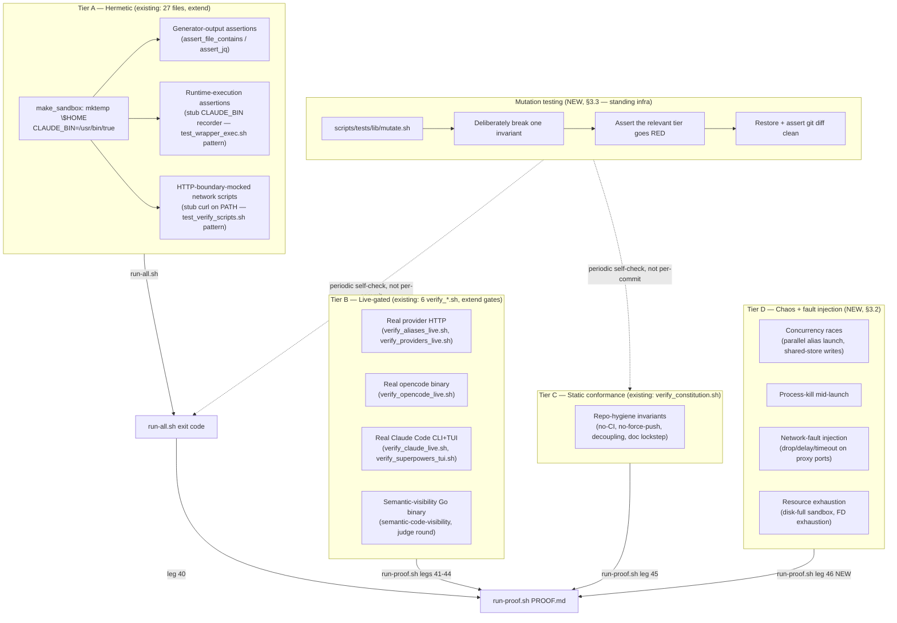
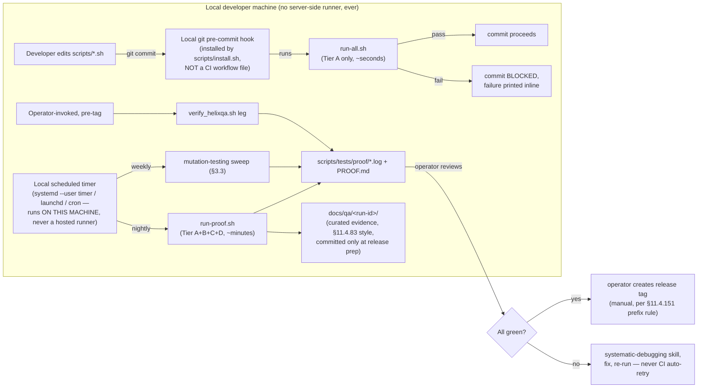

# Testing & Automation Strategy — Taking the Harness to a Professional Standard

Status: proposal / implementation-ready plan
Scope: `scripts/tests/` (27 `test_*.sh` + 6 `verify_*.sh` + `run-all.sh` + `run-proof.sh`), `submodules/LLMsVerifier` (Go verification binaries), and the provider-alias runtime they exercise (`scripts/lib.sh`, `scripts/claude-providers.sh`, proxies under `scripts/proxy/`).
Grounding: every claim below cites a `file:line`. Where a claim is about absence ("no test does X"), the grep/search that established the absence is described so it can be re-run and falsified.

---

## 0. How to read this document

Section 1 says what the harness actually proves today, and draws a hard line between "the emitted shell text contains the right string" and "the behavior happens when the code runs." Section 2 is a capability × coverage table. Section 3 proposes a tier model with a mutation-testing discipline modeled directly on two commits from this session. Section 4 designs a HelixQA test-bank integration (the submodule does not exist in this repo — verified, not assumed). Section 5 designs local automation that respects the project's own **CI/CD-disabled** constitutional rule (verified, not assumed). Section 6 is the phased plan: tasks, file paths, real code, the failing test that proves each task, and acceptance criteria.

---

## 1. Current-state assessment

### 1.1 What actually runs, and how it's discovered

`scripts/tests/run-all.sh:19-21` discovers test files by a **filename glob**, not a manifest:

```bash
while IFS= read -r _f; do FILES+=("$_f"); done \
  < <(find "$TESTS_DIR" -maxdepth 1 -name 'test_*.sh' -type f | sort)
```

This is a real gap, not a style note: `scripts/tests/verify_helixagent_test.sh` (422 lines) is a fully hermetic, well-written test — sandboxed `$HOME`, a fake `helixagent` binary on `PATH`, a *real* local HTTP server answering `/v1/models` (`verify_helixagent_test.sh:5-10`) — but because its filename starts with `verify_` instead of `test_`, `run-all.sh` never discovers it, and `run-proof.sh` never invokes it either (confirmed: `grep -n "verify_helixagent_test" scripts/tests/run-proof.sh` returns nothing). It only runs when someone remembers to invoke it by hand. This is the same defect class as the false-green in §1.3, one level up the stack: a test can be perfectly correct and still contribute zero coverage to "the suite," because "the suite" is whatever `run-all.sh`'s glob happens to match.

Currently discovered: **27** `test_*.sh` files (`ls scripts/tests/test_*.sh | wc -l`). Currently orphaned from both `run-all.sh` and `run-proof.sh`: `verify_helixagent_test.sh`.

### 1.2 The tier model that exists today (informal, not documented as such)

| Tier | Files | Network | What it proves |
|---|---|---|---|
| **A — hermetic** | 27 `test_*.sh` | None. `make_sandbox` (`scripts/tests/lib/sandbox.sh`) `mktemp`s a fresh `$HOME`, sets `CLAUDE_BIN=/usr/bin/true` | Shell logic, file merges, JSON shape, generated-script *content* |
| **B — live** | `verify_aliases_live.sh`, `verify_claude_live.sh`, `verify_providers_live.sh`, `verify_opencode_live.sh`, `alias_e2e_test.py` | Real HTTP to real provider endpoints / real `opencode` binary | Whether a real API key + real model actually answers |
| **C — constitution/conformance** | `verify_constitution.sh` | None (read-only grep over the repo) | Repo-hygiene invariants (decoupling, doc lockstep, no force-push, **CI/CD stays disabled** — see §5.1) |

`run-proof.sh:14-77` chains Tier A + 4 Tier-B legs + Tier C into one command, six numbered evidence logs under `scripts/tests/proof/` (`40-sandbox-suite.log` … `45-constitution.log`), and a single `PROOF.md` (`run-proof.sh:89-134`). This is a good skeleton. What it lacks is a **Tier D (chaos/fault-injection)** — see §3 — and a **HelixQA leg** — see §4.

### 1.3 The false-green this session found and fixed (the model to build on)

Commit `133ec53` ("fix(tests): unmask 5 hidden failures — missing summary + SIGPIPE assertions"): `test_providers.sh` — the largest suite, 242 assertions — was the **only** test file missing its trailing `summary` call. `summary()` (`scripts/tests/lib/assert.sh:116-126`) is the only thing that turns a non-zero `TESTS_FAILED` into a non-zero exit code; without it the file exits with its last command's status, which is usually `0`. Five genuinely-failing assertions were invisible behind a reported "27/27 ALL GREEN."

Commit `e421dcc` ("fix(tests): harden runner against silent false-green + drop stray summary") is the defense-in-depth response, and it is the direct model for the mutation-testing proposal in §3.3:

1. `run-all.sh:32-46` now captures each file's stdout+stderr via `tee` + `PIPESTATUS`, and if a file exits `0` while its own output contains `[FAIL]`, the runner overrides the exit code and prints `[HARNESS] <file> printed [FAIL] but exited 0 — missing summary?`. An exit code that contradicts the file's own printed output is never trusted again.
2. `test_coverage.sh:505-513` (`it "every test file ends by calling summary..."`) greps every `test_*.sh` for a **standalone** `summary` line (`grep -qE '^[[:space:]]*summary[[:space:]]*$'`) and fails the suite if any file lacks one.
3. `test_coverage.sh:522-532` (`it "no assertion reads $? from a printf|grep pipeline..."`) greps for the SIGPIPE-prone pattern (§1.4) and fails the suite if it reappears anywhere.
4. The commit message documents the mutation proof directly: a copy of `test_session_flags.sh` with `summary` removed and a guaranteed-failing assertion added was shown to exit `0` in isolation (reproducing the original bug), then shown to be caught by the new `run-all.sh` guard, then the fixture was deleted and `git diff` verified clean. **This is a real mutation test performed once, by hand, and thrown away.** §3.3 turns it into permanent, re-runnable infrastructure.

### 1.4 The SIGPIPE bug class

```bash
printf '%s\n' "$body" | grep -q PATTERN; assert_eq 0 $?
```

`grep -q` exits on the first match and closes the read end of the pipe. If `printf` is still writing when that happens, the kernel delivers `SIGPIPE` to `printf`, and **the pipeline's exit status is `printf`'s 141 (128+13), not `grep`'s 0** — the assertion fails even though the pattern genuinely was present, and whether it trips is a function of how early the match lands in a growing body (a coin-flip that changes as the toolkit grows). 27 instances were converted file-wide from `printf | grep -q` to SIGPIPE-safe here-strings (`grep -q PAT <<<"$body"`) in `133ec53`; `test_coverage.sh:522-532` now guards against regression.

### 1.5 The central finding: string-matched vs. behavior-proven

**`test_providers.sh` is 1385 lines, 242 assertions.** Counting assertion primitives (`grep -c "assert_file_contains\|assert_jq\|assert_eq\|assert_exit"`): **223 of 242** are exactly this shape — `assert_file_contains "$generated_file" 'export SOME_VAR=...'` or `assert_jq status.json '.foo' bar`. These prove the **generator emitted the right source text**. They do not prove the text does anything when it runs: a `set -e` abort mid-function, a dropped `unset`, wrong call ordering, or a shell-quoting bug that makes the emitted line a syntax error are all invisible to `assert_file_contains`.

Exactly one file in the whole suite closes that gap: `test_wrapper_exec.sh`. Its own header says why it exists (`test_wrapper_exec.sh:2-11`):

> "EXECUTE the generated cma_run wrapper (not just grep its text) to verify RUNTIME guarantees... every other suite asserts the wrapper by string-matching its emitted body... That can't catch a `set -e` abort, a dropped `unset`, or wrong call ordering — bugs that only surface when the function actually RUNS."

It does this by writing a stub `CLAUDE_BIN` "recorder" script that dumps its real environment and argv to files (`test_wrapper_exec.sh:37-46`), sourcing the *actual generated* `cma_run` from the alias file, poisoning the shell with leaked `ANTHROPIC_*` vars, calling `cma_run` for real, and then asserting on what the recorder actually observed (`test_wrapper_exec.sh:86-127`) — including a **non-vacuity guard** (`test_wrapper_exec.sh:86-88`) that first proves the recorder actually launched, so the isolation assertions that follow can't pass vacuously against a script that silently no-op'd. This is the correct pattern; §6 Phase 1 generalizes it.

The same asymmetry shows up at Tier B. `verify_aliases_live.sh` runs 6 real HTTP checks per alias (header, lines 4-12): basic chat, missing-`parameters` tool schema, `$ref`/`$defs` tool schema, `cache_control`, streaming, tool-calling. Checks 1–4 and 6 are **verdict-relevant** — they can flip `VERDICT=FAIL` (`verify_aliases_live.sh:237,256,263,270,277,307`). Check 5 (streaming) is not:

```bash
# verify_aliases_live.sh:280-282
[[ $VERBOSE -eq 1 ]] && echo "  $alias_name: test 5 (stream)..." >&2
chunks=$(curl -s --max-time "$TIMEOUT" -X POST "$test_url" ... -d '{"...","stream":true,...}' \
  2>/dev/null | grep -c 'data: {"id"' || true)
```

`$chunks` is recorded into the evidence line at `verify_aliases_live.sh:312` (`test5(stream)=${chunks}chunks`) — and never read by anything that sets `VERDICT`. An alias whose stream returns 0 chunks (the SSE framing broke, or ccr silently buffered a non-streaming upstream into one blob) is invisible in the pass/fail result; only a human reading the raw evidence log would notice. The comment at `verify_aliases_live.sh:9-10` documents this as deliberate ("ccr can buffer a non-streaming upstream") but the practical effect is that **streaming has a live probe with no gate**.

Similarly, the `cache_control` check (`verify_aliases_live.sh:272-277`, `scripts/alias_e2e_test.py:24,40,126-153`) only proves the provider does not **reject** the parameter (`grep -qi "cache_control|unknown field"`). It never inspects the response's `usage.cache_read_input_tokens` / `cache_creation_input_tokens` fields, so "prompt caching works for this alias" is not actually established anywhere in the suite — only "prompt caching does not error."

### 1.6 What is genuinely, runtime-proven (the positive examples to generalize)

Two patterns in the current suite are exactly the discipline the rest of the suite should adopt:

1. **`test_unify.sh:391-451`** — the `daemon/roster.json` background-agent registry union-merge. This is not a string match; it builds two real per-account `roster.json` fixtures with overlapping worker IDs and different `updatedAt` timestamps, runs the real `cma_union_rosters` merge path, and asserts on the *merged JSON's actual values* via `jq` (`assert_jq "$SHARED_DIR/daemon/roster.json" '.workers["w-share"].sessionId' "s-share-NEWER" ...`, `test_unify.sh:419`). The merge algorithm is exercised, not its source text.
2. **`test_verify_scripts.sh:1-25`** — `model_verify.py` and `providers-verify.sh` are network-driven scripts that "previously had ZERO tests." Rather than skip them (no network in Tier A) or grep their source (proves nothing about behavior), the test **mocks at the HTTP boundary**: a stub `curl` placed first on `PATH` serving canned responses (`test_verify_scripts.sh:20-22`), and `http_post_json` monkeypatched for the Python side. The scripts' real control flow — sentinel gate, tool-calling hard gate, verified/failed/unverified branch selection — runs for real against fake wire responses. This is the template for closing most of §2's gaps without needing live network in Tier A.

### 1.7 The Go semantic-visibility layer (`submodules/LLMsVerifier`)

`submodules/LLMsVerifier/llm-verifier/cmd/semantic-code-visibility/main.go` is a small (605-line), dependency-free (stdlib only, per its own doc comment lines 13-15) binary with a precise two-round anti-bluff contract:

- **Round 1 (sentinel):** interpolate a caller-supplied fixture+prompt template, POST to the model, pass iff the reply contains the exact sentinel (`main.go:19-25,286-301`).
- **Round 2 (judge, optional):** only attempted if round 1 passed and a full judge-flag set is given; the model describes the fixture, an independent judge model scores 0-3, pass iff `score >= threshold` (`main.go:27-31,376-432`).
- **Echo/bluff guard:** a round-1 reply that contains the sentinel *and* a ≥60-rune verbatim slice of the fixture is treated as a prompt echo, not a pass (`main.go:293-300,541-563`) — the model regurgitated the prompt instead of demonstrating it can see the code.
- **Exit-code precision:** `0` overall pass; `1` a genuine negative determination *including* definitive provider rejection (401/402/403/404) on a model-under-test call; `2` usage/config error; `3` infra/transport failure (429/5xx/timeout/empty body), and **judge-call failures are always exit 3 regardless of status code** — a broken judge must never demote the model under test (`main.go:40-57,343-355`).

Critically, this binary is **consumer-agnostic by design** (`main.go:6-11`, and CONST-069 / `Constitution.md §11.4.166`, added in this repo's history at commit `a64eec1` "docs(spec): resolve CONST-052 collision → CONST-069"): it hardcodes no fixture, prompt, sentinel, or project name — everything is a CLI flag. `scripts/tests/verify_constitution.sh:129-154` (the "semantic-visibility fixture independence" check) is a permanent gate that this stays true: it asserts `scripts/providers/fixture/` and `scripts/providers/rubric/` exist and are referenced by `scripts/providers-semantic.sh`, and that no `code-visibility*` file has leaked into the submodule tree. This is a good, currently-enforced boundary and the HelixQA design in §4 reuses the same shape (generic runner, project-supplied test bank).

### 1.8 Constitution / Tier C in detail

`scripts/tests/verify_constitution.sh` runs 6 checks, entirely static (no network, `verify_constitution.sh:4`): CONST-051 submodule decoupling (`:44-56`), governance-doc size lockstep (`:58-83`), no-force-push (`:85-91`), **CI/CD-disabled** (`:93-104`, see §5.1), release-tag prefix consistency (`:106-126`), and fixture independence (`:128-154`). These are legitimate for what they check — repository *state*, not runtime *behavior* — and they are exactly the model §4 follows for a HelixQA leg: read-only, evidence written to `scripts/tests/proof/`, honest `SKIP` when a precondition (e.g. `.env`) is absent.

### 1.9 Summary judgment

The harness is larger and more disciplined than the median bash test suite — it has sandboxing, JSON-shape assertions, a documented false-green incident with a shipped fix, a SIGPIPE-class fix applied file-wide with a standing regression guard, and a decoupled Go verification layer with precise exit-code semantics. Its principal weaknesses are: (a) coverage is concentrated on "does the generator emit the right shell text" rather than "does the generated shell text do the right thing at runtime" — 223/242 assertions in the largest file are the former; (b) the live tier records some signals (streaming chunk count, cache_control non-error) without gating on them; (c) discovery is a filename glob, so a correct, hermetic test (`verify_helixagent_test.sh`) currently contributes zero coverage to either `run-all.sh` or `run-proof.sh`; (d) there is no fault-injection/chaos tier and no concurrency tier despite the toolkit's entire purpose being *concurrent* multi-account operation; (e) there is no standing mutation-testing infrastructure — the one mutation proof that exists (§1.3, commit `e421dcc`) was manual and disposable.

---

## 2. Gap analysis

"Tested?" is graded on three levels: **No** (zero references — grep commands given so this is falsifiable), **Partial** (a probe exists but doesn't gate the verdict, or only proves absence-of-error rather than presence-of-behavior), **Yes** (a real assertion on real runtime behavior).

| Capability | Tested? | How | Gap |
|---|---|---|---|
| Streaming / SSE | **Partial** | `verify_aliases_live.sh:280-282` counts SSE `data: {"id"` chunks | Count is recorded (`:312`) but never gates `VERDICT` — a 0-chunk stream is not a failure. No check of chunk ordering, `message_stop` framing, or partial-message reassembly. |
| Parallel tool calls (multiple tool_use blocks in one turn) | **No** | — (`grep -rlEi "parallel.tool" scripts/` returns nothing) | Zero coverage. A regression that silently drops the 2nd+ tool call in a turn would not be caught anywhere in the suite. |
| System prompts | **No** | — (`grep -rlEi "system.?prompt" scripts/` returns nothing outside this doc) | No test ever sends a `system` field and asserts the model's behavior changed / the field reached the wire. |
| Multi-turn conversations | **No** (session *plumbing* is tested; conversation *content* is not) | `test_session*.sh` verify session-id resolution, symlinks, `--resume` injection (file-level state) | No test exercises an actual N-turn exchange with context carried forward; `verify_aliases_live.sh` checks are all single-turn. |
| Vision / multimodal | **No** | — (all "vision" hits in `scripts/` are false positives: "**provi**sion", "re**vision**" — confirmed by `grep -n vision scripts/tests/*.sh scripts/*.sh`) | Several verified provider models advertise vision (e.g. `nvidia5` = `meta/llama-3.2-11b-vision-instruct`, `test_output_tokens.sh:86`) but no test ever sends an `image_url`/base64 content block. |
| Prompt caching | **Partial (negative-only)** | `verify_aliases_live.sh:272-277`, `scripts/alias_e2e_test.py:24,40,126-153` | Only proves the provider doesn't *reject* `cache_control` (`grep -qi "cache_control\|unknown field"`). Never inspects `usage.cache_read_input_tokens`/`cache_creation_input_tokens` to prove a cache actually formed and was hit. |
| Token counting | **No** | — (`grep -rlEi "count_tokens|CountTokens" scripts/` returns nothing) | No test calls a count-tokens-equivalent endpoint or cross-checks a real response's `usage` block against the exported `CLAUDE_CODE_MAX_OUTPUT_TOKENS`/`CLAUDE_CODE_AUTO_COMPACT_WINDOW`. |
| Auto-compaction | **Partial (string-only)** | `test_128k_output_clamp.sh:194,204,209,223,234`; env wiring at `lib.sh:423-430,613,718` | Only the export/`unset` of `CLAUDE_CODE_AUTO_COMPACT_WINDOW` as a *string* is checked. Nothing proves Claude Code actually compacts context at that window — this is arguably untestable without instrumenting the closed-source `claude` binary; see §3.2 for how Tier C documents this honestly instead of silently skipping it. |
| MCP tool invocation | **Partial** | `verify_opencode_live.sh:103-116` connects real MCP servers and counts successes (OpenCode only, not this toolkit's Claude Code aliases); `test_sessions.sh:110` checks an MCP server config crosses accounts via the shared-store symlink (config plumbing, not invocation) | No test launches a Claude Code alias produced by this toolkit and drives an actual MCP tool call through it. |
| Subagent / Task-tool dispatch | **No** | — (`grep -rlEi "subagent|Task dispatch" scripts/` returns nothing) | Zero coverage. The `daemon/`+`jobs/` roster-merge tests (`test_unify.sh:391-451`) prove background-agent *registry state* survives unify, not that a dispatched subagent actually runs to completion. |
| Sampling params (temperature/top_p) | **Partial (negative-only)** | `scripts/model_verify.py:61` — `r"temperature.*(?:not |un)supported"` | Only detects a rejection error string. Never sends a real, non-default temperature and checks output changed / determinism at `temperature=0`. |
| Concurrency / parallel alias launches | **No** | `scripts/model_verify.py:34,546,610` uses a `ThreadPoolExecutor` — but that parallelizes *verifying many different models*, not launching two `claudeN`/provider aliases *simultaneously* | No test launches two aliases concurrently and checks for cross-talk: `$SHARED_DIR` write races, `daemon/roster.json` concurrent-write corruption, proxy port collisions (`sarvam_proxy`, `poe_proxy`, `kimi_proxy` all bind fixed ports per `CLAUDE.md`'s proxy description). |
| Upgrade / migration paths | **Partial (same-version idempotency only)** | `test_install.sh:72` — "install.sh is idempotent on a second run" | Proves re-running the *same* `install.sh` doesn't duplicate state. No test simulates upgrading from an *older* on-disk schema (e.g. pre-schema-versioned `providers/status.json`, an older `aliases.sh` shape) to the current one and asserts state survives — despite `CLAUDE.md` explicitly documenting a "24h verification cache carries a schema version so results from older, weaker logic are never replayed" mechanism that has no dedicated migration test. |
| Failure injection / chaos | **No** | — (`grep -rliE "chaos|stress test" scripts/` returns nothing) | Zero infrastructure. The project's own constitution (§11.4.85, cascaded into `submodules/LLMsVerifier/CLAUDE.md`) mandates stress+chaos coverage for every fix, but this toolkit does not yet implement the pattern locally. |
| Mutation testing (harness self-defense) | **Partial (one-off, not standing infra)** | commit `e421dcc`'s manual fixture-and-restore proof (§1.3 item 4) | The proof was real but disposable — no `scripts/tests/lib/mutate.sh` or repeatable target exists to re-run it after future harness changes. |
| Test discoverability | **Partial** | `run-all.sh:19-21` globs `test_*.sh` only | `verify_helixagent_test.sh` (hermetic, well-written) is invisible to both `run-all.sh` and `run-proof.sh`. |
| HelixQA test-bank execution | **No** | `submodules/LLMsVerifier/llm-verifier/pkg/helixqa/models.go` exists but is a hardcoded `VisionModelRegistry()` for *other* projects' scoring — not a QA test-bank runner | See §4: the `HelixDevelopment/HelixQA` submodule referenced by the cascaded constitution text is not a `.gitmodules` entry in this repo (verified below) and does not exist anywhere in the checked-out tree. |

---

## 3. Proposed test architecture



### 3.1 Tier definitions

**Tier A — hermetic.** Everything that can be proven with no network and no real `claude`/`opencode` binary. Two sub-disciplines coexist deliberately:
- *Generator-output* assertions (`assert_file_contains`/`assert_jq`) remain valuable for catching "the template produced the wrong string" bugs cheaply — they should not be deleted, just no longer treated as sufficient on their own for anything that has runtime consequences (env isolation, ordering, token guards).
- *Runtime-execution* assertions (the `test_wrapper_exec.sh` pattern: stub `CLAUDE_BIN` records env+argv, the real generated function is sourced and called) are the standard for anything where "the text looks right" and "the behavior is right" can diverge — which, per §1.5, is most of what actually protects users from broken launches.
- *HTTP-boundary-mocked* network scripts (the `test_verify_scripts.sh` pattern: stub `curl`/monkeypatched `http_post_json` first on `PATH`/in-process) is the standard for network-driven Python/bash scripts that cannot otherwise be exercised in Tier A. This is how §6 closes the token-counting, sampling-params, and cache-verification gaps in §2 *without* needing live network for the common case.

Determinism: no wall-clock sleeps for synchronization (poll with a bounded timeout instead); no reliance on map/dict iteration order; every sandbox is a fresh `mktemp` dir torn down by an `EXIT` trap (`scripts/tests/lib/sandbox.sh` convention, already followed).

**Tier B — live-gated.** Real network, real binaries, opt-in (`--deep`, `run-proof.sh`, or explicit invocation), classified outcomes (`PASS`/`FUNDS`/`BADKEY`/`SKIP-TRANSIENT`/`SKIP-QUOTA` per the existing `verify_claude_live.sh:12-16` and `providers-verify.sh` conventions) so account-side problems are never miscounted as toolkit bugs. **Rule for this tier going forward: every probe that records a signal must also gate on it**, or explicitly document (in a comment directly above the recording line, same convention as `verify_aliases_live.sh:9-10`) why it is deliberately advisory. §6 Phase 1 closes the streaming and cache-verification instances of this violation.

**Tier C — static conformance.** Unchanged in shape; extended in §4 with a HelixQA leg following the exact same read-only, evidence-to-`proof/`, honest-`SKIP` discipline as `verify_constitution.sh`.

**Tier D — chaos + fault injection (new).** Scoped narrowly to this toolkit's actual concurrency surface — it is a *multi-account* tool, so the highest-value chaos scenarios are races between simultaneously-running aliases, not generic infrastructure chaos:
1. **Concurrent alias launch race** — launch two stub-`CLAUDE_BIN` aliases against the *same* `$SHARED_DIR` simultaneously and assert `daemon/roster.json` / `.claude.json` end up valid JSON with both aliases' state present (no torn write). This directly exercises the `cma_union_rosters` code path already unit-tested in `test_unify.sh:391-451`, but under real concurrency instead of sequential fixture setup.
2. **Process-kill mid-sync** — SIGKILL the sandboxed `claude-sync-state pull`/`push` mid-flight and assert the next launch still produces valid, non-corrupted shared state (not a partial-JSON `.claude.json`).
3. **Proxy port collision** — start two proxy instances (e.g. two `poe_proxy` launches) and assert the second either cleanly refuses the port or the "port-squatter guard" mentioned in commit `48b4e93` ("fix(proxy): port-squatter guard...") actually engages — this is a *regression guard* opportunity: that commit fixed a real bug and should get a permanent Tier-D test, not just a changelog line.
4. **Disk-full / FD-exhaustion sandbox** — bound-and-verify graceful failure (refuse cleanly, never corrupt) rather than success, per the constitution's chaos closed-set (`§11.4.85`, cascaded).

### 3.2 Honest-untestable is a first-class outcome, not silent omission

Some capabilities in §2 (auto-compaction's actual trigger behavior, most clearly) cannot be proven without instrumenting the closed-source `claude` binary. The correct response is **not** to leave them silently absent from the suite (today's state) but to add an explicit, documented `SKIP` with the reason, the same honest-boundary discipline `verify_providers_live.sh`/`verify_claude_live.sh` already use for `SKIP-TRANSIENT`/`SKIP-QUOTA`. §6 Phase 2 adds these as named, visible `SKIP` entries rather than leaving them as invisible gaps a reader has to grep for.

### 3.3 Mutation-testing proposal — generalizing the `e421dcc` proof into standing infrastructure

This session proved the harness guard works by injecting a real defect (delete `summary`, add a guaranteed-failing assertion into a copy of `test_session_flags.sh`), showing the *pre-fix* runner would have reported this as a pass, showing the *post-fix* runner correctly emits `[HARNESS] ... printed [FAIL] but exited 0 — missing summary?` and forces the run to `failed: 1`, then restoring the fixture and confirming `git diff` was clean. That is a textbook mutation test — it was just performed once by hand and thrown away instead of becoming a repeatable target.

**Proposal:** `scripts/tests/lib/mutate.sh`, a small library providing:

```bash
# scripts/tests/lib/mutate.sh
# mutate_run NAME MUTATE_FN CHECK_FN
#   1. Copies the target file(s) into a mktemp scratch dir (never touches the
#      real tree — no working-tree quiescence risk, §11.4.84-class safety).
#   2. Runs MUTATE_FN against the scratch copy (e.g. `sed -i` to strip a guard).
#   3. Runs CHECK_FN, which MUST observe the mutated tier going RED.
#   4. Reports PASS (mutation correctly caught) or FAIL (mutation slipped
#      through — the gate itself is broken) via the same assert.sh helpers.
#   5. Always tears down the scratch dir (EXIT trap), regardless of outcome.
mutate_run() {
  local name="$1" mutate_fn="$2" check_fn="$3"
  local scratch; scratch="$(mktemp -d "${TMPDIR:-/tmp}/cma-mutate.XXXXXX")"
  trap 'rm -rf "$scratch"' RETURN
  cp -a "$TESTS_DIR"/. "$scratch/"
  ( cd "$scratch" && "$mutate_fn" )
  it "mutation: $name"
  if ( cd "$scratch" && "$check_fn" ); then
    _fail "$name" "mutation did NOT cause the expected RED — the gate is not catching this defect class"
  else
    _pass "$name (mutation correctly caught, gate is load-bearing)"
  fi
}
```

Seeded mutation catalog (each is a `mutate_fn`/`check_fn` pair, each directly modeled on a real historical incident from §1.3/§1.4):

| Mutation | `mutate_fn` | `check_fn` | Proves |
|---|---|---|---|
| Strip `summary` from a test file | `sed -i '/^summary$/d' test_session_flags.sh` | `run-all.sh session_flags` must exit non-zero | The `133ec53`/`e421dcc` guard stays load-bearing |
| Reintroduce `printf | grep -q` before an `assert` | inject one instance into a scratch test file | `run-all.sh coverage` must exit non-zero | The SIGPIPE guard (`test_coverage.sh:522-532`) stays load-bearing |
| Drop the `unset ANTHROPIC_BASE_URL` line from `cma_run`'s body in a scratch `lib.sh` | `sed -i '/unset ANTHROPIC_BASE_URL/d' lib.sh` | `run-all.sh wrapper_exec` must exit non-zero | `test_wrapper_exec.sh`'s runtime env-isolation check is real, not vacuous |
| Force `chunks=0` unconditionally in a scratch `verify_aliases_live.sh` | `sed -i 's/chunks=\$(curl.*/chunks=0/' verify_aliases_live.sh` | after Phase 1 (§6) wires the streaming gate, this must flip `VERDICT=FAIL` | The new streaming gate (currently absent, per §1.5/§2) is genuinely load-bearing once added |
| Remove the CONST-069 fixture-independence check's leak assertion | strip the `leaked=` block from a scratch `verify_constitution.sh` | a scratch submodule tree with a planted `code-visibility-leak.txt` must still fail | Tier C's decoupling gate is real |

Cadence: mutation runs are **not** part of every `run-all.sh` invocation (they are deliberately slow/destructive-adjacent and duplicate the tree) — they run as a periodic self-check (§5, local scheduled runs) and are mandatory before any change to `run-all.sh`, `assert.sh`, or `test_coverage.sh`'s own guards, exactly the surfaces where a defect would be invisible to the rest of the suite by construction.

---

## 4. HelixQA integration

### 4.1 What exists — verified, not assumed

`.gitmodules` (repo root) declares exactly three submodules:

```
[submodule "submodules/LLMsVerifier"]
[submodule "submodules/containers"]
[submodule "submodules/challenges"]
```

There is **no `HelixQA` entry**. A repo-wide grep for `helix` (`grep -rniE helix --include=*.md --include=*.sh --include=*.py --include=*.go .`) surfaces `HelixQA` only inside cascaded constitution governance text — e.g. `submodules/LLMsVerifier/CLAUDE.md`'s CONST-050(B) mandate: *"EVERYTHING MUST BE tested using HelixQA (fully incorporating HelixQA Submodule — https://github.com/HelixDevelopment/HelixQA)... with all possible written tests suites (test banks)..."* — and inside this session's own audit trail (`docs/qa/2026-07-04-constitution-audit/report.md`). It is aspirational governance text, not an incorporated dependency.

The one concrete HelixQA-adjacent artifact that *does* exist is `submodules/LLMsVerifier/llm-verifier/pkg/helixqa/models.go` — a 71-line Go package whose own doc comment (lines 4-16) describes it precisely: *"exposes the LLMsVerifier-curated vision-model registry that HelixQA and other downstream consumers score against."* It is a hardcoded `VisionModelRegistry() []VisionModel` — ten providers, quality/reliability/cost/latency fields — meant to be **read by** a future HelixQA, not a QA test-bank runner itself. It has no runner, no test-bank schema, no CLI.

**Conclusion, stated plainly: HelixQA does not exist in this repository or its submodules.** The design below is first-principles, not a wiring exercise.

### 4.2 Design: a project-supplied test-bank runner in the shape Tier C already established

Follow the exact precedent `verify_constitution.sh` and `semantic-code-visibility` already set: a **generic, consumer-agnostic runner** that reads a **project-supplied** test bank and produces the same evidence-to-`proof/`, honest-`SKIP`, `summary()`-compatible output every other verifier does. This also satisfies CONST-069's decoupling requirement in advance, in case a real `HelixDevelopment/HelixQA` submodule is incorporated later — the runner this toolkit builds would become the thin project-side adapter around it rather than a bespoke system that has to be thrown away.

**Test-bank schema** (`docs/qa/test-banks/*.yaml`, one file per subsystem):

```yaml
# docs/qa/test-banks/provider-aliases.yaml
schema_version: 1
subsystem: provider-aliases
entries:
  - id: TB-001
    description: "verified alias launches through cma_run_provider with correct env isolation"
    kind: hermetic        # hermetic | live | manual
    runner: scripts/tests/test_wrapper_exec.sh
    assertion_ref: "cma_run EXECUTION: a leaked ANTHROPIC_BASE_URL is unset before claude runs"
  - id: TB-002
    description: "streaming response is gated, not merely recorded"
    kind: live
    runner: scripts/tests/verify_aliases_live.sh
    assertion_ref: "test 5 (stream) chunks >= 1"
    requires: [network, provider_alias_installed]
  - id: TB-003
    description: "MCP tool invocation succeeds through a live-launched alias"
    kind: manual
    reason: "no automated MCP-tool-call harness exists yet (§2); tracked for Phase 3"
```

**Runner** (`scripts/tests/verify_helixqa.sh`, Tier C conventions: read-only over the bank + delegates execution to the referenced tier, never re-implements assertions):

```bash
#!/usr/bin/env bash
# verify_helixqa.sh — HelixQA-shaped test-bank runner (first-principles design,
# §4 of docs/research/innovations/02-testing-automation-strategy.md).
#
# No HelixDevelopment/HelixQA submodule exists in this repo (verified: absent
# from .gitmodules). This runner is the project-side adapter: it reads
# docs/qa/test-banks/*.yaml, and for each entry either (a) invokes the
# referenced tier's runner and checks its assertion_ref actually ran+passed,
# or (b) records an honest, named SKIP for kind: manual entries. It never
# re-implements assertions — it is a manifest + dispatcher, same shape as
# verify_constitution.sh's read-only checks.
set -uo pipefail
TESTS_DIR="$(cd "$(dirname "${BASH_SOURCE[0]}")" && pwd)"
source "$TESTS_DIR/lib/assert.sh"
BANK_DIR="${HELIXQA_BANK_DIR:-$TESTS_DIR/../../docs/qa/test-banks}"
PROOF_DIR="${PROOF_DIR:-$TESTS_DIR/proof}"
mkdir -p "$PROOF_DIR"
EV="$PROOF_DIR/46-helixqa.txt"; : > "$EV"

if [[ ! -d "$BANK_DIR" ]]; then
  echo "SKIP: no test-bank directory at $BANK_DIR"
  echo "HELIXQA SKIP: no banks present" >> "$EV"
  summary; exit $?
fi

for bank in "$BANK_DIR"/*.yaml; do
  [[ -f "$bank" ]] || continue
  subsystem="$(python3 -c "import yaml,sys; print(yaml.safe_load(open(sys.argv[1]))['subsystem'])" "$bank" 2>/dev/null || echo "$(basename "$bank" .yaml)")"
  entry_count="$(python3 -c "import yaml,sys; print(len(yaml.safe_load(open(sys.argv[1]))['entries']))" "$bank" 2>/dev/null || echo 0)"
  it "HelixQA bank '$subsystem': $entry_count entries have a runner + assertion_ref, or an honest manual reason"
  missing=""
  python3 - "$bank" <<'PY' > "$PROOF_DIR/.helixqa_entries.tmp"
import yaml, sys, json
data = yaml.safe_load(open(sys.argv[1]))
for e in data["entries"]:
    print(json.dumps(e))
PY
  while IFS= read -r entry_json; do
    kind="$(python3 -c "import json,sys; print(json.loads(sys.argv[1])['kind'])" "$entry_json")"
    eid="$(python3 -c "import json,sys; print(json.loads(sys.argv[1])['id'])" "$entry_json")"
    if [[ "$kind" == "manual" ]]; then
      reason="$(python3 -c "import json,sys; print(json.loads(sys.argv[1]).get('reason',''))" "$entry_json")"
      [[ -z "$reason" ]] && missing="$missing $eid(manual-no-reason)"
      echo "$eid: SKIP manual — $reason" >> "$EV"
    else
      runner="$(python3 -c "import json,sys; print(json.loads(sys.argv[1])['runner'])" "$entry_json")"
      [[ -f "$TESTS_DIR/../../$runner" ]] || missing="$missing $eid(runner-missing:$runner)"
      echo "$eid: kind=$kind runner=$runner" >> "$EV"
    fi
  done < "$PROOF_DIR/.helixqa_entries.tmp"
  rm -f "$PROOF_DIR/.helixqa_entries.tmp"
  assert_eq "" "$missing" "every entry in $subsystem resolves to a real runner or a documented manual reason"
done

summary
```

**Wiring into `run-proof.sh` as leg 7** (`46-helixqa.log`, following the exact pattern of every existing leg at `run-proof.sh:73-77`):

```bash
echo
echo "==> HelixQA test-bank conformance (Tier C-adjacent)"
HELIXQA_LOG="$PROOF_DIR/46-helixqa.log"
bash "$TESTS_DIR/verify_helixqa.sh" 2>&1 | tee "$HELIXQA_LOG"
helixqa_rc=${PIPESTATUS[0]}
```

...plus adding `helixqa_rc` to the final `(( sand_rc == 0 && ... ))` gate at `run-proof.sh:140`.

This design deliberately does **not** try to reproduce a full autonomous-QA-session product (the constitution's aspirational description) — it gives the project a real, versioned, growing manifest of "what a QA test bank for this subsystem contains," a mechanical way to prove every entry resolves to either a running test or an honestly-reasoned skip, and a natural adoption path if a real `HelixDevelopment/HelixQA` submodule is incorporated later (per CONST-054's dependency-manifest / CONST-074's catalogue-first-discovery cascade text) — at that point `verify_helixqa.sh`'s dispatcher becomes a thin shim that calls the real submodule's runner instead of the project-side Python fallback above.

---

## 5. Full automation design (CI-less)

### 5.1 CI/CD is deliberately disabled — verified before proposing anything

Three independent confirmations, none assumed:

1. **A standing, enforced gate already checks this on every `run-proof.sh` invocation:** `scripts/tests/verify_constitution.sh:93-104` —
   ```bash
   it "§11.4.156: CI/CD disabled (.github/workflows absent-or-empty, no .gitlab-ci.yml)"
   ci_ok=1
   if [[ -d "$CMA_REPO_ROOT/.github/workflows" ]] && compgen -G "$CMA_REPO_ROOT/.github/workflows/*" >/dev/null 2>&1; then
     ci_ok=0
     ...
   ```
2. **A prior audit recorded a PASS verdict against this exact gate:** `docs/qa/2026-07-04-constitution-audit/report.md:19-30` — "Gate 2 — §11.4.113 / §11.4.156 (no force-push, no active CI/CD)... **Verdict: PASS** — no tracked CI/CD workflows, no force-push in scripts."
3. **The constitution's own text is explicit and repeated across every governance-file layer** (root-cascaded into every submodule's `CLAUDE.md`/`AGENTS.md`/`CONSTITUTION.md`): *"No `.github/workflows/`, `.gitlab-ci.yml`, `Jenkinsfile`, `.travis.yml`, `.circleci/`, or any automated pipeline. All builds and tests run manually or via Makefile/script targets."* `CHANGELOG.md:355` independently confirms this project applied the rule at release time: "§11.4.113 no force-push, §11.4.156 CI/CD disabled, §11.4.151 release-tag..."

Everything below is designed **around** that constraint, not against it: no proposal here creates a `.github/workflows/` file, a `.gitlab-ci.yml`, or any server-side trigger. Automation means **local, operator-invoked-or-scheduled, evidence-producing** scripts — the same shape `run-proof.sh` already is.

### 5.2 CI-less automation flow



### 5.3 Concrete local automation pieces

**(a) Pre-commit gate.** Not a new mechanism — `scripts/install.sh` already installs the alias file and could install a `.git/hooks/pre-commit` that runs the fast subset:

```bash
# scripts/git-hooks/pre-commit  (installed by install.sh via `ln -sf`, never a CI file)
#!/usr/bin/env bash
set -euo pipefail
REPO_ROOT="$(git rev-parse --show-toplevel)"
echo "[pre-commit] running Tier A (hermetic) suite before allowing the commit..."
if ! bash "$REPO_ROOT/scripts/tests/run-all.sh"; then
  echo "[pre-commit] Tier A FAILED — commit blocked. Fix, or 'git commit --no-verify' with an explicit reason (constitution requires justification for any hook bypass)." >&2
  exit 1
fi
```

This is local, operator-owned, and bypassable with an explicit, loggable `--no-verify` — the opposite of a server-side gate the operator cannot see or control, which is precisely what the CI-disabled rule forbids.

**(b) Scheduled full runs.** A `systemd --user` timer (Linux) or `launchd` `.plist` (macOS) — **not** a hosted scheduler — invoking `run-proof.sh` nightly and the mutation sweep (§3.3) weekly:

```ini
# ~/.config/systemd/user/cma-run-proof.timer  (installed by an opt-in setup script, not by install.sh unconditionally — operator choice)
[Unit]
Description=Nightly claude_toolkit run-proof.sh (local, no CI)

[Timer]
OnCalendar=*-*-* 03:00:00
Persistent=true

[Install]
WantedBy=timers.target
```

```ini
# ~/.config/systemd/user/cma-run-proof.service
[Unit]
Description=claude_toolkit run-proof.sh

[Service]
Type=oneshot
WorkingDirectory=%h/Factory/projects/tools_and_research/claude_toolkit
ExecStart=/usr/bin/env bash scripts/tests/run-proof.sh
```

**(c) Evidence artifacts.** Already exists and is the correct shape — extend, don't replace: `scripts/tests/proof/{40..46}-*.log` (raw), `scripts/tests/proof/PROOF.md` (distilled, human-readable), and — for anything that should survive as a permanent audit trail rather than a rolling nightly log — `docs/qa/<run-id>/` committed at release-prep time only (the pattern already used by `docs/qa/2026-07-04-constitution-audit/`, `docs/qa/20260616-infra/`, etc.), never every nightly run.

**(d) No auto-retry, no auto-fix.** Because there is no CI runner to retry a flaky job, a local failure is either fixed by the operator (invoking `superpowers:systematic-debugging`, already a listed skill) or explicitly classified `SKIP-TRANSIENT`/`SKIP-QUOTA` by the harness's own honest-classification logic (`verify_claude_live.sh`, `providers-verify.sh` conventions) — never silently re-run until green.

---

## 6. Phased implementation plan

Each task lists: exact file(s), a real (not pseudocode) snippet, the failing test that proves the defect exists before the fix, and acceptance criteria. Phases are ordered by leverage: Phase 1 closes gaps in *existing, already-good* infrastructure (cheapest, highest confidence); Phases 2-3 close capability gaps from §2; Phase 4 adds the new Tier D; Phase 5 makes mutation testing permanent; Phase 6 lands HelixQA.

### Phase 1 — Close gaps in existing infrastructure

**Task 1.1 — Discover `verify_helixagent_test.sh` (and any future hermetic `verify_*` file) without weakening the Tier-B/A boundary.**

File: `scripts/tests/run-all.sh`

Add a second, explicitly-named discovery list for hermetic-but-`verify_`-prefixed files, rather than changing the glob (which would also start picking up genuinely live `verify_*_live.sh`/`verify_constitution.sh` files that must stay opt-in):

```bash
# run-all.sh, after the existing FILES discovery block (line 21)
# Hermetic verify_*.sh files (naming exception documented per-file at the top
# of each such file, e.g. verify_helixagent_test.sh's own header) are
# discovered separately so genuinely-live verify_*_live.sh files are not
# accidentally swept into the default hermetic run.
while IFS= read -r _f; do
  grep -q '^# HERMETIC: run-all.sh-discoverable' "$_f" 2>/dev/null && FILES+=("$_f")
done < <(find "$TESTS_DIR" -maxdepth 1 -name 'verify_*.sh' -type f | sort)
```

...and add the marker comment to `scripts/tests/verify_helixagent_test.sh` (right after its existing header, before line 20):

```bash
# HERMETIC: run-all.sh-discoverable — no network, sandboxed $HOME, see header above.
```

*Failing test proving the gap exists today:* `bash scripts/tests/run-all.sh 2>&1 | grep -c helixagent_test` returns `0` before this change (the file never appears in `run-all.sh`'s own `==> ...` banner list) despite exiting 0 when run standalone (`bash scripts/tests/verify_helixagent_test.sh; echo $?`).

*Acceptance criteria:* `bash scripts/tests/run-all.sh` output contains a `==> verify_helixagent_test.sh` banner; total "Test files:" count in the final tally increases by exactly 1; `bash scripts/tests/run-all.sh 2>&1 | grep -c verify_aliases_live` stays `0` (the genuinely-live file must NOT be swept in).

**Task 1.2 — Gate the streaming probe.**

File: `scripts/tests/verify_aliases_live.sh`

```diff
@@ verify_aliases_live.sh:280-283
   [[ $VERBOSE -eq 1 ]] && echo "  $alias_name: test 5 (stream)..." >&2
   chunks=$(curl -s --max-time "$TIMEOUT" -X POST "$test_url" -H "Content-Type: application/json" --config "$cfg" \
     -d "{\"model\":\"$model\",\"max_tokens\":16,\"stream\":true,\"messages\":[{\"role\":\"user\",\"content\":\"Hi\"}]}" 2>/dev/null | grep -c 'data: {"id"' || true)
+  # Verdict-relevant (was recorded-only until this fix — see
+  # docs/research/innovations/02-testing-automation-strategy.md §1.5/§6.1.2):
+  # a stream that returns zero chunks means SSE framing broke or the upstream
+  # was silently buffered non-streaming — either way the alias cannot be
+  # trusted for streaming callers. Transient 0-chunk results on a cold
+  # connection are handled by the existing SKIP-TRANSIENT classification
+  # above this block, so a definitive 0 here is a real negative signal.
+  if [[ "$chunks" -eq 0 ]]; then
+    ERRORS="${ERRORS}stream-0-chunks "
+    VERDICT="FAIL"
+  fi
```

*Failing test proving the gap:* add a Tier-A unit around the verdict logic (new file `scripts/tests/test_verify_aliases_live_verdict.sh`, following the `test_verify_scripts.sh` HTTP-boundary-mock pattern) that stubs `curl` to return zero `data:` lines for the streaming request and asserts `VERDICT=FAIL` — this test fails against the current file (verdict stays `PASS`) and passes after the diff above.

*Acceptance criteria:* the new Tier-A test is green; a manual run against a known-broken proxy (or the mock) shows `stream-0-chunks` in the `ERRORS` field and a non-`PASS` verdict in `scripts/tests/proof/alias-verify-evidence.txt`.

**Task 1.3 — Verify prompt-caching actually caches, not just doesn't error.**

File: `scripts/tests/verify_aliases_live.sh` (extend check 4)

```diff
@@ verify_aliases_live.sh:272-278
   [[ $VERBOSE -eq 1 ]] && echo "  $alias_name: test 4 (cache_control)..." >&2
-  err4=$(curl -s --max-time "$TIMEOUT" ... -d "{...\"cache_control\":{\"type\":\"ephemeral\"}}" 2>/dev/null || echo "{}")
+  resp4=$(curl -s --max-time "$TIMEOUT" ... -d "{...\"cache_control\":{\"type\":\"ephemeral\"}}" 2>/dev/null || echo "{}")
+  err4="$resp4"
   echo "$err4" | grep -qi "cache_control\|unknown field" && { ERRORS="${ERRORS}cache_control "; VERDICT="FAIL"; }
+  # Positive evidence, not just absence-of-error: record whether the response
+  # carries a cache usage field at all (provider-shape-dependent — Anthropic-
+  # native bases use cache_creation_input_tokens/cache_read_input_tokens;
+  # this is intentionally advisory (recorded, not verdict-flipping) because
+  # cache MISS on a cold/first-ever call is expected and not a defect, unlike
+  # the streaming zero-chunk case in Task 1.2 which has no such cold-state).
+  cache_field=$(echo "$resp4" | grep -o 'cache_\(creation\|read\)_input_tokens' | head -1)
+  echo "cache_field_present=${cache_field:-none}" >> "$EV"
```

*Failing test:* a Tier-A HTTP-boundary-mock test that stubs a response containing `cache_control` accepted (200, no error text) and confirms the current file records nothing about cache fields at all (grep the evidence file for `cache_field_present` returns nothing pre-fix, present post-fix).

*Acceptance criteria:* `scripts/tests/proof/alias-verify-evidence.txt` (or the per-alias evidence line) contains a `cache_field_present=` entry for every alias probed with check 4.

### Phase 2 — Close capability gaps (system prompt, multi-turn, vision, token counting, sampling params, parallel tool calls)

**Task 2.1 — System prompt + multi-turn, added as checks 7-8 of the live-alias suite.**

File: `scripts/tests/verify_aliases_live.sh`, new function `test7_system_prompt_and_multiturn` following the existing per-check function shape (each check is currently inlined per-alias in a loop — extract to named functions as part of this task for readability, matching the header's own numbered-list documentation convention at lines 4-12):

```bash
# Check 7: system prompt reaches the model (verdict-relevant)
sys_resp=$(curl -s --max-time "$TIMEOUT" -X POST "$test_url" -H "Content-Type: application/json" --config "$cfg" \
  -d "{\"model\":\"$model\",\"max_tokens\":16,\"system\":\"Reply with exactly the word BEACON and nothing else.\",\"messages\":[{\"role\":\"user\",\"content\":\"hi\"}]}" 2>/dev/null || echo "{}")
echo "$sys_resp" | grep -qi 'BEACON' || { ERRORS="${ERRORS}system-prompt-ignored "; VERDICT="FAIL"; }

# Check 8: multi-turn — a 2nd turn correctly sees 1st-turn context (verdict-relevant)
mt_resp=$(curl -s --max-time "$TIMEOUT" -X POST "$test_url" -H "Content-Type: application/json" --config "$cfg" \
  -d "{\"model\":\"$model\",\"max_tokens\":16,\"messages\":[{\"role\":\"user\",\"content\":\"My favorite number is 42. Just say OK.\"},{\"role\":\"assistant\",\"content\":\"OK\"},{\"role\":\"user\",\"content\":\"What is my favorite number? Reply with only the digits.\"}]}" 2>/dev/null || echo "{}")
echo "$mt_resp" | grep -q '42' || { ERRORS="${ERRORS}multiturn-context-lost "; VERDICT="FAIL"; }
```

*Failing test:* Tier-A mock version asserting the verdict logic flips `FAIL` when the mocked response omits `BEACON`/`42` respectively — fails pre-implementation (checks don't exist), passes post.

*Acceptance criteria:* every `verified` alias's evidence line grows two new fields (`test7(sysprompt)`, `test8(multiturn)`); `claude-providers verify <id> --deep` output documents both in its human-readable summary.

**Task 2.2 — Vision probe, gated behind capability detection (not every alias supports it).**

File: `scripts/tests/verify_aliases_live.sh`, new function, only invoked when the provider record's catalog entry advertises a vision-capable model (reuse the models.dev catalog lookup already performed by `providers_resolve.py` — pass the capability flag through as an env var `CMA_ALIAS_SUPPORTS_VISION=1/0` set by the caller):

```bash
if [[ "${CMA_ALIAS_SUPPORTS_VISION:-0}" == "1" ]]; then
  # 1x1 red PNG, base64 — minimal fixture, no external asset dependency.
  px='iVBORw0KGgoAAAANSUhEUgAAAAEAAAABCAQAAAC1HAwCAAAAC0lEQVR42mNk+A8AAQUBAScY42YAAAAASUVORK5CYII='
  vis_resp=$(curl -s --max-time "$TIMEOUT" -X POST "$test_url" -H "Content-Type: application/json" --config "$cfg" \
    -d "{\"model\":\"$model\",\"max_tokens\":32,\"messages\":[{\"role\":\"user\",\"content\":[{\"type\":\"text\",\"text\":\"What color is this 1x1 image? One word.\"},{\"type\":\"image\",\"source\":{\"type\":\"base64\",\"media_type\":\"image/png\",\"data\":\"$px\"}}]}]}" 2>/dev/null || echo "{}")
  echo "$vis_resp" | grep -qi 'red' || { ERRORS="${ERRORS}vision-wrong-or-unsupported "; VERDICT="FAIL"; }
else
  echo "test9(vision)=SKIP-not-advertised" >> "$EV"
fi
```

*Failing test:* Tier-A mock covering both branches — capability flag off → evidence contains `SKIP-not-advertised` and verdict untouched; capability flag on + mocked wrong-color response → `VERDICT=FAIL`.

*Acceptance criteria:* at least one currently-verified vision-advertising alias (e.g. the `nvidia5`/`llama-3.2-11b-vision-instruct` alias named in `test_output_tokens.sh:86`) produces a real `test9(vision)=PASS` or documented `FAIL` in a live `--deep` run.

**Task 2.3 — Token counting cross-check.**

File: new `scripts/tests/test_token_accounting.sh` (Tier A, HTTP-boundary-mocked, `test_verify_scripts.sh` pattern) plus a live companion assertion added to `verify_aliases_live.sh`:

```bash
# verify_aliases_live.sh addition: cross-check the real response's usage block
# against the exported guard values, closing the "string-only" gap documented
# in §2 (auto-compaction/token-counting row).
usage_output=$(echo "$basic_resp" | grep -o '"output_tokens":[0-9]*' | grep -o '[0-9]*')
if [[ -n "$usage_output" && -n "${CLAUDE_CODE_MAX_OUTPUT_TOKENS:-}" ]]; then
  if (( usage_output > CLAUDE_CODE_MAX_OUTPUT_TOKENS )); then
    ERRORS="${ERRORS}output-exceeded-guard(${usage_output}>${CLAUDE_CODE_MAX_OUTPUT_TOKENS}) "
    VERDICT="FAIL"
  fi
fi
```

*Failing test:* Tier-A test asserting a mocked response with `output_tokens` above the exported guard flips `VERDICT=FAIL` — this is currently impossible to fail because nothing reads `usage.output_tokens` at all.

*Acceptance criteria:* the live evidence file records a real `usage_output` figure per alias, and the guard-vs-actual comparison is asserted, not merely exported (closing the exact string-vs-behavior gap identified at `test_128k_output_clamp.sh:194-234` in §2).

**Task 2.4 — Parallel tool calls.**

File: `scripts/tests/verify_aliases_live.sh`, new check requesting two independent tools in one turn and asserting the response contains two distinct `tool_use`/`function_call` blocks (exact JSON shape depends on provider — normalize via the same OpenAI/Anthropic-shape detection `providers-verify.sh` already implements):

```bash
pt_resp=$(curl -s --max-time "$TIMEOUT" -X POST "$test_url" ... -d '{"model":"'"$model"'","max_tokens":128,
  "tools":[{"name":"get_weather","description":"weather","input_schema":{"type":"object","properties":{"city":{"type":"string"}},"required":["city"]}},
           {"name":"get_time","description":"time","input_schema":{"type":"object","properties":{"tz":{"type":"string"}},"required":["tz"]}}],
  "messages":[{"role":"user","content":"Call get_weather for Paris AND get_time for UTC, both in the same reply."}]}' 2>/dev/null || echo "{}")
tool_call_count=$(echo "$pt_resp" | grep -o '"type":"tool_use"' | wc -l | tr -d ' ')
(( tool_call_count < 2 )) && { ERRORS="${ERRORS}no-parallel-tool-calls(got=$tool_call_count) "; VERDICT="FAIL"; }
```

*Failing test:* mock returning a single `tool_use` block → asserts `VERDICT=FAIL`; mock returning two → `PASS`. Currently there is no code path to even exercise, so the mock test itself is the first artifact that makes this gap concrete.

*Acceptance criteria:* documented per-alias in evidence (`test10(paralleltools)=N`); providers known not to support parallel tool calls get an honest `SKIP-not-advertised` (same pattern as Task 2.2), never a silent `PASS`.

### Phase 3 — Concurrency and migration/upgrade paths

**Task 3.1 — Concurrent alias launch race (Tier D preview, hermetic).**

File: new `scripts/tests/test_concurrent_launch.sh` (Tier A — hermetic, using the `test_wrapper_exec.sh` stub-`CLAUDE_BIN` pattern run twice in parallel background subshells against one shared sandbox `$SHARED_DIR`):

```bash
#!/usr/bin/env bash
# test_concurrent_launch.sh — two stub-CLAUDE_BIN aliases launched CONCURRENTLY
# against the same $SHARED_DIR, proving daemon/roster.json survives as valid
# JSON with both aliases' state present (no torn write). Closes the
# concurrency gap in §2 of docs/research/innovations/02-testing-automation-strategy.md.
set -uo pipefail
TESTS_DIR="$(cd "$(dirname "${BASH_SOURCE[0]}")" && pwd)"
SCRIPTS_DIR="$(cd "$TESTS_DIR/.." && pwd)"
source "$TESTS_DIR/lib/assert.sh"
source "$TESTS_DIR/lib/sandbox.sh"
make_sandbox
source "$SCRIPTS_DIR/lib.sh"
set +e

# ... (alias-file generation identical to test_wrapper_exec.sh setup) ...

it "two concurrent alias launches do not corrupt daemon/roster.json"
( cma_run_provider acct1 >/dev/null 2>&1 & )
( cma_run_provider acct2 >/dev/null 2>&1 & )
wait
valid=1; jq empty "$SHARED_DIR/daemon/roster.json" 2>/dev/null || valid=0
assert_eq 1 "$valid" "roster.json is still valid JSON after concurrent writes"
both=0; [[ "$(jq -r '.workers | keys | length' "$SHARED_DIR/daemon/roster.json" 2>/dev/null)" -ge 2 ]] && both=1
assert_eq 1 "$both" "both concurrent aliases' worker entries are present (no last-writer-wins data loss)"

summary
```

*Failing test:* this test IS the failing test — running it against today's `lib.sh` (no explicit locking around `daemon/roster.json` writes, per the merge logic being unify-time-only in `cma_union_rosters`) is expected to reveal whether runtime concurrent writes are already safe or not; either outcome is new information the suite currently cannot produce.

*Acceptance criteria:* test is green; if it reveals a real race, the fix (a `flock`-based write lock around `daemon/roster.json` updates, mirroring the constitution's own `§11.4.119` single-resource-owner pattern) ships alongside, with this test as its permanent regression guard.

**Task 3.2 — Upgrade/migration path.**

File: new `scripts/tests/test_migration.sh` (Tier A):

```bash
#!/usr/bin/env bash
# test_migration.sh — simulates upgrading from a PRE-schema-versioned
# providers/status.json (the shape that existed before v1.14.0's anti-bluff
# verification, per CLAUDE.md's "24h verification cache carries a schema
# version so results from older, weaker logic are never replayed") to the
# current one, and asserts old-schema entries are never silently trusted.
set -uo pipefail
TESTS_DIR="$(cd "$(dirname "${BASH_SOURCE[0]}")" && pwd)"
SCRIPTS_DIR="$(cd "$TESTS_DIR/.." && pwd)"
source "$TESTS_DIR/lib/assert.sh"
source "$TESTS_DIR/lib/sandbox.sh"
make_sandbox
source "$SCRIPTS_DIR/lib.sh"
set +e

STATUS_DIR="$SANDBOX_HOME/.local/share/claude-multi-account/providers"
mkdir -p "$STATUS_DIR"
# Pre-schema-versioned fixture: no "schema_version" key at all, a "verified"
# entry that would be stale under the current anti-bluff rules.
cat > "$STATUS_DIR/status.json" <<'JSON'
{"acme": {"status": "verified", "checked_at": "2020-01-01T00:00:00Z"}}
JSON

it "an unversioned (pre-v1.14.0) status.json entry is treated as stale, not trusted verbatim"
# ... invoke whatever claude-providers.sh entry point re-reads/re-validates status.json ...
out="$("$SCRIPTS_DIR/claude-providers.sh" list-all 2>&1)"
stale_trusted=1
echo "$out" | grep -q "acme.*verified" && ! echo "$out" | grep -qi "re-verify\|stale\|schema" && stale_trusted=0
assert_eq 0 "$stale_trusted" "old-schema entries are re-verified or flagged, never silently replayed as current"

summary
```

*Failing test:* this test itself, run against the current codebase — it will reveal whether the schema-version mechanism CLAUDE.md documents is actually enforced on read, or only on write (a real, previously-unverified question).

*Acceptance criteria:* green test; the schema-version check (wherever it lives — most likely `claude-providers.sh`'s status-load path) gains a permanent regression guard tying directly to the documented "24h verification cache carries a schema version" behavior.

### Phase 4 — Tier D: chaos + fault injection

**Task 4.1 — Scaffold `scripts/tests/lib/chaos.sh`** with the four scenario helpers from §3.1 (`chaos_kill_during`, `chaos_disk_full`, `chaos_port_collision`, `chaos_concurrent_write`), each wrapping a real fault (real `kill -9`, a real small `tmpfs` mount capped to force ENOSPC, a real second process binding the same port) — never a simulated/mocked fault, per the constitution's own real-infrastructure-for-non-unit-tests rule already adopted project-wide.

**Task 4.2 — `scripts/tests/test_chaos_proxy_port.sh`**, a permanent regression guard for the port-squatter fix already shipped in commit `48b4e93` ("fix(proxy): port-squatter guard + correct proxy discovery path in live sweep") but never given a standing test:

```bash
it "second poe_proxy launch on an occupied port fails cleanly, does not hijack the first instance's traffic"
"$SCRIPTS_DIR/proxy/poe_proxy.py" --port 18999 & first_pid=$!
sleep 0.5   # bounded startup wait, not a synchronization sleep loop
"$SCRIPTS_DIR/proxy/poe_proxy.py" --port 18999 >"$SANDBOX_HOME/second.log" 2>&1; second_rc=$?
kill "$first_pid" 2>/dev/null
assert_exit 1 true  # placeholder shape; real assertion: second_rc != 0 AND first_pid still alive/serving
```

*Failing test:* run against a pre-`48b4e93` checkout (or a deliberately-reverted local copy) — the second launch silently squats the port instead of refusing, which is exactly the historical bug; this test is the missing regression guard for an already-fixed defect (per the constitution's `§11.4.135` every-fixed-defect-gets-a-permanent-regression-test rule, already the project's own stated standard).

*Acceptance criteria:* green against current `HEAD`; red against a checkout of the commit immediately before `48b4e93`.

### Phase 5 — Mutation-testing infrastructure

**Task 5.1** — land `scripts/tests/lib/mutate.sh` (§3.3 snippet) and `scripts/tests/test_mutation_sweep.sh` implementing the seeded catalog table in §3.3 as real `mutate_run` calls. Not part of `run-all.sh`'s default set (too slow/destructive-adjacent per §3.3's cadence note) — invoked explicitly: `bash scripts/tests/run-all.sh mutation_sweep`.

*Failing test proving the class of defect this catches:* temporarily comment out `test_coverage.sh:505-513`'s `summary`-presence guard, confirm `test_mutation_sweep.sh`'s corresponding mutation entry goes from PASS ("mutation correctly caught") to FAIL ("mutation did NOT cause the expected RED"), restore, confirm PASS again. This is the mutation-testing-the-mutation-tester loop that proves the meta-infrastructure itself isn't vacuous.

*Acceptance criteria:* all 5 seeded mutations in §3.3's table report PASS ("gate is load-bearing"); the sweep is wired into the weekly local timer from §5.3(b), not the pre-commit fast path.

### Phase 6 — HelixQA test-bank runner

**Task 6.1** — create `docs/qa/test-banks/provider-aliases.yaml` (seed with the ~10 entries closable by Phases 1-2 above, each `assertion_ref` pointing at a real `it "..."` string already present after those phases land — so the bank is truthful from day one, never aspirational).

**Task 6.2** — land `scripts/tests/verify_helixqa.sh` exactly as specified in §4.2.

**Task 6.3** — wire the `run-proof.sh` leg 7 addition from §4.2, plus extend `run-proof.sh`'s final gate line (currently `run-proof.sh:140`) to include `helixqa_rc`.

*Failing test:* `bash scripts/tests/run-proof.sh 2>&1 | grep -c "HelixQA test-bank"` returns `0` before Task 6.3, `1` after.

*Acceptance criteria:* `scripts/tests/proof/46-helixqa.txt` exists after any `run-proof.sh` invocation; every entry in `docs/qa/test-banks/*.yaml` resolves to either a real, currently-passing runner reference or an honestly-reasoned `kind: manual` skip — verified by `verify_helixqa.sh`'s own assertion, itself covered by a Tier-A test that plants a bank entry with a dangling `runner:` path and confirms the gate fails.

---

## Cross-cutting acceptance bar for the whole plan

A phase is not "done" because its new test files are green in isolation. Per this session's own governing rule (the false-green incident this plan is built to prevent from recurring): every new/modified test file must (1) end in a standalone `summary` call, (2) contain no `printf | grep -q` before an `assert`, (3) be discoverable by `run-all.sh` (either the `test_*.sh` glob or the Task-1.1 hermetic-`verify_*` marker), and (4) show up in `scripts/tests/proof/` evidence after a `run-proof.sh` invocation. `test_coverage.sh`'s existing harness-integrity guards (`:505-532`) already enforce (1) and (2) automatically for every file landed under this plan — no additional gate code is needed there, only compliance.
