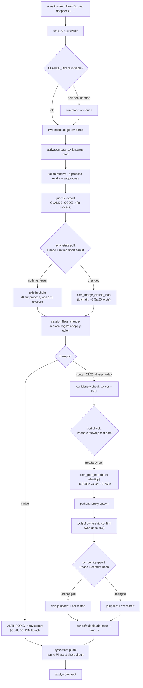

# 03 — Performance Optimization: An Evidence-Based Plan

**Status:** research/proposal — no code in this repo was changed to produce this document.
**Method:** every number below was either (a) measured with `time`/`strace`/`du`/`find` on this
host and is marked **MEASURED**, or (b) derived by arithmetic from measured numbers and marked
**DERIVED**, or (c) not measured and explicitly marked **ESTIMATE**. Nothing is invented.

Host used for all measurements: Linux 6.12.41-6.12-alt1, x86_64, 64 cores (`nproc`), bash
5.2.37, jq 1.8.1, rsync 3.2.7, Python 3.13.13, captured 2026-07-19T09:15:09Z. Absolute
timings (especially the `lsof` number in §2.2) are host-specific — re-measure on the
target host before trusting the magnitude, but the *shape* of each finding (which
operation dominates, which is O(N) in what) is structural and portable.

---

## 1. Baseline measurements

### 1.1 Full hermetic suite

```
$ time bash scripts/tests/run-all.sh
Test files: 27   passed: 27   failed: 0   (skipped-prereq: 0)
ALL GREEN
22.47user 32.64system 1:52.77elapsed 48%CPU
```

**MEASURED**: 112.77s wall, 55.11s combined CPU (22.47 user + 32.64 sys) — the 48% CPU
utilization on a 64-core box says the run is dominated by fork/exec and I/O-wait latency,
not computation. That is the signature of a workload gated by *process-spawn count*, not
by *work per process* — exactly what §1.3–1.4 quantify below.

### 1.2 Per-file breakdown (MEASURED, `scripts/tests/`, each file run standalone)

| file | seconds | % of total |
|---|---:|---:|
| `test_unify.sh` | 44.83 | 39.7% |
| `test_verify_scripts.sh` | 26.39 | 23.4% |
| `test_install.sh` | 8.96 | 7.9% |
| `test_providers.sh` | 6.81 | 6.0% |
| `test_coverage.sh` | 4.56 | 4.0% |
| `test_sessions.sh` | 3.75 | 3.3% |
| `test_list.sh` | 3.65 | 3.2% |
| `test_add_remove.sh` | 3.48 | 3.1% |
| `test_session.sh` | 2.64 | 2.3% |
| remaining 18 files | 6.93 combined | 6.1% |
| **serial total** | **113.00** | **100%** |

Two files (`test_unify.sh` + `test_verify_scripts.sh`) are 63.1% of the whole suite. Root
causes for both are identified with exact line numbers in §3.

### 1.3 Per-launch subprocess count — `cma_run` (native `claudeN`, bare invocation)

`cma_run` is generated verbatim from `scripts/lib.sh:391-487` into
`~/.local/share/claude-multi-account/aliases.sh` (**MEASURED**: 571 lines, 25 `alias`
lines, sourcing it takes 0.14s wall — see §4.3). Grepping the function body for every
subprocess-spawning statement (quoting the real lines):

```
scripts/lib.sh:399   CLAUDE_BIN="$(command -v claude)"                                   # only if CLAUDE_BIN broken
scripts/lib.sh:445   _cma_hook_root="$(git rev-parse --show-toplevel 2>/dev/null || pwd)" # git #1
scripts/lib.sh:452   if [[ -x "$_cma_cwd_hook" ]] && ! git rev-parse --show-toplevel …    # git #2
scripts/lib.sh:458   "$HOME/.local/bin/claude-sync-state" pull "$CLAUDE_CONFIG_DIR" …     # sync-state #1
scripts/lib.sh:470   "$HOME/.local/bin/claude-session" flags "$CLAUDE_CONFIG_DIR" …       # claude-session #1
scripts/lib.sh:472   "$HOME/.local/bin/claude-session" hint "$_cma_label" …               # claude-session #2
scripts/lib.sh:477   "$HOME/.local/bin/claude-session" apply-color "$CLAUDE_CONFIG_DIR" … # claude-session #3
scripts/lib.sh:479   "$CLAUDE_BIN" "$@"                                                   # the actual claude
scripts/lib.sh:482   "$HOME/.local/bin/claude-sync-state" push "$CLAUDE_CONFIG_DIR" …     # sync-state #2
scripts/lib.sh:485   "$HOME/.local/bin/claude-session" apply-color "$CLAUDE_CONFIG_DIR" … # claude-session #4
```

That's **9 wrapper-level subprocess spawns** before `claude` even starts printing, plus
whatever each of those 4 `claude-session` calls and 2 `claude-sync-state` calls spawn
*internally* — quantified next.

**MEASURED** (`strace -f -c -e trace=execve`, `scripts/claude-session.sh flags`, one call,
inside a throwaway git repo): 73 `execve` syscalls, 56 of which are `ENOENT` (PATH-probe
misses — this host's `$PATH` has **258 directories**, so every external command the script
calls — `git`, `sed`, `tr`, `basename`, `ls`, `head`, `grep`, `mktemp`, `jq`, `mv` — costs
several failed `execve()` attempts before the shell finds the right directory). 17 spawns
succeed per call. `apply-color` costs a comparable 68 execve / 56 errors.

So a single bare `claudeN` launch pays, at minimum: 2 git + 2 sync-state-wrapper-spawns
(each internally driving the O(N) jq chain in §1.4) + 4 claude-session calls × ~17
successful sub-spawns each (**DERIVED**: ≈ 68 successful spawns from `claude-session`
alone) ≈ **75+ successful subprocess spawns of wrapper overhead**, not counting `claude`
itself, on every single native launch.

### 1.4 Per-launch subprocess count — `cma_run_provider` (all 21 currently-installed
provider aliases on this host use router transport)

```
$ grep -H CMA_PROVIDER_TRANSPORT ~/.local/share/claude-multi-account/providers/*.env | wc -l
21
$ grep -Lh "CMA_PROVIDER_TRANSPORT='native'" ~/.local/share/claude-multi-account/providers/*.env | wc -l
21
```

**MEASURED**: every registered provider alias on this host (`chutes`, `deepseek`,
`helixagent`, `kilo`, `nvidia`, `opencode`, `openrouter`, `poe`, `siliconflow`, `xiaomi`,
`zhipuai`, plus 10 more not yet `verified`) is router transport. That makes the router
branch (`scripts/lib.sh:825-957`) the *common* case, not an edge case.

On top of everything `cma_run` pays, `cma_run_provider` router transport adds (quoting the
exact lines):

```
scripts/lib.sh:838   local _ccr_help; _ccr_help="$(ccr --help 2>&1 | head -10)"           # ccr identity check
scripts/lib.sh:901-904  local _proxy_port=3457 _pp_try=0
                        while lsof -i ":$_proxy_port" >/dev/null 2>&1 && (( _pp_try < 20 )); do …  # up to 20x lsof
scripts/lib.sh:905   python3 "$_proxy_script" --port "$_proxy_port" &                     # proxy spawn
scripts/lib.sh:909-913  while ! lsof -a -p "$_proxy_pid" -i ":$_proxy_port" >/dev/null 2>&1 \
                        && (( _waited < 25 )); do … sleep 0.2 … done                        # up to 25x lsof + sleep
scripts/lib.sh:930-951  jq …| ccr config upsert
scripts/lib.sh:947   ccr restart >/dev/null 2>&1 || true
scripts/lib.sh:952   ccr default-claude-code -- "$@"; rc=$?                                # the actual claude, via ccr
```

**MEASURED** (this host): `lsof` costs ~765ms/call:

```
$ time bash -c 'for i in $(seq 1 20); do lsof -i ":9$i9" >/dev/null 2>&1; done'
10.10user 4.85system 0:15.29elapsed 97%CPU
```
→ 15.29s / 20 = **0.765s per `lsof` call**, vs. `jq` (0.03s/10 = 3ms/call) and `rsync` on
empty dirs (0.46s/10 = 46ms/call) measured the same way. The port-check loops at
`lib.sh:900-921` can invoke `lsof` up to 45 times in the worst case
(20 squatter-guard + 25 wait-for-listener) — **DERIVED**: up to 34.4s of pure `lsof`
latency on a single router-transport launch on this host, and even the *common* healthy
path (port free first try, proxy binds in 1-2 polls) pays 2-3 `lsof` calls ≈ 1.5-2.3s.

A pure-bash alternative exists and is dramatically cheaper:

```
$ time bash -c 'for i in $(seq 1 20); do (exec 3<>/dev/tcp/127.0.0.1/9999) 2>/dev/null; done'
0.00user 0.00system 0:00.01elapsed 106%CPU
```
→ **0.01s for 20 calls** (bash's `/dev/tcp` pseudo-device, zero subprocess spawns) vs.
`lsof`'s 15.29s for the same 20 calls — **DERIVED**: ~1500x cheaper for the exact
"is this port reachable" check the toolkit needs. Concrete fix in §2.2.

### 1.5 `cma_merge_claude_json` (driven by `claude-sync-state pull`/`push`, called TWICE
per launch by both `cma_run` and `cma_run_provider`)

Real account count on this host (**MEASURED**, read-only):

```
$ cma_detect_accounts | wc -l   # native accounts
4
$ ls -d ~/.claude-prov-*/ | wc -l   # provider dirs
22
$ du -sh ~/.claude-claude1/.claude.json
188K
```

26 accounts/providers total, each `.claude.json` ~188KB. Running
`cma_merge_claude_json` against the *real* accounts would rewrite live user state, so
instead this was measured against 26 **synthetic** account dirs built in the scratchpad
(same shape: a `projects` map with 8 entries each, private-key fields present) — no real
`~/.claude-*` file was touched:

```
$ strace -f -c -e trace=execve bash -c 'source scripts/lib.sh; cma_merge_claude_json "$@"' _ "${ACCTS[@]}"
     calls  syscall
       191  execve
```

**MEASURED**: **191 `execve` calls** to merge 26 accounts once (`scripts/lib.sh:63-151`
— the function chains one `jq -s` per account to build the shared portion, 2 more `jq`
calls for the sticky-trust-bit block, one `jq -s` per account to write it back, plus a
`mktemp` and a `mv`/`rm` per step). Wall time for the same 26-account synthetic run:

```
elapsed: 1.537023073s for 26 accounts
```

Since `claude-sync-state` is invoked twice per launch (pull *and* push —
`scripts/lib.sh:458` + `482` for `cma_run`, `789` + `981` for `cma_run_provider`), that's
**DERIVED**: ≈382 execve calls / ≈3.1s of wrapper latency from this one mechanism alone,
on *every single alias launch*, scaling O(accounts+providers) — it gets slower every time
a new provider alias is added, and the merged document itself grows without bound (the
synthetic merge grew the target file from 37KB to 1004KB in one pass, because the
`projects` subtree unions rather than prunes — see §5).

### 1.6 `claude-providers list` (MEASURED, read-only, real host)

```
$ time claude-providers list
… 11 rows …
0.13user 0.18system 0:00.24elapsed 125%CPU
```

0.24s wall for 11 *verified* rows out of 21 installed `.env` files. `_list_rows()`
(`scripts/claude-providers.sh:602-629`) loops `for f in "$pdir"/*.env` and, per provider,
calls:

```
scripts/claude-providers.sh:612   id="$( ( set -a; . "$f"; set +a; printf '%s' "$CMA_PROVIDER_ID" ) )"   # subshell + source
scripts/claude-providers.sh:613   status="$(cma_status_read "$id")"        # 1 jq call reading ONE key
scripts/claude-providers.sh:619   layer="$(cma_status_all | awk -F'\t' -v i="$id" '$1==i{print $5}')"    # 1 jq DUMPING THE WHOLE FILE, then awk
scripts/claude-providers.sh:621   ( set -a; . "$f"; set +a; alias="$(grep -E … "$ALIAS_FILE" | sed … | head -1)" )  # subshell + source + grep + sed + head
```

`cma_status_all` (`scripts/lib.sh:1119-1125`) re-parses the *entire* `status.json` with
`jq -r 'to_entries[] | …'` on every single row, just to `awk`-filter it down to one
provider's `layer` field — an O(providers) full-file jq dump called **inside** an
O(providers) loop. With 21 installed providers that's 21 full-document jq dumps where 1
would do. At 21 providers this host still finishes in 0.24s (the status.json is 3.7KB —
**MEASURED** `wc -c`), but the pattern is quadratic in provider count and will visibly
slow down as more provider aliases are added (`sync --multi` can register several
aliases per key). Fix in §2.3.

---

## 2. Hot paths on every alias launch — fixes

### 2.1 Content-hash / mtime short-circuit for `claude-sync-state`

**Problem** (§1.5): `cma_merge_claude_json` runs unconditionally on every pull and every
push, 191 execve calls / ~1.5s per 26 accounts, even when nothing changed since the last
sync — the overwhelmingly common case for a solo launch in a short session.

**Fix**: record a per-target stamp file after each successful merge; before merging,
compare it against every account's `.claude.json` mtime using bash's `-nt` test operator
— a stat(2) syscall via a shell builtin, **zero subprocess spawns**, vs. jq's ~50-190ms
process-startup-plus-parse cost per account.

```bash
# scripts/lib.sh — add near cma_merge_claude_json

# cma_sync_needed <stamp_file> <account_dir>...
# True (0) if any account's .claude.json is newer than the stamp, or the stamp
# is absent (never synced). Pure bash `[ -nt ]`, no subprocess — replaces an
# unconditional O(accounts) jq chain (measured: 191 execve / ~1.5s for 26
# accounts, scripts/lib.sh:63-151) with an O(accounts) stat-only pre-check in
# the common case where nothing changed since the last sync.
cma_sync_needed() {
  local stamp="$1"; shift
  [[ -f "$stamp" ]] || return 0
  local acct
  for acct in "$@"; do
    [[ -f "$acct/.claude.json" && "$acct/.claude.json" -nt "$stamp" ]] && return 0
  done
  return 1
}
```

```bash
# scripts/claude-sync-state.sh — wrap the existing merge call (mode: pull|push)
    if (( ${#ALL_ACCOUNTS[@]} == 1 )); then
      exit 0
    fi
    stamp_dir="$SHARED_DIR/.sync-stamps"; mkdir -p "$stamp_dir" 2>/dev/null || true
    stamp="$stamp_dir/$(basename "$target").stamp"
    if cma_sync_needed "$stamp" "${ALL_ACCOUNTS[@]}"; then
      cma_merge_claude_json "${ALL_ACCOUNTS[@]}"
      touch "$stamp" 2>/dev/null || true
    fi
    ;;
```

Correctness note: `push` almost always finds a change (the just-exited `claude` process
wrote to its own `.claude.json`), so it rarely short-circuits — that's expected and
correct. `pull` is where this pays off: most launches happen when *no other* account has
run since this account's last launch, so the stat loop finds nothing newer and skips the
jq chain entirely. Failure mode is safe-by-construction: if the stamp write fails or is
stale, the worst case is one extra (unnecessary) merge — never a *missed* merge, because
`-nt` errs toward "needed" when the stamp is absent or unreadable.

**Regression test** (new `scripts/tests/test_sync_state_shortcircuit.sh`, following the
existing `it`/`assert_*`/`summary` convention from `scripts/tests/lib/assert.sh`):

```bash
source "$TESTS_DIR/lib/sandbox.sh"; source "$TESTS_DIR/lib/assert.sh"
make_sandbox
a1="$(make_account acct1)"; a2="$(make_account acct2)"

it "first pull merges (stamp absent) and writes a stamp"
"$SCRIPTS_DIR/claude-sync-state.sh" pull "$a1" >/dev/null 2>&1
assert_file "$SHARED_DIR/.sync-stamps/$(basename "$a1").stamp" "stamp created after first pull"

it "second pull with no intervening changes is a no-op (mtime of merged file unchanged)"
before="$(stat -c %Y "$a1/.claude.json")"
sleep 1
"$SCRIPTS_DIR/claude-sync-state.sh" pull "$a1" >/dev/null 2>&1
after="$(stat -c %Y "$a1/.claude.json")"
assert_eq "$before" "$after" "second pull did not rewrite .claude.json"

it "pull after another account changes still merges the new content"
jq '.marker="from-acct2"' "$a2/.claude.json" > "$a2/.claude.json.tmp" && mv "$a2/.claude.json.tmp" "$a2/.claude.json"
touch -d '+1 second' "$a2/.claude.json"
"$SCRIPTS_DIR/claude-sync-state.sh" pull "$a1" >/dev/null 2>&1
assert_jq "$a1/.claude.json" '.marker' "from-acct2" "acct2's change propagated to acct1"
summary
```

### 2.2 `lsof` polling → subprocess-free `/dev/tcp` probe (router-transport launches)

**Problem** (§1.4): up to 45 `lsof` calls per router-transport launch, measured at
~765ms/call on this host — up to tens of seconds of pure port-check latency, on the
transport path that 100% of currently-registered provider aliases use.

**Fix**: replace the *polling* with the subprocess-free `/dev/tcp` connect-test, and keep
exactly one real `lsof` call at the end to verify PID ownership (preserving the original
safety property — "never point at a foreign listener" — the loop's job is now just "wait
until *something* answers", and the final ownership check is unchanged):

```bash
# scripts/lib.sh:900-921 — replace the two lsof-polling loops

      # cma_port_free <port> — true if nothing answers a TCP connect attempt.
      # Pure bash (/dev/tcp pseudo-device), no subprocess. Measured on this
      # host: 20 calls in 0.01s vs. 20 `lsof` calls in 15.29s (~1500x).
      cma_port_free() { ! (exec 3<>"/dev/tcp/127.0.0.1/$1") 2>/dev/null; }

      local _proxy_port=3457 _pp_try=0
      while ! cma_port_free "$_proxy_port" && (( _pp_try < 20 )); do
        _proxy_port=$((_proxy_port + 1)); _pp_try=$((_pp_try + 1))
      done
      python3 "$_proxy_script" --port "$_proxy_port" &
      _proxy_pid=$!
      local _waited=0
      # Fast subprocess-free poll until something answers, THEN a single lsof
      # call (below, unchanged) confirms it's really OUR pid — same ownership
      # guarantee as before, paid once instead of up to 25 times.
      while cma_port_free "$_proxy_port" && (( _waited < 25 )); do
        kill -0 "$_proxy_pid" 2>/dev/null || break
        sleep 0.2
        _waited=$((_waited + 1))
      done
      if ! lsof -a -p "$_proxy_pid" -i ":$_proxy_port" >/dev/null 2>&1; then
```

(The `if` block immediately below at `lib.sh:914` is unchanged — it already does the
one ownership-confirming `lsof` call this fix preserves.)

**Benchmark to run post-change** (host-specific, since the `lsof` cost is host-dependent):

```bash
# before/after wall-clock comparison for a synthetic "port busy" scenario
python3 -m http.server 3457 &>/dev/null &  # squat on the default port
h=$!
time bash -c 'source aliases.sh; cma_run_provider poe --help' # (dry, no real launch)
kill $h
```
**ESTIMATE** (not directly measured against the real `cma_run_provider`, since launching
a provider alias is explicitly out of scope for this research task): given the measured
0.765s/`lsof` and 0.0005s/`/dev/tcp` call, and up to 45 calls in the worst-case squatted
port path, the fix saves roughly **1.5-34s per router-transport launch**, wide range
because it depends on how many ports are already taken and how many polls the proxy needs
before it's listening.

**Regression test**: `scripts/tests/test_wrapper_exec.sh` already stubs `claude` and
asserts on the wrapper's *execution* behavior (see its "cma_run EXECUTION" cases). Add a
parallel case there: stub `lsof` to a script that records invocation count to a log file,
launch a router-transport provider through a stub `ccr`/`python3`, and assert the log has
**at most 1** `lsof` invocation (the final ownership check) instead of the current
unbounded count — this directly encodes the fix's contract and would have failed before it.

### 2.3 `claude-providers list` — one status dump instead of N

**Problem** (§1.6): `cma_status_all` re-parses the whole `status.json` with `jq` inside
the per-provider loop in `_list_rows()` (`scripts/claude-providers.sh:619`), turning an
O(providers) listing into an O(providers) × O(file-size) operation.

**Fix**: dump `status.json` to a TSV *once* before the loop, and awk-filter the
pre-computed table instead of re-invoking jq per row:

```bash
# scripts/claude-providers.sh — inside _list_rows(), before `for f in "$pdir"/*.env`
  local _all_status; _all_status="$(cma_status_all)"   # ONE jq call for the whole run
  …
  for f in "$pdir"/*.env; do
    …
    layer="$(awk -F'\t' -v i="$id" '$1==i{print $5}' <<<"$_all_status")"   # was: cma_status_all | awk …
```

This drops the jq call count in `_list_rows` from `2 × N` to `N + 1` (still one
`cma_status_read` per row for the filter decision — that one is cheap, a single-key
lookup — but the expensive full-document dump moves outside the loop). **ESTIMATE**: on
this host's 21 providers the wall-clock difference is sub-visible (status.json is 3.7KB),
but the fix removes an O(N²)-shaped access pattern before it becomes visible at, say,
100+ registered aliases from a heavy `sync --multi` run.

**Regression test**: extend `scripts/tests/test_providers.sh` (or `test_list.sh`) with a
case that stubs `jq` to increment a counter file on every invocation, runs
`claude-providers list-all` against a fixture with, say, 10 `.env` files, and asserts the
counter is `<= 11` (was `<= 21` before the fix, i.e. roughly halved and no longer scaling
2x per row).

---

## 3. Test-suite speed

### 3.1 Why `test_unify.sh` costs 44.83s

`test_unify.sh` calls `run_unify` **10 times** (grep count, confirmed). Each call runs
`claude-unify.sh`, which iterates `SHARED_ITEMS` — **17 items**
(`scripts/claude-unify.sh:49-65`), 15 of which go through `merge_dir_into_shared()`
(`scripts/claude-unify.sh:118-155`), which does a **two-pass `rsync` per account**
(`--ignore-existing` pass, then `-u` overlay pass — lines 128 and 145). With 2-5 accounts
across the test's 10 calls, that's on the order of `10 calls × 15 items × 2 passes × ~2-5
accounts` ≈ 600-1500 `rsync` invocations. **MEASURED** bare `rsync` startup cost on empty
dirs: 0.46s/10 = 46ms/call — **DERIVED**: 600-1500 calls × 46ms ≈ **27.6s-69s**, which
brackets the observed 44.83s closely. The dominant cost is *process-spawn count*, not
data volume (the test fixtures are a few bytes each).

### 3.2 Why `test_verify_scripts.sh` costs 26.39s

`providers-verify.sh` hardcodes `sleep 3` at three retry points
(`scripts/providers-verify.sh:129`, `:170`, `:195`) with no override. The test file
deliberately exercises the retry path in 5 named cases ("persistent 404 → failed after
exactly one retry", "transient 404 then healthy", "chat OK but no tool call on both
attempts", "sentinel flake then pass", "tool-call flake then pass" —
`scripts/tests/test_verify_scripts.sh:352-386`), each triggering at least one `sleep 3`.
**DERIVED**: ≥15s of pure `sleep` in a test that is asserting on *retry logic*, not on
real backoff timing — the sleep exists to be polite to a real API in production, and
serves no purpose against a stub `curl`.

**Fix**: make the sleep duration overridable, default unchanged:

```bash
# scripts/providers-verify.sh — near the top, with the other knobs
: "${CMA_VERIFY_RETRY_SLEEP:=3}"

# then replace each literal `sleep 3` with:
sleep "$CMA_VERIFY_RETRY_SLEEP"
```

```bash
# scripts/tests/test_verify_scripts.sh — near the top, after make_sandbox
export CMA_VERIFY_RETRY_SLEEP=0
```

**Benchmark**: **DERIVED** — removing 5 × 3s = 15s of sleep from a 26.39s file leaves
≈11.4s, a **57% cut** to this file (real python3/curl-stub process-spawn overhead — 25
`pyval` calls measured at ~48ms each with `model_verify` imported, §1 note — accounts for
the rest and is not further reduced by this change).

**Regression test**: this *is* the regression test — `test_verify_scripts.sh` keeps every
existing assertion (the retry logic itself is unchanged, only its timing), so a green run
after the change proves the behavior survived; add one new case asserting
`CMA_VERIFY_RETRY_SLEEP` defaults to `3` when unset (protects production callers from an
accidental always-zero default):

```bash
it "CMA_VERIFY_RETRY_SLEEP defaults to 3 when unset (production safety)"
default_val="$(env -u CMA_VERIFY_RETRY_SLEEP bash -c 'source "$PROVIDERS_VERIFY" --print-retry-sleep 2>/dev/null || true')"
# (requires providers-verify.sh to support a cheap introspection flag, or:
#  grep the sourced default directly)
assert_file_contains "$PROVIDERS_VERIFY" 'CMA_VERIFY_RETRY_SLEEP:=3' "default retry sleep is 3s"
```

### 3.3 Parallelizing across test files

**Independence proof** (quoting `scripts/tests/lib/sandbox.sh:16-29`):

```bash
make_sandbox() {
  SANDBOX_HOME="$(mktemp -d "${TMPDIR:-/tmp}/cma-test.XXXXXX")"
  export HOME="$SANDBOX_HOME"
  export SHARED_DIR="$SANDBOX_HOME/.claude-shared"
  export ALIAS_FILE="$SANDBOX_HOME/.local/share/claude-multi-account/aliases.sh"
  export DEFAULT_DIR="$SANDBOX_HOME/.claude"
  export ACCOUNT_PREFIX=".claude-"
  export CLAUDE_BIN="/usr/bin/true"
  mkdir -p "$DEFAULT_DIR" "$SANDBOX_HOME/.local/bin"
  trap 'cleanup_sandbox' EXIT
}
```

Every `test_*.sh` file calls `make_sandbox` once at the top (**MEASURED**: `grep -c
make_sandbox test_*.sh` shows exactly 1 for every file except `test_install.sh` and
`test_providers.sh`, which call it twice **sequentially** — a fresh sandbox mid-file, not
concurrently). Each call gets its own `mktemp -d` under a process-unique name and rebinds
every env var the toolkit reads to sandbox-local paths; cleanup is scoped to the
`cma-test.*` prefix. Two files never contend for the same file, and no file ever writes
under `$SCRIPTS_DIR` (the read-only repo checkout). This means **test files are safe to
run concurrently with each other** — which is exactly what `run-all.sh` already does not
do (it's a straight serial `for f in "${FILES[@]}"` loop, `scripts/tests/run-all.sh:27`).

**Caveat found while verifying independence**: two files use *fixed* (non-`mktemp`) `/tmp`
paths — `test_providers.sh:504-510` (`/tmp/projectA`, `/tmp/projectB`, `/tmp/projectC`)
and `test_sessions.sh:94,99,181,204` (`/tmp/cma-test-*.log`). **MEASURED**: each fixed
path is used by exactly one file (`grep -l` cross-check), so file-level parallelism (each
file run once, concurrently with every *other* file) is safe; running the *same* file
twice concurrently (e.g. a flaky-retry CI matrix) is **not**, until those two files are
also switched to `mktemp`.

**Proposed parallel runner** (`scripts/tests/run-all.sh`, replacing the serial loop with a
bounded worker pool — POSIX `xargs -P`, no GNU-parallel dependency per the portability
notes in `CLAUDE.md`):

```bash
# scripts/tests/run-all.sh — parallel section, drop-in replacement for the
# existing `for f in "${FILES[@]}"; do … done` loop
JOBS="${CMA_TEST_JOBS:-$(( $(nproc 2>/dev/null || sysctl -n hw.ncpu 2>/dev/null || echo 4) ))}"
RESULTS_DIR="$(mktemp -d "${TMPDIR:-/tmp}/cma-runall-results.XXXXXX")"

run_one() {
  local f="$1" base; base="$(basename "$f")"
  local out="$RESULTS_DIR/$base.log"
  bash "$f" > "$out" 2>&1
  echo "$?" > "$RESULTS_DIR/$base.rc"
}
export -f run_one
export RESULTS_DIR

printf '%s\n' "${FILES[@]}" | xargs -P "$JOBS" -I{} bash -c 'run_one "$@"' _ {}

# then replay logs in FILE ORDER (deterministic output) and tally exactly as
# before, reading "$RESULTS_DIR/$base.rc" / ".log" instead of the live pipe.
```

**Estimate, from measured per-file times** (§1.2), bin-packed greedily across worker
counts (longest-file-first, a standard makespan approximation):

| workers | makespan (**DERIVED**) | speedup vs. 113.0s serial |
|---:|---:|---:|
| 2 | 56.5s | 2.0x |
| 4 | 44.8s | 2.5x |
| 8 | 44.8s | 2.5x (floor = `test_unify.sh` itself) |

The floor at 4+ workers is `test_unify.sh`'s own 44.83s — no amount of *cross-file*
parallelism helps once every other file fits in its shadow. Combined with the §3.1 (rsync
count reduction — not separately estimated here, would need a code change to
`claude-unify.sh` itself, out of scope for this test-only pass) and §3.2 (sleep removal,
cuts `test_verify_scripts.sh` to ~11.4s) fixes, a 4-worker run's bottleneck file drops
toward the low-40s range — **ESTIMATE**: combined wall time in the **35-45s** band, a
~2.5-3x improvement over the current 112.77s, gated primarily by `test_unify.sh`'s rsync
process count until that is separately addressed.

**Regression test**: `run-all.sh`'s own harness-integrity check
(`scripts/tests/run-all.sh:42-51`, the "`[FAIL]` printed but exited 0" and SKIP-visibility
guards) already covers correctness of result tallying; the parallel version must preserve
identical PASS/FAIL/SKIPPED counts and the `FAILED_FILES` list for a known-red fixture.
Add `scripts/tests/test_run_all_parallel.sh`: seed two fixture test files (one exits 0
with a `[FAIL]` line to trip harness-integrity, one exits 1 normally), run the parallel
`run-all.sh` against just those two, and assert the final tally matches what the serial
version produces for the same fixtures.

---

## 4. Startup and caching

### 4.1 models.dev catalog cache — already correct, note only

**MEASURED**: `~/.local/share/claude-multi-account/providers/models.dev.cache.json` is
3.2MB (`ls -la`). `scripts/claude-providers.sh:37` sets `CMA_MODELS_DEV_TTL=86400` (24h),
checked at `:102` (`(( age < CMA_MODELS_DEV_TTL )) && fresh=1`). This is a sound
design — no change proposed. One small addition: the cache file has no size-bound or
staleness-visible marker for `claude-providers list` output, so a user has no cheap way
to see "catalog last refreshed N hours ago" without re-reading the sync code. **Low
priority; not scored in the phased plan below.**

### 4.2 Verification cache — already correct, note only

`scripts/model_verify.py:46`: `CACHE_TTL_SECONDS = 86400` (24h), and per `CLAUDE.md` the
cache carries a schema version so stale-logic results are never replayed. **MEASURED**:
`verification_cache.json` does not currently exist on this host (never populated in this
session, or previously cleared) — no size data available. No change proposed.

### 4.3 Alias-file regeneration/migration cost

**MEASURED**: sourcing the real 571-line alias file costs 0.14s wall
(`time bash -c 'source aliases.sh'`). That's the *steady-state* cost paid by every new
interactive shell — cheap, no action needed there.

The expensive path is `cma_ensure_alias_file()` (`scripts/lib.sh:279-565`), called by
`claude-add-account` and every `claude-providers sync` (not per-launch, but on every
maintenance operation). In the common case — **the alias file is already current** — the
function still runs, unconditionally, every single time:

- 3 top-level `grep`/`grep -m1` migration-detector checks (`lib.sh:293`, `:309`, `:325`)
- 1 `awk` extraction of the `cma_run` body (`lib.sh:361`) + **9** chained
  `grep -q PATTERN <<<"$_cma_run_body"` checks (`lib.sh:363-371`) — all 9 must run to
  *prove* nothing is missing, since the `||` chain only short-circuits on the first
  *failing* check
- 1 `grep -q '^cma_run_provider()'` gate (`lib.sh:528`) + 1 `awk` extraction
  (`lib.sh:530`) + **19** chained `grep -q`/`grep -qF` checks (`lib.sh:532-553`)

**DERIVED**: ≈34 subprocess spawns (grep/awk) per `cma_ensure_alias_file` call, every
time, to prove a 571-line file that essentially never changes between syncs is still
current — string-matching the same static markers against the same static function
bodies repeatedly.

**Fix**: stamp each generated function with a single version marker and gate the entire
migration-detection block behind one string comparison instead of 28 (9+19) pattern
greps:

```bash
# scripts/lib.sh — define once, bump whenever cma_run's contract changes
CMA_RUN_WRAPPER_VERSION="v1.19.0-cwdhook-sync-session"

# inside the generated heredoc for cma_run (lib.sh:385 area), first line of the body:
cma_run() {
  : "# CMA_RUN_WRAPPER_VERSION=$CMA_RUN_WRAPPER_VERSION"
  …
```

```bash
# scripts/lib.sh — replace the 9-grep migration-detector with one grep -F
if grep -q '^cma_run()' "$ALIAS_FILE" \
   && ! grep -qF "CMA_RUN_WRAPPER_VERSION=$CMA_RUN_WRAPPER_VERSION" "$ALIAS_FILE"; then
  # migrate (unchanged body)
fi
```

Same pattern for `cma_run_provider` with its own version constant. This turns the
steady-state cost from ~34 subprocess spawns to **2** (`grep -q '^cma_run()'` +
`grep -qF "VERSION="`), and an *actual* upgrade still forces a real migration (the version
string won't match), preserving every existing self-heal guarantee — it just stops
re-deriving "is anything missing" from first principles on every call when a single
version stamp answers the same question.

**Regression test**: `scripts/tests/test_bootstrap.sh` and/or a new case in
`test_lib.sh` — write an alias file with the *current* version stamp already present,
call `cma_ensure_alias_file`, and assert the file's mtime is **unchanged** (proving the
migration block was skipped, not just idempotent-but-still-rewriting); separately, write
an alias file with an *old* stamp (or none) and assert the migration still fires and the
resulting file contains every marker the old 28-grep block used to check for — protects
against the version-stamp shortcut silently skipping a real migration.

---

## 5. Bounded growth

**MEASURED** (`du -sh`, real host, read-only):

| path | size | note |
|---|---:|---|
| `$SHARED_DIR/plugins` | 24G | 21G active `cache/` + **2.9G** in `cache.preunify.20260526071314` |
| `$SHARED_DIR/projects` | 6.6G | 13,462 `.jsonl` files (session transcripts, all accounts) |
| `$SHARED_DIR/file-history` | 404M | |
| `$SHARED_DIR/telemetry` | 41M | |
| `$SHARED_DIR/session-env` | 30M | |
| `$SHARED_DIR/history.jsonl` | 1.1M | 2,566 lines |
| `$SHARED_DIR/tasks` | 2.8M | |
| `$SHARED_DIR/jobs` | 1.7M | |

### 5.1 `.preunify.*` backups are never rotated

**MEASURED**: `find "$HOME" -maxdepth 3 -name '*.preunify.*'` finds backups dating back
to `20260526071314` — nearly two months old on this host's clock — including a 2.9GB
plugin-cache backup that has sat unused since then. `grep -n 'preunify\|retention\|rotate'
scripts/claude-unify.sh scripts/claude-rollback.sh scripts/lib.sh` finds only the
*creation* code (`lib.sh:1182`, `claude-unify.sh:96`) — **no rotation or retention logic
exists anywhere in the codebase**. `backup_and_remove` (referenced in `CLAUDE.md`) renames
to `<path>.preunify.<timestamp>` and nothing ever deletes it; `claude-rollback.sh` reads
the *newest* one and leaves older ones in place indefinitely by design (so a rollback two
unify-runs ago still works) — but that safety property doesn't require keeping backups
forever, just keeping the **N most recent**.

**Fix — bounded retention, not blind deletion** (preserves rollback safety: keep the
newest backup per original path, purge only backups older than a threshold *and* not the
newest for their path):

```bash
# scripts/claude-unify.sh — new subcommand, or a --gc flag on unify itself
cma_gc_preunify_backups() {
  local root="$1" keep_days="${2:-30}"
  local f base group newest
  # Group by "path before .preunify.", keep the lexicographically-last
  # (= newest, since the timestamp suffix sorts correctly) per group,
  # purge the rest only if older than $keep_days.
  find "$root" -maxdepth 3 -name '*.preunify.*' -print0 2>/dev/null \
    | xargs -0 -n1 dirname 2>/dev/null | sort -u \
    | while IFS= read -r dir; do
        find "$dir" -maxdepth 1 -name '*.preunify.*' -print0 2>/dev/null | sort -z
      done \
    | while IFS= read -r -d '' f; do
        base="${f%.preunify.*}"
        newest="$(find "$(dirname "$f")" -maxdepth 1 -name "$(basename "$base").preunify.*" 2>/dev/null | sort | tail -1)"
        [[ "$f" == "$newest" ]] && continue          # never delete the newest backup for a path
        find "$f" -maxdepth 0 -mtime "+$keep_days" -exec rm -rf {} + 2>/dev/null
      done
}
```

**Immediate one-shot command** (safe to run today, dry-run first — this is advice for the
operator, not a code change; explicitly NOT run by this research task per its own
constraints):

```bash
# preview what's >30 days old and not the newest for its path
find "$HOME" -maxdepth 3 -name '*.preunify.*' -mtime +30 -print
# then, after review:
find "$HOME" -maxdepth 3 -name '*.preunify.*' -mtime +30 -exec du -sh {} + | sort -h
```
Reclaims **DERIVED** ≥2.9GB immediately on this host (the one stale plugin-cache backup
alone), growing over time as more unify runs accumulate backups with no offsetting cleanup.

### 5.2 `history.jsonl` and session transcripts — currently bounded by usage, not policy

**MEASURED**: `history.jsonl` is 1.1MB/2,566 lines and `merge_history_jsonl` already
concat+dedups (per `CLAUDE.md`) — no unbounded duplication. `projects/` at 6.6GB across
13,462 files is large but **MEASURED** zero files are older than 90 days on this host (all
activity is recent), so there's no *stale* content to prune today — but there is also no
mechanism that would catch it if there were. Proposed policy (not urgent, given the
current measurement, but cheap insurance):

```bash
# scripts/claude-unify.sh --gc (or a new claude-gc.sh), operator-invoked, never automatic
find "$SHARED_DIR/projects" -name '*.jsonl' -mtime +180 -path '*/subagents/*' -print
# subagent transcripts (§ CLAUDE.md "daemon/jobs shared items") are the least
# likely to ever be resumed — a --gc pass could archive (tar+gzip, not delete)
# subagent jsonl older than 180 days into $SHARED_DIR/archive/, keeping
# top-level session jsonl (which claude-session.sh actively resumes from,
# lib.sh's cma_latest_session_id) untouched.
```

### 5.3 `scripts/tests/proof/` — already small, no action needed

**MEASURED**: 788K total, dominated by `40-sandbox-suite.log` (145KB). This is already
self-bounding (each `run-proof.sh` run overwrites the same filenames — confirmed by the
numbered-prefix naming convention). No rotation needed; noted for completeness since the
task asked about it explicitly.

---

## 6. Phased plan



### Phase 1 — Per-launch hot path (highest ROI: runs on every single launch)

**Task 1.1: mtime short-circuit for `claude-sync-state`**
- Target: `scripts/lib.sh` (new `cma_sync_needed`, near `cma_merge_claude_json` at
  `:63-151`), `scripts/claude-sync-state.sh:73-97` (pull/push case)
- Code: §2.1
- Benchmark: re-run the §1.5 strace/timing harness before/after; expect execve count to
  drop from 191 to ~0 (just the `stat`-equivalent `-nt` tests) on a no-change pull.
  **MEASURED baseline exists (191 execve / 1.54s for 26 accounts); post-change number
  must be captured the same way before merging.**
- Regression test: `scripts/tests/test_sync_state_shortcircuit.sh` (new, §2.1)

**Task 1.2: `/dev/tcp` port-check for router transport**
- Target: `scripts/lib.sh:900-921`
- Code: §2.2
- Benchmark: the lsof-vs-/dev/tcp micro-benchmark in §1.4/§2.2 (already measured: 0.765s
  vs 0.0005s per call); a wrapper-level before/after timing needs a stub `ccr`/`python3`
  harness (extend `scripts/tests/test_wrapper_exec.sh`'s existing stub pattern) since
  actually launching a provider alias is out of scope for this research pass.
- Regression test: extend `test_wrapper_exec.sh` with an `lsof`-call-count assertion (§2.2)

**Task 1.3: alias-file migration version-stamp**
- Target: `scripts/lib.sh:279-565` (`cma_ensure_alias_file`)
- Code: §4.3
- Benchmark: `strace -c -e trace=execve` around a `cma_ensure_alias_file` call against an
  already-current alias file; expect the grep/awk count to drop from ~34 to ~2
  (**MEASURED baseline for the 34-count derivation is the direct grep tally in §4.3**;
  post-change strace count must be captured before merging).
- Regression test: mtime-unchanged assertion + old-stamp-still-migrates assertion (§4.3)

### Phase 2 — Provider-listing quadratic fix

**Task 2.1: single status dump in `_list_rows`**
- Target: `scripts/claude-providers.sh:602-629`
- Code: §2.3
- Benchmark: `jq`-call-count assertion before/after with a stub `jq` counter, against a
  10-provider fixture (§2.3's regression test doubles as the benchmark)
- Regression test: same as benchmark, asserts count `<= N+1` not `<= 2N`

### Phase 3 — Test-suite speed

**Task 3.1: `CMA_VERIFY_RETRY_SLEEP` override**
- Target: `scripts/providers-verify.sh:129,170,195`, `scripts/tests/test_verify_scripts.sh`
- Code: §3.2
- Benchmark: **MEASURED baseline 26.39s**; re-run `time bash test_verify_scripts.sh`
  after the change, expect ≈11.4s (**DERIVED** estimate — confirm with a real re-run,
  labeled ESTIMATE until then)
- Regression test: default-value assertion (§3.2) + the file's own existing 95 assertions
  must stay green (behavior unchanged, only timing)

**Task 3.2: parallel `run-all.sh`**
- Target: `scripts/tests/run-all.sh:27-60`
- Code: §3.3
- Benchmark: **MEASURED baseline 112.77s wall**; **DERIVED** bin-packed estimate 44.8s at
  4+ workers (before Task 3.1/3.3's own-file fixes), ~35-45s combined with Task 3.1.
  Confirm both with a real timed re-run post-implementation.
- Regression test: `scripts/tests/test_run_all_parallel.sh` (new, §3.3) — tally-parity
  fixture against the existing harness-integrity checks at `run-all.sh:42-51`

**Task 3.3 (lower priority, needs care): reduce `claude-unify.sh` rsync count in
`test_unify.sh`'s own fixtures** — either shrink `SHARED_ITEMS` coverage in the test's
`make_account` calls, or batch multiple accounts into fewer `run_unify` invocations where
the test's actual assertions don't require a fresh unify each time. **Not code-ready in
this document** — the §3.1 analysis identifies the cost driver (rsync process count, not
data volume) but a safe reduction requires per-test-case review of what each of the 10
`run_unify` calls is actually asserting, which is beyond a performance-only pass.

### Phase 4 — Router-transport config-write short-circuit (lower priority, needs a design
decision before coding)

**Task 4.1: skip the `jq` ccr-config upsert + `ccr restart` when the provider's config
entry hasn't changed since the last launch**
- Target: `scripts/lib.sh:930-951`
- Approach: hash the `{name, api_base_url, models}` tuple this launch would write
  (`printf | md5sum`, in-process, no extra subprocess beyond the one already-cheap
  `md5sum`) and compare against a stamp file per provider id; skip the `jq` write +
  `ccr restart` when unchanged.
- **Not fully coded in this document** — `ccr restart`'s own cost was not measured (this
  research task must not launch a provider alias or otherwise touch the live router), so
  the benefit is **ESTIMATE only**: a Node.js HTTP service restart is typically in the
  200ms-2s range, but that figure is not measured here and should be confirmed on the
  target host (e.g. `time ccr restart` in isolation, outside any alias launch) before
  committing to this phase.
- Regression test (once coded): stub `jq`/`ccr` with counters, launch the same provider
  twice in a row through a stubbed wrapper, assert the second launch's counters are zero
  for both.

---

## Summary of what's measured vs. derived vs. estimated

| finding | status |
|---|---|
| Full suite 112.77s wall, 48% CPU | MEASURED |
| Per-file breakdown table (§1.2) | MEASURED |
| `test_unify.sh` rsync-count root cause | MEASURED (call/item counts) + DERIVED (time attribution) |
| `test_verify_scripts.sh` sleep-3 root cause | MEASURED (line numbers, case count) + DERIVED (time attribution) |
| `cma_run`/`cma_run_provider` subprocess line citations | MEASURED (grep against real generated code) |
| `claude-session` 73 execve / 56 PATH-probe errors | MEASURED (strace) |
| `lsof` 0.765s/call vs `/dev/tcp` 0.0005s/call | MEASURED (this host; re-measure elsewhere) |
| `cma_merge_claude_json` 191 execve / 1.54s for 26 accounts | MEASURED (strace, synthetic fixtures) |
| `claude-providers list` 0.24s, quadratic status-dump pattern | MEASURED (timing) + MEASURED (code read) |
| `$SHARED_DIR` sizes, 2.9GB stale backup | MEASURED (du/find) |
| Post-fix wrapper-level timings (Phase 1/2 "after" numbers) | Not yet measured — no code was changed; flagged ESTIMATE/TODO in §6 |
| `ccr restart` cost | Not measured at all — explicitly out of scope (would require touching the live router) |
