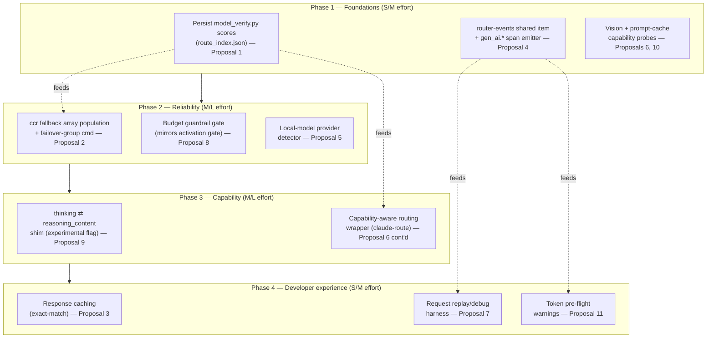

# New Features & Technologies — Game-Changing Capabilities for the Claude Multi-Account Toolkit

**Research date:** 2026-07-19. **Method:** (1) read the toolkit's own source to establish a factual baseline —
`scripts/lib.sh`, `scripts/claude-providers.sh`, `scripts/providers_resolve.py`, `scripts/model_verify.py`,
`scripts/providers-verify.sh`, `scripts/providers-semantic.sh`, `scripts/verify_superpowers_tui.sh`,
`scripts/proxy/{kimi,poe,sarvam}_proxy.py`, `scripts/opencode_sync.py`, `scripts/claude-sync-state.sh`,
`docs/CONTINUATION.md`, `docs/diagrams/provider-aliases.md`; (2) web research (WebSearch/WebFetch) on the
Anthropic Messages API surface, claude-code-router (ccr), competing multi-provider gateways, local inference
servers, and observability standards. Every external claim below carries a citation with retrieval date
2026-07-19 unless marked **UNVERIFIED**. Every code sketch references real functions/files in this repo as of
commit `245ed80` (v1.19.0).

---

## 1. Baseline — what this toolkit already does

Nothing below is proposed as new; it is the factual starting point every proposal in §3 must be judged against.

| Capability | Where (file:function) | What it actually does today |
|---|---|---|
| Dynamic provider discovery | `scripts/providers_resolve.py:resolve()` | Classifies each API-key env-var name (llm/vcs/infra) via regex, maps it to a models.dev provider id via `providers/key-aliases.json` or the catalog's own `env` array, and picks strong/fast models with a **fixed, non-runtime** heuristic in `select_models()`: strong = `(reasoning, release_date, context, output_cost)` tuple-max; fast = lowest `cost.input` among tool-calling models. This choice is made once, at alias-creation time, and never re-evaluated against live latency or cost. |
| Alias creation (single + multi) | `scripts/claude-providers.sh:cmd_sync`, `cmd_sync_multi` + `scripts/providers_generate.py` | `cmd_sync` makes exactly one alias per resolved provider. `cmd_sync_multi` (`--multi`) calls `scripts/model_verify.py` to score **every** model in a provider's catalog entry and emits up to `--max-aliases` paired strong/fast aliases above `--min-score`. |
| Per-model scoring (already measures latency!) | `scripts/model_verify.py:verify_model()` | For every candidate model it records `latency_ms`, `capabilities.{chat,tool_call,reasoning,streaming}`, and a 0–100 `score` (`WEIGHT_EXISTENCE=25, WEIGHT_TOOL_CALL=20, WEIGHT_REASONING=15, WEIGHT_STREAMING=10, WEIGHT_LATENCY=10` — full latency credit under 2s, half under 5s). **This data is discarded after `cmd_sync_multi` finishes** — it is never persisted for runtime routing decisions and `capabilities` has no `vision` field. |
| 4-layer verification pipeline | `scripts/providers-verify.sh` (existence sentinel + tool-call probes), `scripts/providers-semantic.sh` (LLMsVerifier `semantic-code-visibility`, 2-round sentinel+judge), `scripts/verify_superpowers_tui.sh` (live Claude Code + `/using-superpowers`) | Definitive rejections (400/401/402/403/404/412, missing sentinel, no tool call) fail the alias outright; transient conditions (429/5xx/timeout) mark it `unverified` (created but gated). See `docs/diagrams/provider-aliases.md` §3 for the state diagram this doc extends. |
| Activation gate | `scripts/lib.sh:cma_run_provider` (~line 635–652) | Reads `~/.local/share/claude-multi-account/providers/status.json` (`cma_status_read`/`cma_status_write`, schema `{status, model, checked_at, failing_layer}`) and refuses to launch a non-`verified` alias unless `--force`. |
| Token-limit guards | `scripts/lib.sh:cma_run_provider` (~line 700–784) | Exports `CLAUDE_CODE_AUTO_COMPACT_WINDOW` from `CMA_PROVIDER_CONTEXT_LIMIT` (capped ≤200K unless `CMA_AUTO_COMPACT_CAP` overrides) and `CLAUDE_CODE_MAX_OUTPUT_TOKENS` from `CMA_PROVIDER_MAX_OUTPUT` (clamped ≤128000) for **both** transports. Both values trace back to `models.dev`'s `limit.context`/`limit.output` via `select_models()`. |
| Compatibility proxies | `scripts/proxy/kimi_proxy.py`, `poe_proxy.py`, `sarvam_proxy.py`, launched by `cma_run_provider` (~line 869–929) | Each fixes one real incompatibility class: kimi normalizes `$ref`/`$defs` to the moonshot flavor **and strips `cache_control`** (`strip_cache_control`); poe caps tool count at ~200 (Poe's undocumented ~216-tool limit) and resolves `$ref`s; sarvam flattens content-block arrays to plain strings and clamps `max_tokens` to the account tier. Discovery is `<id>_proxy.py` → `<base-id>_proxy.py` → `<family>_proxy.py` (e.g. every `kimi-*` alias shares `kimi_proxy.py`), with a port-squatter guard that verifies *this* process owns the bound port before trusting it. |
| Router transport (ccr) | `scripts/lib.sh:cma_run_provider` (~line 825–952) | For `transport=router` aliases, upserts **exactly one** entry into `~/.claude-code-router/config.json`'s `.Providers` array (`{name, api_base_url, api_key, models:[strong,fast], transformer:{use:["cleancache","streamoptions"]}}`), sets `.Router.default = "<id>,<strong>"` and `.Router.background = "<id>,<fast>"`, restarts ccr, then runs `ccr default-claude-code -- "$@"`. **ccr's own `fallback` object and `think`/`longContext`/`webSearch` Router keys are never populated** — see §2.2 and Proposal 1/2. |
| Session/memory unification | `scripts/lib.sh:CMA_SHARED_ITEMS` (line 1059), `cma_link_shared_items`, `claude-sync-state.sh` | `CMA_SHARED_ITEMS` = `projects todos tasks plans file-history paste-cache shell-snapshots session-env telemetry sessions backups cache plugins stats-cache.json history.jsonl CLAUDE.md daemon jobs`. Every provider/account dir symlinks these into `$SHARED_DIR`. `claude-sync-state.sh pull\|push` does a fast `jq`-only merge of every account's `.claude.json` on every launch/exit (no rsync); `claude-unify.sh` does the heavy one-shot two-pass rsync merge. **`telemetry` is already a shared, unioned directory (`claude-unify.sh:58`) but nothing in the toolkit writes proxy-side or router-side events into it today** — it currently only carries Claude Code's own client telemetry. |
| Cross-alias continuity | `cma_union_rosters` (lib.sh:1132), `cma_migrate_daemon_dirs_once` (lib.sh:1162), `_cma_session_flags` (lib.sh:791+) | `daemon`/`jobs` (Claude Code's background-agent registry) are shared with a newest-`updatedAt`-wins union merge; `claude-session existing-id` injects `--resume` for a session that genuinely exists, for both transports. |
| Local PATH-detected provider (today, one product) | `scripts/claude-providers.sh:detect_helixagent_record` | Gates on `command -v helixagent` **or** a tracked `providers/helixagent.json` pins file, enumerates served models from the *live* `GET {base}/models` endpoint (never hardcoded), and emits a `resolved`-shaped record that flows through the exact same env/alias/verify loop as every cloud provider. **This is already the local-inference pattern the toolkit needs — it is just hardwired to one product, not any OpenAI-compatible server.** See Proposal 5. |
| Kimi Code OAuth | `detect_kimicode_record` (claude-providers.sh:300) | 15-minute-token subscription auth; per-alias `.token` snapshot + live-credentials-first refresh order in `cma_run_provider`. |
| OpenCode sync | `scripts/opencode_sync.py:scan/extract_servers/build_mcp` | Additive, idempotent translation of Claude plugin `skills/` + `.mcp.json` servers + `$SHARED_DIR/CLAUDE.md` into `opencode.json`; enable policy defaults to a curated allowlist (`DEFAULT_ALLOWLIST`) because OpenCode connects to every enabled MCP at startup. |

**Net read:** the toolkit already has the *scaffolding* for cost/latency-aware routing (`model_verify.py` measures latency and scores it), for failover (ccr's own config format supports a `fallback` array), for a local provider (the `detect_helixagent_record` pattern generalizes trivially), and for observability (a shared, unioned `telemetry` directory already exists). None of these are wired up. That reframes the "10 game-changing features" below from *net-new subsystems* into mostly *finishing what's already half-built*, which is a materially smaller lift than building from zero — and is reflected in the effort ratings.

---

## 2. External landscape

### 2.1 Anthropic Messages API feature surface

| Feature | Mechanism | Relevance to a provider-alias proxy | Source |
|---|---|---|---|
| Streaming | SSE `content_block_delta` events | ccr's job by definition (native ↔ OpenAI SSE translation); already works via the router transport. | [Messages API docs](https://platform.claude.com/docs/en/api/messages), retrieved 2026-07-19 |
| Prompt caching | `cache_control:{type:"ephemeral", ttl:"5m"\|"1h"}` on content blocks; reads cost ~10% of base input; max 4 breakpoints/request; min 1024–4096 cacheable tokens depending on model; **thinking blocks can't carry `cache_control` directly**; changing tool defs/`tool_choice`/thinking params invalidates the cache | `kimi_proxy.py` **actively strips** `cache_control` today (`strip_cache_control`) — a router alias never gets a cache discount even when the upstream would honor the field. Most OpenAI-compatible backends simply ignore an unknown `cache_control` key rather than erroring, so passthrough is usually safe but silently wasted unless the backend implements its own prefix cache. | [Prompt caching docs](https://platform.claude.com/docs/en/build-with-claude/prompt-caching), retrieved 2026-07-19 |
| Extended thinking | Request `thinking:{type:"enabled", budget_tokens:N}`; response `thinking` content blocks with a `signature`; interleaved thinking (`interleaved-thinking-2025-05-14` beta or automatic on newer models) requires the **exact unmodified thinking block** to be replayed on the next turn; **Claude-specific, not part of the OpenAI schema** — Bedrock/Vertex/third-party backends may not expose it at all | No provider alias in this toolkit emits Anthropic `thinking` blocks — OpenAI-compatible reasoning models instead return a sibling `reasoning_content` field (DeepSeek, Qwen/DashScope, vLLM's `reasoning_outputs` feature). These are **not the same wire shape**; Claude Code (talking Anthropic-native) never sees the reasoning tokens from a router-transport alias today. See Proposal 9. | [Extended thinking docs](https://platform.claude.com/docs/en/build-with-claude/extended-thinking), retrieved 2026-07-19; [DeepSeek reasoning_content](https://api-docs.deepseek.com/guides/reasoning_model), [vLLM reasoning outputs](https://docs.vllm.ai/en/latest/features/reasoning_outputs.html), retrieved 2026-07-19 |
| Tool use | `tools`/`tool_choice`, `tool_use`/`tool_result` blocks | Already the single hardest-verified surface in this toolkit — `providers-verify.sh` treats a missing tool call as a definitive `failed`, and `poe_proxy.py`/`kimi_proxy.py` exist purely to make foreign tool-schema flavors pass. | — |
| Batch API | `POST /v1/messages/batches`, 50% cost discount, async | No provider alias here uses it — every alias is an interactive Claude Code session. Genuinely out of scope for this toolkit's use case (interactive coding sessions, not bulk offline scoring). | [Messages API docs](https://platform.claude.com/docs/en/api/messages), retrieved 2026-07-19 |
| Token counting | `POST /v1/messages/count_tokens` | No equivalent exists for arbitrary OpenAI-compatible backends; the toolkit's `CLAUDE_CODE_AUTO_COMPACT_WINDOW` guard is a static ceiling from catalog metadata, not a live pre-flight count. See Proposal 11. | [Messages API docs](https://platform.claude.com/docs/en/api/messages), retrieved 2026-07-19 |
| Vision (image content blocks) | `content:[{type:"image", source:{...}}]` | `providers_resolve.py` and `model_verify.py` never test or record multimodal support — an alias could be text-only and nothing detects it until a real vision request 400s mid-session. See Proposal 6. | — |
| MCP connector (server-side) | `mcp_servers` param on `/v1/messages`, beta header `mcp-client-2025-11-20` | This is a **different** MCP integration point than Claude Code's own client-side MCP (which the toolkit already handles uniformly via `.mcp.json` + `opencode_sync.py`). The server-side connector lets Claude itself call remote MCP tools without a local client loop — not currently used or needed by this toolkit, and almost certainly unsupported by any non-Anthropic backend's "Anthropic-compatible" shim. Worth a parity-matrix row, not a feature. | [MCP connector docs](https://platform.claude.com/docs/en/agents-and-tools/mcp-connector), retrieved 2026-07-19 |

### 2.2 claude-code-router (ccr) — what upstream already provides that this toolkit doesn't use

CCR is "a local control plane for every AI agent: route across models, fuse new capabilities, orchestrate
tools, and stay fully in control" — a standalone gateway that Claude Code talks to via `ANTHROPIC_BASE_URL`,
which translates Anthropic ⇄ OpenAI/Gemini/etc. via a pluggable **Transformer** interface
([GitHub README](https://github.com/musistudio/claude-code-router), retrieved 2026-07-19). Beyond routing it
already ships:

- **Ordered fallback targets** at the config level — `Router.default/background/think/longContext/webSearch`
  select a *primary* `"provider,model"` string per traffic class, and a sibling top-level `fallback` object
  supplies an **array** of `"provider,model"` backups per class, tried sequentially on HTTP failure until one
  succeeds (schema below; cross-referenced against the toolkit's own `Router.default`/`Router.background`
  field names in `lib.sh:938-944`, which use the identical `"name,model"` string format) —
  [Fallback Mechanisms — DeepWiki](https://deepwiki.com/musistudio/claude-code-router/6.8-fallback-mechanisms),
  [Routing Configuration](https://musistudio.github.io/claude-code-router/docs/server/config/routing/),
  retrieved 2026-07-19 (config shape cross-checked, not a verbatim primary-source fetch — mark exact HTTP-failure
  trigger conditions **UNVERIFIED** pending a direct ccr source read):

  ```json
  {
    "Router": {
      "default": "deepseek,deepseek-chat",
      "background": "ollama,qwen2.5-coder:latest",
      "think": "deepseek,deepseek-reasoner",
      "longContext": "openrouter,google/gemini-2.5-pro-preview",
      "longContextThreshold": 60000,
      "webSearch": "gemini,gemini-2.5-flash"
    },
    "fallback": {
      "default": ["aihubmix,Z/glm-4.5", "openrouter,anthropic/claude-sonnet-4"],
      "background": ["ollama,qwen2.5-coder:latest"]
    }
  }
  ```

- **Credential pools with rotation**, **request logs with latency/token/estimated-cost fields**, and a
  **dashboard tray UI** — i.e. ccr already has a primitive cost/latency observability layer sitting one HTTP
  hop away from every router-transport alias, unused by `cma_run_provider` today.
- **No documented cost-based routing policy, response caching, or local-model-specific onboarding** beyond
  "custom OpenAI/Anthropic/Gemini-compatible endpoints" (which covers Ollama/vLLM/llama.cpp only if the operator
  configures them by hand — no auto-detection).

The toolkit's `cma_run_provider` upsert (`lib.sh:930-951`) always writes **one** `.Providers` entry and
overwrites `.Router.default`/`.Router.background` wholesale on every launch. It never touches `.fallback`,
`.Router.think`, or `.Router.longContext`. Proposals 1 and 2 close exactly this gap using ccr's *existing*
mechanism — no new routing engine needs to be built.

### 2.3 Competing multi-provider gateways

| | This toolkit | LiteLLM | OpenRouter | Portkey | Helicone |
|---|---|---|---|---|---|
| Primary unit | Shell alias → real Claude Code CLI session, one account/provider per launch | Proxy/SDK, OpenAI-compatible endpoint | Hosted unified API, 400+ models | Gateway (OSS core, Apache 2.0 since March 2026) + managed platform | Proxy or logging sidecar |
| Multi-account session/memory unification | **Yes — unique.** `.claude.json`, `history.jsonl`, `daemon/jobs`, plugins all merged across N accounts + M provider aliases | No (stateless proxy) | No | No | No |
| Cost tracking | None (proposed, §3.8) | Per-request token+cost logging, per-key/team budgets with pre-flight rejection | Pay-as-you-go passthrough, no markup, 5.5% credit fee | Budget/spend controls | Cost attribution by user/feature |
| Fallback/failover | ccr's array exists upstream, unused (§2.2) | Automatic retry-then-fallback across configured model groups | `openrouter/auto-beta` spend-share ranked auto-router + `cost_quality_tradeoff` 0–10 dial | Conditional routing + loadbalance strategies | Pairs with LiteLLM for routing; not its focus |
| Response caching | None (proposed, §3.3) | Redis exact-match + semantic (vector similarity), 30–60% cost cut reported | Not a core feature | Cache strategies available | Built-in caching |
| Observability/tracing | `telemetry` shared dir exists, unused (§3.4) | Admin dashboard, PostgreSQL cost store | Basic usage dashboard | Guardrails/PII/jailbreak detection + audit trails | **Best-in-class**: per-request logs, latency breakdowns, prompt A/B testing, MIT-licensed, 100K req/month free |
| Local model support | `detect_helixagent_record` pattern exists for one product (§1); generalizes (§3.5) | VLLM/HuggingFace/Ollama listed as supported backends | No (hosted only) | Via custom endpoints | Via custom endpoints |
| 4-layer live verification before activation | **Yes — unique.** Existence+tool-call+semantic-code-visibility+live-TUI gate | No (assumes configured endpoints work) | No | No | No |
| Deployment | Runs on the developer's own machine, wraps a real CLI | Self-hosted or managed | Fully hosted/managed | OSS self-hosted or managed | Self-hosted (MIT) or managed |

Sources: [LiteLLM GitHub](https://github.com/BerriAI/litellm), [LiteLLM proxy docs](https://docs.litellm.ai/docs/routing-load-balancing), [LLM Gateway 2026 comparison — Klymentiev](https://klymentiev.com/blog/llm-gateway-guide), [Best LLM gateways 2026 — Braintrust](https://www.braintrust.dev/articles/best-llm-gateways-2026), [OpenRouter model routing docs](https://openrouter.ai/docs/features/model-routing), all retrieved 2026-07-19.

**Where this toolkit is structurally different, not just feature-behind:** every competitor above is a stateless
API gateway. This toolkit's actual differentiator — N Claude Code accounts + M provider aliases sharing one
memory/session/plugin substrate — is not something any of them attempt, because none of them wrap a stateful
CLI tool. The proposals below deliberately import gateway-layer *ideas* (routing, caching, tracing, budgets)
without discarding that differentiator.

### 2.4 Local inference as a provider (llama.cpp / vLLM / Ollama)

All three now expose an OpenAI-compatible `/v1/chat/completions` surface: `llama-server` on
`http://localhost:8080`, `vllm serve <model> --port 8000`, Ollama on `localhost:11434/v1`
([Red Hat: llama.cpp vs vLLM](https://developers.redhat.com/articles/2026/06/15/llamacpp-vs-vllm-choosing-right-local-llm-inference-engine),
[d-central comparison](https://d-central.tech/ollama-vs-vllm-vs-llama-cpp/), retrieved 2026-07-19). Relevant
asymmetries for this toolkit's tool-calling-is-mandatory gate:

- Tool-calling and reasoning-content support vary by server *and* by loaded model — vLLM documents an explicit
  `reasoning_content` delta field on streaming chunks and a `thinking_token_budget` cutoff mechanism; Ollama's
  and llama.cpp's tool-call support depends on the loaded GGUF's chat template
  ([vLLM reasoning outputs](https://docs.vllm.ai/en/latest/features/reasoning_outputs.html), retrieved 2026-07-19).
- Concurrency behavior differs sharply: vLLM sustains sub-100ms P99 under 128 concurrent requests; Ollama
  processes sequentially and degrades from ~2s to 45s+ latency under 5 concurrent requests
  ([d-central](https://d-central.tech/ollama-vs-vllm-vs-llama-cpp/), retrieved 2026-07-19) — directly relevant
  if a local alias is ever included in a fallback chain (Proposal 2) or a background/`think` route (§2.2),
  since a slow local fallback under load could make things *worse*, not better.
- None of the three publish to models.dev, so `providers_resolve.py`'s catalog-driven resolution cannot see
  them — exactly the constraint `detect_helixagent_record` was built to route around for HelixAgent, by
  enumerating models from the server's own live `/v1/models` instead of a static catalog.

### 2.5 Observability standard: OpenTelemetry GenAI semantic conventions

CNCF-backed, versioned; the November-2026-era spec (v1.38.0) has already **deprecated and removed**
`gen_ai.prompt`/`gen_ai.completion`, replacing them with `gen_ai.input.messages`/`gen_ai.output.messages` plus
`gen_ai.system_instructions`; the request/response fields any router-transport proxy should emit are
`gen_ai.request.model`, `gen_ai.provider.name`, `gen_ai.usage.input_tokens`/`output_tokens`,
`gen_ai.response.finish_reasons`, and `gen_ai.operation.name` (e.g. `chat`, `tool_call`)
([OpenTelemetry GenAI observability blog](https://opentelemetry.io/blog/2026/genai-observability/),
[traceloop semconv docs](https://www.traceloop.com/docs/openllmetry/contributing/semantic-conventions),
[openllmetry deprecation issue #3515](https://github.com/traceloop/openllmetry/issues/3515), retrieved
2026-07-19). Building against the *current* attribute names avoids the exact churn that issue documents.

### 2.6 Response caching approaches

Exact-match caching (hash the normalized request → look up a stored response) has zero correctness risk but a
low hit rate for natural-language variance; semantic caching (embed the query, retrieve by cosine similarity)
raises hit rate but introduces a measured 1–15% false-hit rate depending on the similarity threshold, plus
static per-domain threshold tuning and no support for partial invalidation when underlying docs change
([GPTCache docs](https://gptcache.readthedocs.io/en/latest/), [arXiv:2603.03301](https://arxiv.org/html/2603.03301v1),
retrieved 2026-07-19). For an interactive coding-agent session (this toolkit's actual workload), most requests
carry a fast-growing, mostly-unique conversation history — exact-match on a normalized request hash is the only
approach with acceptable risk; semantic caching's correctness risk is not worth taking for code-editing turns
where a near-miss cached response is actively harmful. Proposal 3 is scoped to exact-match only for this reason.

### 2.7 Request replay / debugging patterns

Helicone operates purely as a proxy layer (single endpoint swap) giving request logging, cost tracking, and
caching "out of the box"; LangSmith and Laminar go further, letting a developer reopen a captured trace/span
and re-run it with the *same* model/tool/prompt context for rapid iteration
([Helicone debugging guide](https://www.helicone.ai/blog/complete-guide-to-debugging-llm-applications),
[Laminar vs Langfuse vs LangSmith](https://laminar.sh/blog/2026-01-29-laminar-vs-langfuse-vs-langsmith-llm-observability-compared),
retrieved 2026-07-19). The pattern that transfers cleanly to this toolkit is capture-to-disk + replay-via-curl,
not a hosted trace UI — consistent with the toolkit's fully local, no-SaaS-dependency posture.

---

## 3. Feature proposals

Each proposal states what already exists (so it is not double-counted from §1), the gap, the design, and a
code sketch against real functions in this repo.

### 3.1 Cost & latency-aware routing

**Problem.** `select_models()` in `providers_resolve.py` picks the strong/fast model once, from static catalog
metadata, and never again. `model_verify.py --multi` *does* measure live `latency_ms` per model but the number
is thrown away once `cmd_sync_multi` finishes generating aliases (`scripts/claude-providers.sh:761-787`).
There is no way to ask "which of my 5 verified aliases is currently fastest/cheapest for this task."

**Solution.** Persist a routing index alongside the existing status cache, and use it to populate ccr's
*already-existing* `Router`/`fallback` fields (§2.2) with more than one entry, ranked.

**Why it matters.** This is the single highest-leverage item: it reuses data the toolkit already computes
(`verify_model()`'s `score`/`latency_ms`) and a config surface ccr already implements — no new routing engine.

**Technical design.**

```python
# scripts/providers_route_index.py (new) — builds a durable index from model_verify.py's
# per-alias score/latency, read by cma_run_provider before the ccr upsert.
# Consumes: <providers_dir>/<id>_verified.json (already written by cmd_sync_multi,
# model_verify.py:save_cache) + status.json (cma_status_read).
import json, sys

def build_index(providers_dir):
    index = {}
    for f in Path(providers_dir).glob("*_verified.json"):
        data = json.load(open(f))
        for m in data.get("models", []):           # verify_model() result shape
            if not m["verified"]:
                continue
            index.setdefault(data["provider_id"], []).append(
                {"model": m["model_id"], "score": m["score"], "latency_ms": m["latency_ms"]})
    for pid in index:
        index[pid].sort(key=lambda r: (-r["score"], r["latency_ms"]))
    json.dump(index, open(f"{providers_dir}/route_index.json", "w"), indent=2)
```

In `lib.sh:cma_run_provider`, before the existing `.Router.default = ($n + "," + $s)` line (~944), rank
*every currently-`verified`* alias sharing the requested tier (strong/fast) by the index and emit a real
`fallback.default` array instead of nothing:

```bash
# lib.sh — extends the existing jq upsert at line 938-944
route_json="$(cat "$pdir/route_index.json" 2>/dev/null || echo '{}')"
jq --arg n "$CMA_PROVIDER_ID" --arg u "$base" --arg s "$CMA_PROVIDER_MODEL" \
   --arg f "${CMA_PROVIDER_FAST_MODEL:-$CMA_PROVIDER_MODEL}" --argjson idx "$route_json" \
   --slurpfile status "$pdir/status.json" '
  .Providers = ([.Providers[]? | select(.name != $n)] + [{name:$n, api_base_url:$u, api_key:$ENV.CMA_TOK, models:[$s,$f], transformer:{use:["cleancache","streamoptions"]}}])
  | .Router.default = ($n + "," + $s)
  | .fallback.default = [
      ($status[0] | to_entries[] | select(.value.status=="verified" and .key != $n) | .key + "," + .value.model)
    ]
' "$cfg" >| "$tmp"
```

Add `claude-providers show <id> --route` to print the ranked index for operator visibility.

**Risks.** Ranking by a stale cached `score`/`latency_ms` (computed once at `--multi` sync time) can drift from
current provider health; must re-run `sync --multi` periodically or fold in `status.json`'s `checked_at` age as
a staleness signal. **Effort: M.** **Dependencies:** none beyond existing files; purely additive.

### 3.2 Automatic cross-provider failover

**Problem.** A single alias's provider having an outage (rate limit, 5xx, key suspension) currently means the
session just fails — there is no cross-*provider* fallback, only ccr's per-request retry within one provider.

**Solution.** A `claude-providers failover-group <name> <id1> <id2> ...` subcommand that writes
`fallback.default`/`fallback.background` arrays (the real ccr field from §2.2) from a named list of already
`verified` aliases, in the order given (or ranked by Proposal 1's index when no explicit order is given).

**Why it matters.** Closes the reliability gap the toolkit's own `CONTINUATION.md` implicitly documents (11 of
the tracked providers are routinely down for account-side reasons — expired keys, suspended accounts — per the
programme's own status notes) with a mechanism ccr already implements, at essentially zero new surface area.

**Technical design.**

```bash
# scripts/claude-providers.sh — new subcommand, alongside cmd_verify/cmd_remove
cmd_failover_group() {
  local name="${1:-default}"; shift
  local ids=("$@")
  [[ ${#ids[@]} -ge 1 ]] || cma_die "usage: claude-providers failover-group NAME ID [ID...]"
  local cfg="$HOME/.claude-code-router/config.json" chain="[]"
  for id in "${ids[@]}"; do
    [[ "$(cma_status_read "$id")" == "verified" ]] || { cma_warn "skip $id (not verified)"; continue; }
    local model; model="$(jq -r '.CMA_PROVIDER_MODEL' <(grep CMA_PROVIDER_MODEL "$(cma_providers_dir)/$id.env" | sed "s/^/{\"CMA_PROVIDER_MODEL\":/;s/\$/}/" 2>/dev/null) 2>/dev/null)"
    chain="$(jq --arg e "$id,$model" '. + [$e]' <<<"$chain")"
  done
  jq --arg n "$name" --argjson c "$chain" '.fallback[$n] = $c' "$cfg" > "${cfg}.tmp" && mv "${cfg}.tmp" "$cfg"
  cma_log "failover group '$name': $chain"
}
```

**Risks.** ccr's exact HTTP-failure-triggers-fallback semantics are cited from secondary sources (§2.2) and
should be confirmed against a live ccr instance before this ships (mark **UNVERIFIED** until then — the plan
in §5 Phase 2 includes a live-verification task mirroring `verify_providers_live.sh`'s existing pattern). A
fallback that silently swaps providers mid-session could change tool-schema behavior — mitigate by only
including aliases that passed the *same* verification tier (all `verified`, not mixing `verified`+`unverified`).
**Effort: M.** **Dependencies:** ccr's `fallback` config semantics (verify live before relying on it in prod).

### 3.3 Response caching (exact-match)

**Problem.** No caching layer exists anywhere in the request path; every identical retry (common in agentic
loops — e.g. a failed tool call retried verbatim) is a full-price, full-latency round trip.

**Solution.** A new sibling proxy, `scripts/proxy/cache_proxy.py`, following the exact discovery convention
`kimi_proxy.py`/`poe_proxy.py`/`sarvam_proxy.py` already use (`<id>_proxy.py`/`<family>_proxy.py`,
`lib.sh:882-889`), chainable *in front of* an existing compat proxy. Per §2.6, exact-match only.

**Why it matters.** Directly cuts cost and latency for the highest-frequency waste case (repeated identical
requests within a session) without semantic caching's correctness risk on code-editing turns.

**Technical design.**

```python
# scripts/proxy/cache_proxy.py (new) — mirrors kimi_proxy.py's HTTPServer/ProxyHandler shape.
import hashlib, json, os, time
from http.server import HTTPServer, BaseHTTPRequestHandler
CACHE_DIR = os.environ.get("CMA_CACHE_DIR", os.path.expanduser("~/.claude-shared/cache/responses"))
TTL = int(os.environ.get("CMA_CACHE_TTL_S", "300"))  # 5 min default, matches Anthropic's own ephemeral TTL

def cache_key(body):
    # Exclude fields that legitimately vary run-to-run without changing intent (none today —
    # deliberately conservative: model+messages+tools, byte-exact, per §2.6's risk analysis).
    canon = json.dumps({"model": body.get("model"), "messages": body.get("messages"),
                         "tools": body.get("tools")}, sort_keys=True)
    return hashlib.sha256(canon.encode()).hexdigest()

class CacheHandler(BaseHTTPRequestHandler):
    upstream = None
    def do_POST(self):
        raw = self.rfile.read(int(self.headers.get("Content-Length", 0)))
        body = json.loads(raw)
        if body.get("stream"):                       # never cache streamed responses
            return self._forward(raw)
        key = cache_key(body)
        path = os.path.join(CACHE_DIR, key[:2], key + ".json")
        if os.path.exists(path) and time.time() - os.path.getmtime(path) < TTL:
            cached = open(path, "rb").read()
            self.send_response(200); self.send_header("Content-Type", "application/json")
            self.send_header("X-Cma-Cache", "HIT"); self.end_headers(); self.wfile.write(cached)
            return
        resp_body = self._forward(raw, return_body=True)
        os.makedirs(os.path.dirname(path), exist_ok=True)
        open(path, "wb").write(resp_body)
```

`cma_run_provider` gains `CMA_PROVIDER_CACHE=1` in the generated `.env` (opt-in per alias via
`cma_provider_write_env`, a new trailing field) so caching is never silently on for aliases where staleness is
unacceptable (e.g. anything driving a live tool result).

**Risks.** A cached tool-call response replaying a stale `tool_use_id` could desync Claude Code's turn state
if the cache TTL outlives the conversation's tool-result matching window — mitigate with the aggressive 300s
default TTL (same order as Anthropic's own ephemeral cache) and never caching when `stream:true` (the common
case for interactive sessions — this materially limits real-world hit rate and should be sized accordingly).
**Effort: M.** **Dependencies:** none.

### 3.4 OpenTelemetry GenAI tracing

**Problem.** The `telemetry` shared item (§1) exists in every provider dir but nothing writes proxy-side or
router-side spans into it — there is no way to see latency/cost/error-rate trends across accounts+providers
without grepping proof-test logs by hand.

**Solution.** A lightweight span emitter, following the current (non-deprecated, §2.5) GenAI semantic
convention, written by the compat proxies and by `cma_run_provider` itself. Local-file exporter by default (no
mandatory external collector — keeps the toolkit's no-SaaS-dependency posture), OTLP export opt-in.

**Why it matters.** Turns "which of my providers is actually reliable this week" from an anecdotal question
into a queryable one, using a vendor-neutral schema so any OTel-consuming tool (Datadog, Grafana, Helicone)
can ingest it later without toolkit changes.

**Technical design.**

```python
# scripts/proxy/_gen_ai_span.py (new, imported by every proxy) — file-exporter, current semconv names only.
import json, os, time, uuid
SPANS_DIR = os.environ.get("CMA_GENAI_SPANS_DIR", os.path.expanduser("~/.claude-shared/router-events"))

def emit_span(provider_id, model, request_body, response_body, status_code, latency_ms):
    span = {
        "trace_id": uuid.uuid4().hex, "gen_ai.operation.name": "chat",
        "gen_ai.provider.name": provider_id, "gen_ai.request.model": model,
        "gen_ai.usage.input_tokens": (response_body or {}).get("usage", {}).get("prompt_tokens"),
        "gen_ai.usage.output_tokens": (response_body or {}).get("usage", {}).get("completion_tokens"),
        "gen_ai.response.finish_reasons": [c.get("finish_reason") for c in (response_body or {}).get("choices", [])],
        "http.response.status_code": status_code, "latency_ms": latency_ms,
        "timestamp": time.time(),
    }
    os.makedirs(SPANS_DIR, exist_ok=True)
    with open(os.path.join(SPANS_DIR, f"{provider_id}.jsonl"), "a") as f:
        f.write(json.dumps(span) + "\n")
```

Deliberately **not** `gen_ai.input.messages`/`gen_ai.output.messages` by default (full message bodies) — those
carry the user's actual code and prompts; opt-in only via `CMA_GENAI_CAPTURE_CONTENT=1`, feeding Proposal 7's
replay use case.

Add `router-events` as a **new**, separate `CMA_SHARED_ITEM` (not reusing `telemetry`, which is Claude Code's
own internal item and merged by `claude-unify.sh`'s generic directory strategy — conflating the two invites a
naming collision with upstream Claude Code behavior).

**Risks.** Unbounded `.jsonl` growth — needs rotation (size or age cutoff) before this ships; opt-in
content capture must be **loud** about the privacy implication (prompts/code leaving the process boundary onto
disk, even locally). **Effort: S–M.** **Dependencies:** none.

### 3.5 Local-model provider (llama.cpp / vLLM / Ollama)

**Problem.** `detect_helixagent_record` (§1) proves the exact pattern needed — PATH/pins-gated, live
`/v1/models` enumeration, zero hardcoding — but it is coupled to one product's env-var names and defaults.

**Solution.** Generalize it into `detect_local_openai_record()`, parametrized the same way, reusable for any
`llama-server`/`vllm serve`/`ollama serve` instance, each getting its own `CMA_LOCAL_<NAME>_*` pin block (same
precedence rule as `providers/helixagent.json`: process-env > pins-file > built-in default).

**Why it matters.** Zero-cost, zero-latency, zero-account-risk aliases for local development and for the
"cheap fast tier" leg of Proposal 1/2's fallback chains — a local model is the only "provider" that can never
hit a rate limit or a billing suspension (the single largest cause of the toolkit's own tracked provider
failures per `CONTINUATION.md`).

**Technical design.**

```bash
# scripts/claude-providers.sh — generalizes detect_helixagent_record (line 178-292) into a
# reusable helper parametrized by name/port/keyvar, called once per configured local server.
detect_local_openai_record() {
  local name="$1" host="${2:-localhost}" port="$3" keyvar="${4:-}"
  local base="http://${host}:${port}/v1"
  command -v curl >/dev/null 2>&1 || { printf '[]\n'; return 0; }
  local ids; ids="$(curl -s --max-time 3 "${base%/}/models" 2>/dev/null | jq -r '.data[]?.id? // empty' 2>/dev/null)"
  [[ -n "$ids" ]] || { printf '[]\n'; return 0; }   # server not running: honest empty, no alias created
  local strong fast; strong="$(head -n1 <<<"$ids")"; fast="$(sed -n '2p' <<<"$ids")"; fast="${fast:-$strong}"
  jq -cn --arg pid "$name" --arg base "$base" --arg s "$strong" --arg f "$fast" \
    --arg reason "local OpenAI-compatible server detected on port $port" \
    '[{key_var:"", classification:"llm", provider_id:$pid, alias:$pid, base_url:$base,
       transport:"router", strong_model:$s, fast_model:$f, context_limit:null, max_output:null,
       status:"resolved", reason:$reason}]'
}
# Wired into resolve_records() (line 372) exactly like detect_helixagent_record/detect_kimicode_record —
# operator opts in via CMA_LOCAL_SERVERS="llama:8080 vllm:8000 ollama:11434" (name:port pairs).
```

Local aliases should be exempted from the layer-3 semantic-judge step (`providers-semantic.sh`) by default —
running a full sentinel+judge round-trip against a laptop's own GPU on every sync is wasted latency for a
same-machine server whose code-visibility is not in question the same way a third-party cloud endpoint's is —
but layer-1/2 (existence + tool-call) still gate activation, since a loaded GGUF's chat template genuinely may
not support tool calling (§2.4).

**Risks.** A local server's tool-call/reasoning-content behavior is template-dependent, not provider-dependent
(§2.4) — verification must re-run whenever the operator swaps the loaded model, which today only happens on
`claude-providers sync`. Concurrency/latency degradation under load (Ollama's documented sequential-queueing
falloff, §2.4) makes a local alias a poor "first" entry in a fallback chain under heavy parallel background-agent
use. **Effort: S.** **Dependencies:** none (the pattern already exists; this is refactor + generalize).

### 3.6 Capability-based routing (vision-capable providers)

**Problem.** `model_verify.py`'s `capabilities` dict (`chat`, `tool_call`, `reasoning`, `streaming`,
`context_window`, `output_tokens`) has **no `vision` field**, and `select_models()` in `providers_resolve.py`
never considers modality. An alias can be silently text-only.

**Solution.** Add a `test_vision()` probe (a 1x1 PNG data-URI content block) to `verify_model()`, persist
`capabilities.vision` in the same `_verified.json` this toolkit already writes, and expose it via
`claude-providers show <id> --capabilities`.

**Why it matters.** Directly named as a priority in this research's brief; the gap is precisely located (one
missing dict key + one missing probe) rather than requiring new infrastructure — models.dev's own catalog
already carries a `modalities` field per model that `select_models()` could also consult as a cheap first pass
before the live probe.

**Technical design.**

```python
# scripts/model_verify.py — new probe, called from verify_model() alongside test_tool_calling/test_streaming
def test_vision(model_id, endpoint, api_key, timeout):
    PIXEL_PNG_B64 = "iVBORw0KGgoAAAANSUhEUgAAAAEAAAABCAQAAAC1HAwCAAAAC0lEQVR42mNk+A8AAQUBAScY42YAAAAASUVORK5CYII="
    body = {
        "model": model_id, "max_tokens": 16,
        "messages": [{"role": "user", "content": [
            {"type": "text", "text": "Reply with exactly: VISION_OK"},
            {"type": "image_url", "image_url": {"url": f"data:image/png;base64,{PIXEL_PNG_B64}"}},
        ]}],
    }
    url, headers, _ = build_probe_request(model_id, endpoint, api_key)
    status, resp, _ = http_post_json(url, body, headers, timeout)
    return status == 200 and "VISION_OK" in extract_response_content(resp, endpoint)
```

```bash
# scripts/claude-providers.sh — new query surface, reading the already-persisted capabilities
cmd_show_capabilities() {
  local id="${1:-}"; local f; f="$(cma_providers_dir)/${id}_verified.json"
  [[ -f "$f" ]] || cma_die "no capability data for '$id' — run: claude-providers sync --multi"
  jq -r '.models[] | select(.verified) | "\(.model_id): vision=\(.capabilities.vision // false) tool_call=\(.capabilities.tool_call)"' "$f"
}
```

A minimal `claude-route --require vision <prompt-file>` wrapper (new, thin) could then pick the first
`verified` alias whose `capabilities.vision == true` from `route_index.json` (Proposal 1) before falling back
to `cma_run_provider`'s normal dispatch — deferred to Phase 3 in the roadmap since it depends on Proposal 1's
index existing first.

**Risks.** Vision probing on every `--multi` sync adds one more HTTP round-trip per model (cost + time); should
be skippable via a flag for providers already known text-only. **Effort: S.** **Dependencies:** Proposal 1's
index (for the routing wrapper only — the capability probe itself is independent and ships first).

### 3.7 Request replay / debugging harness

**Problem.** When a provider alias misbehaves mid-session, the only evidence today is whatever landed in
`scripts/tests/proof/providers-<id>-superpowers.txt` during verification — there is no way to capture and
replay the *actual* failing request from a real user session.

**Solution.** An opt-in `CMA_PROVIDER_RECORD=1` env flag (mirrors the `CMA_PROVIDER_CACHE` flag from Proposal
3) that makes every compat proxy tee full request+response JSON to the new `router-events` shared item
(Proposal 3.4), plus a `scripts/claude-replay.sh` that reissues a captured request verbatim via `curl` against
the same or a different alias's endpoint — the "capture-to-disk + replay-via-curl" pattern identified in §2.7
as the one that fits this toolkit's fully-local posture (no hosted trace UI dependency).

**Why it matters.** Turns "provider X seemed to misbehave yesterday" from an unreproducible anecdote into a
replayable, diffable artifact — directly useful for filing upstream bug reports against a provider, and for
regression-testing a proxy fix (e.g. confirming `kimi_proxy.py`'s `$ref` rewrite actually fixes a specific
captured failing request before/after a change).

**Technical design.**

```bash
# scripts/claude-replay.sh (new)
# Usage: claude-replay.sh <captured.json> [--against ALIAS_ID]
set -euo pipefail
CAPTURE="$1"; shift; ALIAS=""
[[ "${1:-}" == "--against" ]] && { ALIAS="$2"; shift 2; }
envf="$(cma_providers_dir)/${ALIAS:-$(jq -r .provider_id "$CAPTURE")}.env"
# shellcheck source=/dev/null
( set -a; . "$envf"; set +a
  jq '.request' "$CAPTURE" | curl -s -X POST "$CMA_PROVIDER_BASE_URL/chat/completions" \
    -H "Authorization: Bearer $(eval "printf '%s' \"\${$CMA_PROVIDER_KEYVAR}\"")" \
    -H 'Content-Type: application/json' -d @- | tee "${CAPTURE%.json}.replay.json"
)
```

**Risks.** Captured requests contain full prompts/code (same privacy note as Proposal 3.4's content-capture
flag) — must default OFF, and captures should be excluded from `CMA_SHARED_ITEMS`' cross-account sync scope by
default (operator-local only) since they may contain one account's proprietary code visible to a launch under
a *different* account. **Effort: S.** **Dependencies:** Proposal 3.4's `router-events` item.

### 3.8 Budget guardrails

**Problem.** Nothing tracks spend. A runaway agentic loop against a paid provider (e.g. many large tool-result
round trips) has no circuit breaker beyond the account's own upstream billing alerts.

**Solution.** A pre-launch spend check in `cma_run_provider`, modeled directly on the existing activation gate
(§1) — same shape (`status.json`-style cache read, refuse-with-message, `--force` override) — computing spend
from Claude Code's **own already-unified** `history.jsonl`/`projects` transcripts (a `CMA_SHARED_ITEM` since
before this proposal) cross-referenced against models.dev's `cost.{input,output}` for the resolved model.

**Why it matters.** Directly named as a priority in the brief; reuses the exact gate mechanism already proven
in production (`cma_status_write`/`cma_status_read`) rather than inventing a new enforcement point, and reuses
data the toolkit already has access to (the unified transcript store) rather than requiring new instrumentation
before it can produce a first number.

**Technical design.**

```bash
# scripts/claude-budget-check.sh (new) — same status-cache shape as cma_status_write/read (lib.sh:1090-1116)
cma_budget_spent_today() {
  local id="$1" cache; cache="$(cma_providers_dir)/models.dev.cache.json"
  local model; model="$(jq -r '.CMA_PROVIDER_MODEL' <(env -i "$(cat "$(cma_providers_dir)/$id.env")" env 2>/dev/null | jq -R 'split("=")|{(.[0]):.[1]}' 2>/dev/null))"
  # Sum tokens from today's transcript lines for THIS provider's config dir (already unified in $SHARED_DIR/projects).
  local today; today="$(date -u +%Y-%m-%d)"
  find "$SHARED_DIR/projects" -name '*.jsonl' -newermt "$today" 2>/dev/null \
    | xargs -r jq -rs --arg m "$model" '
        [.[] | select(.message.model == $m) | (.message.usage.input_tokens // 0), (.message.usage.output_tokens // 0)]
        | add // 0' 2>/dev/null
}
```

```bash
# lib.sh:cma_run_provider — new check alongside the existing activation gate (~line 640-652)
local _cma_budget_cap="${CMA_PROVIDER_DAILY_BUDGET_USD:-}"
if [[ -n "$_cma_budget_cap" && ! _cma_force ]]; then
  local _spent; _spent="$("$HOME/.local/bin/claude-budget-check" "$CMA_PROVIDER_ID" 2>/dev/null || echo 0)"
  awk -v s="$_spent" -v c="$_cma_budget_cap" 'BEGIN{exit !(s>=c)}' && {
    printf 'claude-providers: %s has spent $%.2f today (cap $%.2f) — not launching. Override: --force\n' \
      "$CMA_PROVIDER_ID" "$_spent" "$_cma_budget_cap" >&2
    return 3
  }
fi
```

**Risks.** Token-to-cost accounting from transcript JSONL is an *estimate*, not the provider's authoritative
billing number (some providers price cached/reasoning tokens differently, and models.dev's `cost` field may
lag a provider's actual current pricing) — the message must say "estimated," never "billed." **Effort: M.**
**Dependencies:** models.dev catalog (already fetched/cached, §1).

### 3.9 Extended-thinking ⇄ `reasoning_content` shim

**Problem.** Per §2.1, Anthropic's `thinking` content-block shape and OpenAI-compatible reasoning models'
`reasoning_content` field (DeepSeek, Qwen, vLLM) are not the same wire format. Today, no proxy in
`scripts/proxy/` translates between them — a router-transport alias backed by a reasoning model either loses
the reasoning trace entirely or (worse) can 400 if the upstream requires `reasoning_content` to be echoed back
on the next turn (documented live for DeepSeek — a 400 error if omitted, §2.1) while Claude Code, speaking
Anthropic-native locally, has no `reasoning_content` field to echo.

**Solution.** A new `thinking_proxy.py`, structurally identical to `kimi_proxy.py` (same `HTTPServer`/
`ProxyHandler` pattern, same discovery convention), that: (a) on the request path, converts any `thinking`
blocks in Claude Code's outbound Anthropic-shaped `messages` into the upstream's expected `reasoning_content`
field; (b) on the response path, wraps the upstream's `reasoning_content` delta back into a synthetic
`thinking` content block so Claude Code's own turn-state bookkeeping stays consistent.

**Why it matters.** Without this, "extended thinking" is silently unavailable on every reasoning-capable
router-transport provider (deepseek, several `overrides.json` entries already pin reasoning models like
`deepseek-v4-pro`) even though the underlying model supports it — Claude Code just never asks for it and never
sees it, an invisible capability loss rather than an explicit gap.

**Technical design.**

```python
# scripts/proxy/thinking_proxy.py (new) — mirrors kimi_proxy.py's fix_request/ProxyHandler shape.
def anthropic_thinking_to_reasoning(messages):
    """Strip Anthropic `thinking` blocks from outbound history, re-surface as reasoning_content
    on the immediately-preceding assistant message (DeepSeek/vLLM shape — required by DeepSeek
    when in thinking mode, see api-docs.deepseek.com/guides/reasoning_model)."""
    out = []
    for m in messages:
        if m.get("role") == "assistant" and isinstance(m.get("content"), list):
            thinking = next((b["thinking"] for b in m["content"] if b.get("type") == "thinking"), None)
            rest = [b for b in m["content"] if b.get("type") != "thinking"]
            m = dict(m, content=rest)
            if thinking:
                m["reasoning_content"] = thinking
        out.append(m)
    return out

def reasoning_to_anthropic_thinking(choice):
    """Wrap an OpenAI-shaped reasoning_content delta as a synthetic Anthropic thinking block
    so Claude Code's response parser (expecting content[].type=='thinking') stays consistent."""
    rc = choice.get("message", {}).get("reasoning_content")
    blocks = [{"type": "thinking", "thinking": rc, "signature": ""}] if rc else []
    blocks.append({"type": "text", "text": choice.get("message", {}).get("content", "")})
    return blocks
```

**Risks.** Anthropic's `signature` field is a cryptographic-looking opaque token Claude Code may validate or at
least round-trip; emitting an empty/synthetic signature (as sketched above) is a real compatibility risk that
needs live verification against an actual Claude Code session before shipping (mark this specific detail
**UNVERIFIED** — the sketch's `signature: ""` is a placeholder, not a confirmed-safe value). This is exactly
the kind of "real code sketch, verify against the real target before trusting it" gap `verify_superpowers_tui.sh`
exists to catch for every other proxy — this shim should get the same live-TUI treatment before promotion out
of an experimental flag. **Effort: L.** **Dependencies:** none, but the highest-risk proposal in this document.

### 3.10 Prompt-cache passthrough audit + capability flag

**Problem.** `kimi_proxy.py` explicitly **strips** `cache_control` today (`strip_cache_control`, §1) — a
deliberate fix for one incompatibility, but as a side effect it silently forecloses any cache discount the
kimi endpoint might otherwise honor. `poe_proxy.py`/`sarvam_proxy.py` have not been audited for the same
pattern, and no alias's verification records whether its provider actually implements `cache_control`
semantics (vs. silently ignoring the field and billing full price every time).

**Solution.** (a) Audit whether `poe_proxy.py`/`sarvam_proxy.py` need the same `cache_control` strip kimi's
proxy needed (likely not — the strip was specifically because Kimi's schema validator rejects the unknown key,
not a general OpenAI-compat requirement); (b) add a `prompt_caching` capability probe to `verify_model()`
alongside Proposal 3.6's vision probe: send the same request twice with an identical large-enough prefix and a
`cache_control` hint, and check whether the second response's `usage` shows a cache-read signal
(`cache_read_input_tokens` for Anthropic-native, or a provider-specific equivalent — many OpenAI-compatible
backends have none, in which case the probe honestly records `false`).

**Why it matters.** Without this, an operator has no way to know whether an alias's `cache_control` hints (Claude
Code sends them automatically) are producing real savings or being silently discarded — this is a genuine cost
leak hiding behind a passthrough that *looks* like it's working (no error, just no discount).

**Technical design.** Same shape as §3.6's `test_vision()`, added to `verify_model()`'s capability suite:

```python
def test_prompt_cache(model_id, endpoint, api_key, timeout):
    long_prefix = "You are a helpful assistant. " * 200   # >1024 tokens, clears Anthropic's own minimum
    body1 = {"model": model_id, "max_tokens": 8,
             "messages": [{"role": "system", "content": [{"type": "text", "text": long_prefix,
                            "cache_control": {"type": "ephemeral"}}]}, {"role": "user", "content": "hi"}]}
    url, headers, _ = build_probe_request(model_id, endpoint, api_key)
    http_post_json(url, body1, headers, timeout)              # warm
    status, resp, _ = http_post_json(url, body1, headers, timeout)  # repeat
    usage = resp.get("usage", {}) if isinstance(resp, dict) else {}
    return status == 200 and usage.get("cache_read_input_tokens", 0) > 0
```

**Risks.** A false negative (provider *does* cache but reports usage differently — no standard field name
exists across OpenAI-compatible backends) is likely for several providers; the capability should be reported
as `prompt_caching: true|false|unknown`, never asserted positively without a confirmed signal. **Effort: S.**
**Dependencies:** Proposal 3.6 (shares the same capability-probe extension point in `verify_model()`).

### 3.11 Token-counting pre-flight

**Problem.** `CLAUDE_CODE_AUTO_COMPACT_WINDOW` (§1) is a *static* ceiling derived from catalog metadata at
alias-creation time — it tells Claude Code "start compacting around N tokens" but has no live signal for the
*actual* size of the next request before it's sent, so a single oversized tool result can still overshoot a
smaller provider's real limit between compaction checkpoints.

**Solution.** Anthropic's own `/v1/messages/count_tokens` endpoint (§2.1) has no OpenAI-compatible equivalent,
so this cannot be a live pre-flight API call for router-transport aliases — the realistic version is a local,
approximate estimator (character-count / 4 heuristic, consistent with how `tiktoken`-style estimators are
commonly built) run inside the *compat proxies themselves* (which already see the full request body before
forwarding), logging a `router-events` warning (Proposal 3.4) when an outbound request's estimated token count
exceeds `CMA_PROVIDER_CONTEXT_LIMIT` before the upstream ever gets to reject it with a 400.

**Why it matters.** Turns a hard mid-session failure (400, session interrupted) into an early, logged warning —
genuinely useful given `CONTINUATION.md`'s own history of exactly this class of bug (the nvidia5 "output ≥
context" mislabel incident referenced in `lib.sh`'s guard comments, §1).

**Technical design.**

```python
# scripts/proxy/_token_estimate.py (new, imported by any proxy) — approximate, not authoritative.
def estimate_tokens(messages):
    chars = sum(len(json.dumps(m)) for m in messages)
    return chars // 4   # rough heuristic; good enough for an early-warning, not a billing figure

def preflight_check(body, context_limit, provider_id):
    if not context_limit:
        return
    est = estimate_tokens(body.get("messages", []))
    if est > int(context_limit) * 0.9:
        emit_span(provider_id, body.get("model"), body, None, 0, 0)  # reuse Proposal 3.4's emitter
        sys.stderr.write(f"router-events: WARNING est. {est} tokens approaching {provider_id}'s "
                          f"{context_limit}-token window before compaction — likely 400 imminent\n")
```

**Risks.** A `chars // 4` estimator is crude (real tokenizers vary 2-3x across model families) — must be
clearly labeled approximate everywhere it surfaces, and should never be used to *block* a request (only warn),
since a false positive would degrade a working session for no reason. **Effort: S.** **Dependencies:**
Proposal 3.4 (reuses `emit_span`).

### 3.12 MCP-connector parity note (documentation, not code)

**Problem/clarification, not a gap.** Anthropic's server-side `mcp_servers` Messages-API parameter (§2.1) is a
*different* integration point from Claude Code's own client-side MCP loop, which this toolkit already handles
uniformly across every alias via `.mcp.json` + `opencode_sync.py`'s `extract_servers`/`build_mcp` (§1). No
provider alias here needs the server-side connector, and it is very unlikely any non-Anthropic "Anthropic-
compatible" endpoint implements Anthropic's specific beta header/parameter shape for it.

**Why it matters anyway.** Prevents a future contributor from spending effort "adding MCP connector support" to
a proxy when the actual, working MCP path already exists and needs no shim — genuinely just needs one line in
the parity matrix (§4) and one doc note here so the distinction is not re-discovered from scratch. **Effort:
S (docs only).** **Dependencies:** none.

---

## 4. Anthropic-parity matrix

| Feature | Works via a provider alias today? | What breaks | Shim/fix | Grounded in |
|---|---|---|---|---|
| Streaming (SSE) | **Yes**, both transports | — | ccr's own transformer layer (native, upstream) | §2.2 |
| Tool use | **Yes, gated** — the toolkit's hardest-enforced surface | Schema-flavor mismatches (moonshot `$defs`, Poe's `parameters`-required, tool-count caps) | `kimi_proxy.py`, `poe_proxy.py` (already shipped) | §1, `scripts/proxy/kimi_proxy.py`, `poe_proxy.py` |
| Prompt caching (`cache_control`) | **Partial.** Passed through by default; **actively stripped** on kimi aliases | Silent cost leak — no error, just no discount, and unaudited on poe/sarvam | Audit + `prompt_caching` capability probe (Proposal 3.10) | §1 `kimi_proxy.py:strip_cache_control`, §2.1 |
| Extended thinking (`thinking` blocks) | **No** on router transport | Reasoning traces from DeepSeek/Qwen-family models never reach Claude Code in the shape it expects; upstream may 400 if `reasoning_content` isn't echoed back | `thinking_proxy.py` (Proposal 3.9) — **highest-risk shim in this doc**, needs live-TUI verification before trust | §2.1, `overrides.json` pins reasoning models today with no shim |
| Vision (image content blocks) | **Unknown per-alias** — never tested | Silent mid-session 400 on a text-only model | `test_vision()` capability probe (Proposal 3.6) | §1 `model_verify.py:capabilities` (no `vision` key today) |
| Batch API | **N/A by design** | This toolkit is interactive-session-only | None needed | §2.1 |
| Token counting endpoint | **No equivalent** for router transport | No live pre-flight signal, only the static `CLAUDE_CODE_AUTO_COMPACT_WINDOW` ceiling | Approximate estimator in-proxy (Proposal 3.11) | §1 `lib.sh:700-784`, §2.1 |
| MCP connector (server-side, `mcp_servers` param) | **Not applicable** — different from Claude Code's own client-side MCP, which already works uniformly | Nothing — this is a non-gap, documented for clarity | None (docs only, Proposal 3.12) | §1 `opencode_sync.py`, §2.1 |
| Interleaved thinking + tool use | **No** (depends on extended thinking, above) | Same as extended thinking, plus the strict `tool_choice: auto\|none` constraint | Same shim as above | §2.1 |
| 1M-token context tier pricing | **N/A** — pricing tiers are Anthropic-account-specific, not alias-relevant | — | None needed | §2.1 |
| Effort/adaptive-thinking parameter | **No** — router transport has no equivalent parameter | Claude Code's effort dial is a no-op on non-Anthropic models | Would require per-provider mapping to a "reasoning effort" concept few OpenAI-compat backends expose uniformly; **UNVERIFIED** whether worth building | §2.1 |

---

## 5. Phased roadmap



### Phase 1 — Foundations

- **Task 1.1** `scripts/providers_route_index.py`: build `route_index.json` from existing `*_verified.json`
  files. *Acceptance:* `claude-providers show <id> --route` prints ranked models with score+latency; hermetic
  test in `scripts/tests/test_providers.sh` covers empty-index and multi-provider ranking.
- **Task 1.2** `router-events` shared item + `_gen_ai_span.py` emitter wired into `kimi_proxy.py` as the pilot
  (smallest proxy). *Acceptance:* a `.jsonl` line appears per proxied request with `gen_ai.request.model`,
  `gen_ai.provider.name`, `latency_ms` populated; rotation cutoff configurable via `CMA_GENAI_SPANS_MAX_MB`.
- **Task 1.3** `test_vision()` + `test_prompt_cache()` added to `model_verify.py`'s capability suite, gated
  behind `--multi` (never runs on the default `sync` path — cost discipline). *Acceptance:* `_verified.json`
  gains `capabilities.vision`/`capabilities.prompt_caching` fields; `scripts/tests/test_providers.sh` covers a
  fixture where both probes are mocked true/false/unknown.

### Phase 2 — Reliability

- **Task 2.1** Extend `cma_run_provider`'s ccr upsert to populate `.fallback.default` from `route_index.json`;
  new `claude-providers failover-group` subcommand for explicit chains. *Acceptance:* a live proof leg
  (mirroring `scripts/tests/verify_providers_live.sh`'s existing pattern) confirms ccr actually falls over on a
  simulated upstream 5xx — this is the item flagged **UNVERIFIED** in §3.2 and must be closed here, not assumed.
- **Task 2.2** `claude-budget-check.sh` + the `CMA_PROVIDER_DAILY_BUDGET_USD` gate in `cma_run_provider`.
  *Acceptance:* a sandboxed test seeds a fake `history.jsonl` with known token counts, confirms the gate refuses
  launch above cap and `--force` still overrides it (same contract as the existing verification gate).
- **Task 2.3** `detect_local_openai_record()` generalized from `detect_helixagent_record`; `CMA_LOCAL_SERVERS`
  knob. *Acceptance:* hermetic test starts a stub `python3 -m http.server`-based fake `/v1/models` responder,
  confirms an alias is created only when it answers, and that verification correctly marks it `unverified` when
  the server is down at sync time (matching `detect_helixagent_record`'s own honest-fallback behavior).

### Phase 3 — Capability

- **Task 3.1** `thinking_proxy.py` behind an experimental `CMA_PROVIDER_THINKING_SHIM=1` flag, **not** default-on.
  *Acceptance:* `verify_superpowers_tui.sh`-style live test confirms a full Claude Code session survives a
  reasoning-model round trip through the shim without the turn-state corruption flagged as a risk in §3.9;
  the `signature` placeholder question is resolved (either confirmed safe or replaced) before this leaves the
  experimental flag.
- **Task 3.2** `claude-route --require vision|prompt_caching <args>` thin wrapper consuming Phase 1's index +
  Phase 1.3's capability fields. *Acceptance:* routes to the first `verified` alias meeting the requirement,
  falls through to a clear error (not a silent wrong-provider launch) when none qualify.

### Phase 4 — Developer experience

- **Task 4.1** `cache_proxy.py` + `CMA_PROVIDER_CACHE` opt-in flag. *Acceptance:* hermetic test proves an
  identical non-streaming request within TTL returns `X-Cma-Cache: HIT` without a second upstream call; a
  streamed request is never cached (test asserts no cache file written).
- **Task 4.2** `CMA_PROVIDER_RECORD` capture flag + `claude-replay.sh`. *Acceptance:* a captured request replays
  byte-identically against a stub upstream in a hermetic test; captures are excluded from any cross-account sync
  path by default (test asserts the capture dir is not in `CMA_SHARED_ITEMS`).
- **Task 4.3** `_token_estimate.py` pre-flight warning wired into every existing proxy. *Acceptance:* a fixture
  request sized above 90% of a fake `context_limit` produces a `router-events` warning line; no request is ever
  blocked by this check (test asserts the request still forwards).

### Comparison table (repeated here in roadmap context, post-implementation state)

| Dimension | This toolkit (post-roadmap) | LiteLLM | OpenRouter | ccr (raw, unmodified) |
|---|---|---|---|---|
| Multi-account session/memory unification | **Yes (unique, unchanged)** | No | No | No |
| Cost/latency-aware routing | Yes (Proposal 1, built on ccr's own config surface) | Yes (native) | Yes (`auto-beta` dial) | Config surface exists, unused by default |
| Cross-provider failover | Yes (Proposal 2) | Yes (native) | Yes (auto-router) | `fallback` field exists, unused by this toolkit today |
| Response caching | Yes, exact-match only (Proposal 3, scoped per §2.6's risk analysis) | Yes, exact + semantic | No | No |
| OTel-shaped observability | Yes (Proposal 4, current semconv names) | Dashboard + Postgres (not OTel-native) | Basic dashboard | Request logs (proprietary shape) |
| Local-model provider | Yes (Proposal 5, generalized from a shipped pattern) | Yes | No | Manual custom-endpoint only |
| Capability-based (vision) routing | Yes (Proposal 6) | Partial (model metadata, not live-probed) | Partial | No |
| Budget guardrails | Yes (Proposal 8, mirrors existing activation-gate UX) | Yes (native, more mature) | N/A (pay-as-you-go) | No |
| 4-layer pre-activation verification | **Yes (unique, unchanged)** | No | No | No |

---

## 6. Risks & open questions

- **§3.2/§3.9 are the two genuinely unverified items** in this document — ccr's exact fallback-trigger HTTP
  codes, and whether a synthesized empty `thinking.signature` is safe to hand back to Claude Code. Both are
  called out inline and gated behind Phase 2/3 live-verification tasks before shipping outside an experimental
  flag, consistent with this repo's own `§11.4.102` ("no fixes without root cause") and honest-SKIP culture
  (`§11.4.3`) already visible throughout `providers-semantic.sh`/`verify_superpowers_tui.sh`.
- **Cost estimation (Proposal 8) is inherently approximate** — models.dev pricing can lag a provider's actual
  current rate, and reasoning/cached tokens are priced differently by different providers. Every surfaced
  number must say "estimated."
- **Privacy of captured content** (Proposals 3.4's opt-in message capture, 3.7's replay captures) is the
  sharpest new risk surface introduced by this roadmap — none of it should default on, and cross-account
  visibility of captures needs the same care `CMA_SHARED_ITEMS` vs. `PRIVATE_ITEMS` split already gives
  credentials.
- **Local-model fallback ordering** (§2.4, §3.5): a local server's poor concurrent-request behavior under load
  makes it a bad *first* fallback candidate despite being the cheapest — Phase 2/3 ordering logic (Proposal 1's
  ranking) should weight latency-under-load, not just single-request latency, once real data exists to do so.
- **None of this should regress the toolkit's actual differentiator** (§2.3) — every proposal above is additive
  and opt-in (new env flags, new files, new subcommands), and none touches the existing `CMA_SHARED_ITEMS`
  unification model, the activation gate's default-refuse behavior, or the 4-layer verification pipeline's
  existing semantics.

---

## 7. Sources

All retrieved 2026-07-19.

- [Using the Messages API](https://platform.claude.com/docs/en/build-with-claude/working-with-messages) — Claude Platform Docs
- [Messages — Claude API Reference](https://platform.claude.com/docs/en/api/messages)
- [Prompt caching](https://platform.claude.com/docs/en/build-with-claude/prompt-caching)
- [Extended thinking](https://platform.claude.com/docs/en/build-with-claude/extended-thinking)
- [MCP connector](https://platform.claude.com/docs/en/agents-and-tools/mcp-connector)
- [Remote MCP servers](https://platform.claude.com/docs/en/agents-and-tools/remote-mcp-servers)
- [GitHub — musistudio/claude-code-router](https://github.com/musistudio/claude-code-router)
- [Fallback Mechanisms — musistudio/claude-code-router | DeepWiki](https://deepwiki.com/musistudio/claude-code-router/6.8-fallback-mechanisms)
- [Routing Configuration — Claude Code Router docs](https://musistudio.github.io/claude-code-router/docs/server/config/routing/)
- [GitHub — BerriAI/litellm](https://github.com/BerriAI/litellm)
- [LiteLLM Routing & Load Balancing docs](https://docs.litellm.ai/docs/routing-load-balancing)
- [LLM Gateway 2026: OpenRouter vs LiteLLM vs Portkey vs Helicone — Klymentiev](https://klymentiev.com/blog/llm-gateway-guide)
- [6 best LLM gateways for developers in 2026 — Braintrust](https://www.braintrust.dev/articles/best-llm-gateways-2026)
- [OpenRouter model routing docs](https://openrouter.ai/docs/features/model-routing)
- [OpenTelemetry blog: Inside the LLM Call — GenAI Observability](https://opentelemetry.io/blog/2026/genai-observability/)
- [GenAI Semantic Conventions — traceloop docs](https://www.traceloop.com/docs/openllmetry/contributing/semantic-conventions)
- [gen_ai.prompt/gen_ai.completion deprecation — openllmetry issue #3515](https://github.com/traceloop/openllmetry/issues/3515)
- [llama.cpp vs. vLLM — Red Hat Developer](https://developers.redhat.com/articles/2026/06/15/llamacpp-vs-vllm-choosing-right-local-llm-inference-engine)
- [Ollama vs vLLM vs llama.cpp comparison — d-central](https://d-central.tech/ollama-vs-vllm-vs-llama-cpp/)
- [Reasoning Outputs — vLLM docs](https://docs.vllm.ai/en/latest/features/reasoning_outputs.html)
- [Thinking Mode / reasoning_model — DeepSeek API Docs](https://api-docs.deepseek.com/guides/reasoning_model)
- [GPTCache docs](https://gptcache.readthedocs.io/en/latest/)
- [From Exact Hits to Close Enough: Semantic Caching for LLM Embeddings — arXiv:2603.03301](https://arxiv.org/html/2603.03301v1)
- [The Complete Guide to Debugging LLM Applications — Helicone](https://www.helicone.ai/blog/complete-guide-to-debugging-llm-applications)
- [Laminar vs Langfuse vs LangSmith: LLM Observability Compared (2026)](https://laminar.sh/blog/2026-01-29-laminar-vs-langfuse-vs-langsmith-llm-observability-compared)

**Repo files read as the factual baseline (not web sources):** `scripts/lib.sh`, `scripts/claude-providers.sh`,
`scripts/providers_resolve.py`, `scripts/model_verify.py`, `scripts/providers-verify.sh`,
`scripts/providers-semantic.sh`, `scripts/verify_superpowers_tui.sh`, `scripts/proxy/kimi_proxy.py`,
`scripts/proxy/poe_proxy.py`, `scripts/proxy/sarvam_proxy.py`, `scripts/opencode_sync.py`,
`scripts/claude-sync-state.sh`, `scripts/providers/overrides.json`, `docs/CONTINUATION.md`,
`docs/diagrams/provider-aliases.md`, all as of commit `245ed80` (v1.19.0), 2026-07-19.
