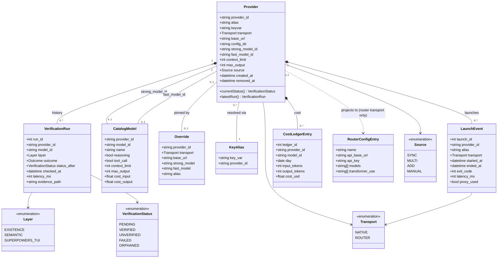
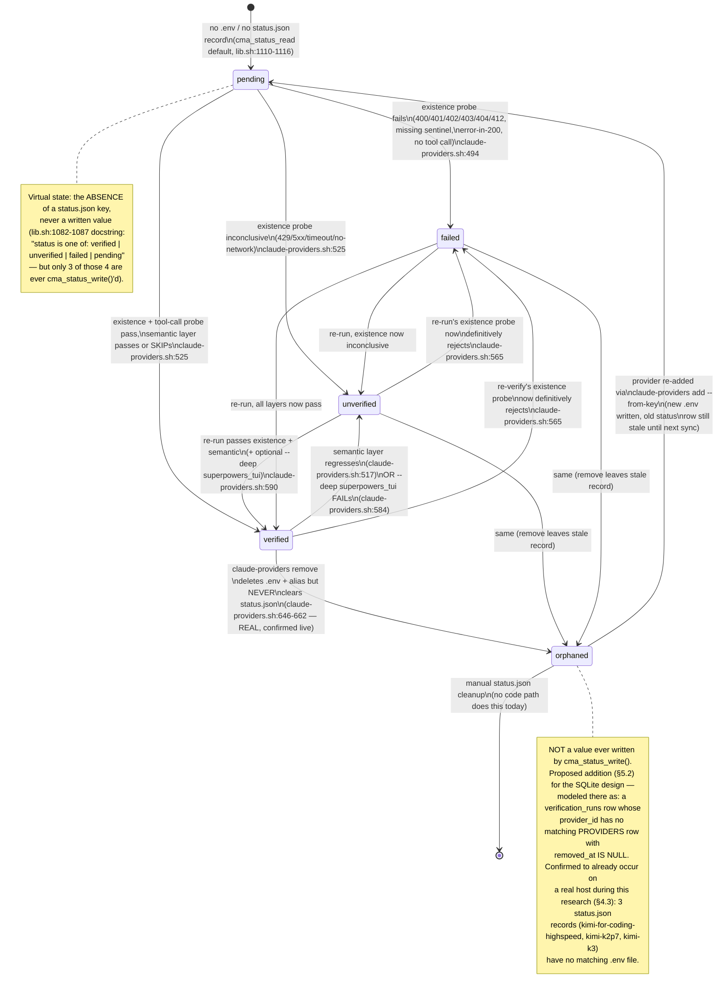

# 05 — Data Models and Schemas

**Status:** DRAFT — research document, not yet actioned.
**Scope:** the toolkit's provider-registry state (`~/.local/share/claude-multi-account/providers/*`,
`scripts/providers/*.json`, `~/.claude-code-router/config.json`, the cached models.dev catalog),
reverse-engineered into formal schemas, plus a proposed SQLite migration target, UML, and
copy-pasteable templates.
**Companion documents:** see [`00-INDEX.md`](00-INDEX.md) for how this fits with 01–04.
**Grounding method:** every schema in §2 was validated with `jsonschema` (Draft 2020-12) against
the *real, live* files on the host this research was written on (2026-07-19); the SQLite DDL in
§3 was executed against a real `sqlite3` instance; the migration script in §4 was actually run
(read-only) against the live toolkit state and its output is reproduced verbatim. Nothing here was
installed, synced, or launched — all reads were passive (`cat`/`Read`/`python3 -c`), matching the
"never modify code, never run install.sh/sync, never launch provider aliases" constraint this
document was written under.

---

## 1. The current data layer, as it actually exists

The toolkit's provider subsystem (`CLAUDE.md` → "Provider aliases and verification") has **no
formal schema today**. Six kinds of file carry its state, all hand-rolled shell/`jq`/Python
writers with no shared type definition:

| # | File | Format | Owner (writer) | Mutability |
|---|------|--------|-----------------|------------|
| 1 | `~/.local/share/claude-multi-account/providers/status.json` | JSON | `cma_status_write()`, `scripts/lib.sh:1092-1108` | generated, atomic-replace |
| 2 | `~/.local/share/claude-multi-account/providers/<id>.env` | POSIX shell (`VAR='value'`) | `cma_provider_write_env()`, `scripts/lib.sh:1306-1359` (+ multi-alias twin `generate_env_content()`, `scripts/providers_generate.py:82-107`) | generated, full overwrite |
| 3 | `~/.claude-code-router/config.json` | JSON | inline `jq` transform in `cma_run_provider`, `scripts/lib.sh:930-951` | generated, upserted **at every router-transport launch** (not by sync) |
| 4 | `scripts/providers/overrides.json` | JSON | human-edited; read by `providers_resolve.py:149-208` | hand-edited |
| 5 | `scripts/providers/key-aliases.json` | JSON | human-edited (or `claude-providers add`, `scripts/claude-providers.sh:665-682`); read by `providers_resolve.py:165` | hand-edited or appended |
| 6 | `~/.local/share/claude-multi-account/providers/models.dev.cache.json` | JSON | fetched verbatim, `ensure_catalog()`, `scripts/claude-providers.sh:88-126` | 3rd-party, cached with 24h TTL |

Two more files exist in the pipeline and are documented in §1.7 as supporting evidence for the
SQLite design (§3), because they are the closest thing this toolkit has to "verification history"
today, even though neither persists across runs the way a database would.

### 1.1 `status.json` — the verification status cache

This is the single source of truth for "is this provider alias usable" (`scripts/lib.sh:1082-1087`
docstring). Read live from `~/.local/share/claude-multi-account/providers/status.json`:

```json
{
  "opencode": {
    "status": "verified",
    "model": "big-pickle",
    "checked_at": "2026-07-19T07:42:34Z",
    "failing_layer": ""
  },
  "fireworks-ai": {
    "status": "failed",
    "model": "accounts/fireworks/routers/glm-5p2-fast",
    "checked_at": "2026-07-19T07:41:41Z",
    "failing_layer": "existence"
  },
  "zai-coding-plan": {
    "status": "unverified",
    "model": "glm-5.2",
    "checked_at": "2026-07-19T07:43:58Z",
    "failing_layer": "existence"
  },
  "kimi-k3": {
    "status": "failed",
    "model": "k3",
    "checked_at": "2026-07-19T07:42:12Z",
    "failing_layer": "existence"
  }
}
```
(4 of 24 real records shown; full file has one object per provider/alias id.)

**Fields** (writer: `cma_status_write()`, `scripts/lib.sh:1092-1108`):

| Field | Type | Optional? | Written by |
|---|---|---|---|
| *(key)* | string | — | provider/alias id, `scripts/lib.sh:1093` arg `$1` |
| `status` | string enum `verified\|unverified\|failed` | **no** — `pending` is never written, see below | `$2` |
| `model` | string (may be `""`) | no (field always present, value may be empty) | `$3`, defaults to `""` |
| `checked_at` | string, UTC ISO-8601 `date -u +%Y-%m-%dT%H:%M:%SZ` | no | `scripts/lib.sh:1098` |
| `failing_layer` | string enum `""\|existence\|semantic\|superpowers_tui` | no (empty string when nothing failed) | `$4`, defaults to `""` |

**`pending` is a virtual state, never persisted.** `cma_status_read()` (`scripts/lib.sh:1110-1116`)
returns the literal string `pending` only when the id has *no record at all* — either the file is
absent/empty, or the key is missing. No code path ever writes `"status":"pending"` to disk. This
matters for §5's state diagram: `pending` is "absence of a row," not a row value — a distinction
the SQLite design in §3 makes structural (no `providers` row ⇒ no status) instead of implicit.

**Callers that write a status** (all via `cma_status_write`, one call = one state transition):

- `scripts/claude-providers.sh:494` — existence probe failed during `sync` → `failed`
- `scripts/claude-providers.sh:525` — end of the `sync` per-provider loop → `verified` or `unverified`, `failing_layer` set to the first layer that did not pass
- `scripts/claude-providers.sh:565/566/569/580/584/590` — the `verify <id> [--deep]` subcommand's layered re-check (existence → semantic → optional live TUI)
- `scripts/claude-providers.sh:816/818` — `sync --multi`'s per-alias write after `model_verify.py` scoring

**A real gap found while researching this document:** `cmd_remove()` (`scripts/claude-providers.sh:646-662`)
deletes the `.env` file, the shell alias line, and backs up the config dir — but **never touches
`status.json`**. A removed provider's status record is silently orphaned. This was confirmed live
(§4.3): running the migration script against this host's real state found **3 pre-existing orphaned
records** (`kimi-for-coding-highspeed`, `kimi-k2p7`, `kimi-k3` — all have `status.json` entries but
no matching `.env` file on disk). This is the concrete, already-happening precedent for the
`orphaned` state added in §5.2.

*(Cross-reference: `01-architecture-and-risk-audit.md`'s **D-9** independently documents the
mirror-image case — a `.env` file that outlives its key when `~/api_keys.sh` no longer resolves
it, with its own live example on this host, two coexisting `zhipuai`/`zhipuai-coding-plan`
records. Both findings share one root cause: **no code path reconciles `api_keys.sh` presence,
`.env` files, and `status.json` against each other** — §3's `providers` table with `ON DELETE
CASCADE` foreign keys is a structural fix for both directions at once, not just the
`cmd_remove()` case this document started from.)*

### 1.2 Provider env file — `providers/<id>.env`

Real file, `~/.local/share/claude-multi-account/providers/deepseek.env`, quoted in full (no
secrets — the file's own header comment states the invariant, and it holds):

```sh
# generated by claude-providers — non-secret. Do not edit by hand.
# Secrets are NEVER stored here; the key is read from the keys file at launch.
CMA_PROVIDER_ID='deepseek'
CMA_PROVIDER_KEYVAR='DEEPSEEK_API_KEY'
CMA_PROVIDER_TRANSPORT='router'
CMA_PROVIDER_BASE_URL='https://api.deepseek.com'
CMA_PROVIDER_MODEL='deepseek-v4-pro'
CMA_PROVIDER_FAST_MODEL='deepseek-v4-flash'
CMA_PROVIDER_CONFIG_DIR='/home/milos/.claude-prov-deepseek'
# Context-window limits from the models.dev catalog for the selected strong model.
# CMA_PROVIDER_CONTEXT_LIMIT: input context window (tokens); empty = unknown.
#   -> exported as CLAUDE_CODE_AUTO_COMPACT_WINDOW (input-side guard).
# CMA_PROVIDER_MAX_OUTPUT:    maximum output tokens; empty = unknown.
#   -> exported as CLAUDE_CODE_MAX_OUTPUT_TOKENS (output-side guard).
CMA_PROVIDER_CONTEXT_LIMIT='1000000'
CMA_PROVIDER_MAX_OUTPUT='384000'
# Alias name for this provider (used by 'list --refresh-aliases' to rebuild the
# alias shell line with NO network — the session hook's fast path). Empty is OK;
# refresh falls back to the provider id as the alias name.
CMA_PROVIDER_ALIAS='deepseek'
```

**Fields**, all written verbatim by `cma_provider_write_env()` (`scripts/lib.sh:1339-1356`),
POSIX-single-quote-escaped by the local `_cma_q()` helper (`scripts/lib.sh:1326-1335`):

| Field | Type | Optional? | Consumer |
|---|---|---|---|
| `CMA_PROVIDER_ID` | string | no | echoed everywhere as the canonical id |
| `CMA_PROVIDER_KEYVAR` | string, OR literal `_CMA_KIMICODE_OAUTH_` sentinel | no | `scripts/lib.sh:693` — `eval "token=\"\${$CMA_PROVIDER_KEYVAR:-}\""` |
| `CMA_PROVIDER_TRANSPORT` | enum `native\|router` (or empty, normalized from JSON `null`, `scripts/lib.sh:1313`) | effectively no | `scripts/lib.sh:825` branch |
| `CMA_PROVIDER_BASE_URL` | string (URL) | yes (empty allowed) | native: `ANTHROPIC_BASE_URL` (`scripts/lib.sh:959`); router: ccr provider `api_base_url` |
| `CMA_PROVIDER_MODEL` | string | yes | strong/primary model id |
| `CMA_PROVIDER_FAST_MODEL` | string | yes, falls back to `CMA_PROVIDER_MODEL` | background/haiku-tier model id |
| `CMA_PROVIDER_CONFIG_DIR` | absolute path string | no | becomes `CLAUDE_CONFIG_DIR` (`scripts/lib.sh:700`) |
| `CMA_PROVIDER_CONTEXT_LIMIT` | integer-as-string, or `""` | yes | → `CLAUDE_CODE_AUTO_COMPACT_WINDOW` (`scripts/lib.sh:706-718`) |
| `CMA_PROVIDER_MAX_OUTPUT` | integer-as-string, or `""` | yes | → `CLAUDE_CODE_MAX_OUTPUT_TOKENS`, `min()`'d against 128000 (`scripts/lib.sh:726-768`) |
| `CMA_PROVIDER_ALIAS` | string | yes, falls back to id | `list --refresh-aliases` no-network path |
| `CMA_PROVIDER_ALIAS_SUFFIX` | string | **only in multi-alias mode** | `scripts/providers_generate.py:95` — `""`, `"2"`, `"3"`... Absent from the single-alias writer entirely (not even as an empty field) |

**Live schema drift found while researching this document:** 2 of the 20 real `.env` files on this
host — `github-models.env` and `tencent-tokenhub.env`, both dated 2026-07-03 — **predate the
`CMA_PROVIDER_ALIAS` field** and lack it entirely. Every current writer emits it, but nothing
regenerates stale files, so `CMA_PROVIDER_ALIAS` cannot be treated as required by a schema unless
that schema is also willing to call two real, currently-functioning files invalid. §2.2 encodes
this as an *optional* field with the drift documented in the schema's own `description`. This is
exactly the class of problem flat files hide and a real schema (or a `NOT NULL DEFAULT` column,
§3) surfaces immediately.

### 1.3 `~/.claude-code-router/config.json` — the router (ccr) config

**This file is not part of `SHARED_ITEMS`** (per `CLAUDE.md`'s unification model) — it is a
live, per-host, secret-bearing file, `chmod 600` from creation (`scripts/lib.sh:864` and re-applied
at `:946`), upserted **at every router-transport launch**, not at `sync` time. It also gets mutated
by `ccr` itself at runtime (`CLAUDE.md`: "the live route is app_config… config.json is not
re-imported on restart").

Real file, `~/.claude-code-router/config.json`, secrets redacted (`api_key` values are live
provider keys — genuinely present in the real file, replaced below with `«REDACTED»`):

```json
{
  "Providers": [
    {
      "name": "deepseek",
      "api_base_url": "https://api.deepseek.com/chat/completions",
      "api_key": "«REDACTED»",
      "models": ["deepseek-v4-pro", "deepseek-v4-flash"],
      "transformer": { "use": ["cleancache", "streamoptions"] }
    },
    {
      "name": "HelixAgent",
      "api_base_url": "http://127.0.0.1:18434/v1/chat/completions",
      "api_key": "«REDACTED»",
      "models": ["HelixLLM"],
      "transformer": { "use": ["cleancache", "streamoptions"] },
      "id": "HelixAgent"
    }
  ],
  "Router": {
    "default": "chutes,zai-org/GLM-5.2-TEE",
    "background": "chutes,Qwen/Qwen3.6-27B-TEE"
  }
}
```
(2 of 20 real `Providers[]` entries shown; the full file mirrors every currently-installed
router-transport `.env` plus whichever provider was launched most recently. `HelixAgent` is the
only entry carrying the extra `id` field — required by ccr v3.0.6's target-adapter registry so
`id == name` resolves a routable adapter, per `CHANGELOG.md` v1.18.0.)

**Fields**, written by the inline `jq` transform in `cma_run_provider` (`scripts/lib.sh:938-945`):

| Field | Type | Optional? | Source |
|---|---|---|---|
| `Providers[].name` | string | no | `CMA_PROVIDER_ID` (or `HelixAgent` facade name) |
| `Providers[].api_base_url` | string (URI) | no | `CMA_PROVIDER_BASE_URL`, normalized to end in `/chat/completions` unless already OpenAI/Gemini-shaped (`scripts/lib.sh:865-868`) |
| `Providers[].api_key` | string | no | **live secret**, re-derived from the resolved key var at every launch (`scripts/lib.sh:938`, passed via `$ENV.CMA_TOK` — never argv, never persisted elsewhere) |
| `Providers[].models` | array of 1-2 strings | no | `[CMA_PROVIDER_MODEL, CMA_PROVIDER_FAST_MODEL or CMA_PROVIDER_MODEL]` |
| `Providers[].transformer.use` | array of strings | no | fixed `["cleancache","streamoptions"]` on every write path, `scripts/lib.sh:942` |
| `Providers[].id` | string | **yes**, only the HelixAgent facade has it | `scripts/lib.sh` HelixAgent-specific write path |
| `Router.default` | string `"<name>,<strong-model>"` | no | `scripts/lib.sh:943` |
| `Router.background` | string `"<name>,<fast-model>"` | no | `scripts/lib.sh:944` |

The upsert is a full-array replace-by-name (`select(.name != $n)` then append, `scripts/lib.sh:940-942`)
— idempotent per provider, but it means this file only ever reflects providers that have been
**launched at least once**, not every provider `sync` created. A provider can be `verified` in
`status.json` and never appear here.

### 1.4 `scripts/providers/overrides.json`

Hand-edited. Real file, quoted in full:

```json
{
  "deepseek": {
    "transport": "router",
    "base_url": "https://api.deepseek.com",
    "strong_model": "deepseek-v4-pro",
    "fast_model": "deepseek-v4-flash"
  },
  "kimi-for-coding": {
    "transport": "router",
    "base_url": "https://api.kimi.com/coding/v1",
    "strong_model": "kimi-for-coding",
    "fast_model": "kimi-for-coding",
    "context_limit": 262144
  },
  "fireworks-ai": { "alias": "fireworks" },
  "xai": { "base_url": "https://api.x.ai/v1" }
}
```
(4 of 15 real entries shown.)

**Fields**, read by `resolve()` in `scripts/providers_resolve.py:149-208`:

| Field | Type | Optional? | Applied? |
|---|---|---|---|
| `transport` | enum `native\|router` | yes | yes — `providers_resolve.py:191-193` loop |
| `base_url` | string | yes | yes |
| `strong_model` | string | yes | yes |
| `fast_model` | string | yes | yes |
| `alias` | string | yes | yes |
| `context_limit` | integer | yes | **no** — a real finding. `providers_resolve.py:191`'s override loop is `for field in ("alias","base_url","transport","strong_model","fast_model")` — `context_limit` is not in that tuple. It is present in the real `kimi-for-coding` entry above but is **currently a documented no-op**; `context_limit`/`max_output` actually always flow from the catalog's selected strong model (`providers_resolve.py:130-137`), never from this file. |

### 1.5 `scripts/providers/key-aliases.json`

Hand-edited (or appended by `claude-providers add --from-key`, `scripts/claude-providers.sh:665-682`).
Real file, quoted in full:

```json
{
  "ZAI_API_KEY": "zai-coding-plan",
  "CODESTRAL_API_KEY": "mistral",
  "HUGGINGFACE_API_KEY": "huggingface",
  "GITHUB_MODELS_API_KEY": "github-models",
  "TENCENT_CLOUD_API_KEY": "tencent-tokenhub",
  "XIAOMI_MIMO_API_KEY": "xiaomi",
  "ZEN_API_KEY": "opencode",
  "ApiKey_Opencode_Zen": "opencode",
  "POE_API_KEY": "poe",
  "ApiKey_Poe": "poe",
  "SAKANA_API_KEY": "sakana",
  "FIREWORKS_API_KEY": "fireworks-ai",
  "DEEPINFRA_API_KEY": "deepinfra",
  "MOONSHOT_API_KEY": "moonshotai",
  "ApiKey_Kimi": "kimi-for-coding"
}
```

A flat `{env_var_name: provider_id}` map — first-choice lookup in `resolve()`
(`providers_resolve.py:165`) before falling back to scanning every catalog provider's `env[]`
array (`find_provider_by_env()`, `providers_resolve.py:67-73`). Exists purely to bridge naming
drift between a user's `~/api_keys.sh` convention (e.g. `ApiKey_Kimi`) and models.dev's own `env`
field (which may use a different name, or may not list the var at all for OAuth-style providers).

### 1.6 models.dev catalog cache

Third-party data, **not owned by this toolkit** — fetched verbatim from
`https://models.dev/api.json` by `ensure_catalog()` (`scripts/claude-providers.sh:88-126`), cached
at `providers/models.dev.cache.json`, 24h TTL (`CMA_MODELS_DEV_TTL`, `scripts/claude-providers.sh:37`),
stale-cache-tolerant on fetch failure. **167 providers, 5,697 models** in the live cache read for
this document (2026-07-19, 3.2 MB).

Real excerpt — the `deepseek` provider (metadata only) and its `deepseek-v4-pro` model, matching
§1.2's `.env` example:

```json
{
  "deepseek": {
    "id": "deepseek",
    "env": ["DEEPSEEK_API_KEY"],
    "npm": "@ai-sdk/openai-compatible",
    "api": "https://api.deepseek.com",
    "name": "DeepSeek",
    "doc": "https://api-docs.deepseek.com/quick_start/pricing",
    "models": {
      "deepseek-v4-pro": {
        "id": "deepseek-v4-pro",
        "name": "DeepSeek V4 Pro",
        "description": "Open MoE flagship with million-token context for coding and long agent runs",
        "family": "deepseek-thinking",
        "attachment": false,
        "reasoning": true,
        "reasoning_options": [
          { "type": "toggle" },
          { "type": "effort", "values": ["high", "max"] }
        ],
        "tool_call": true,
        "interleaved": { "field": "reasoning_content" },
        "structured_output": true,
        "temperature": true,
        "knowledge": "2025-05",
        "release_date": "2026-04-24",
        "last_updated": "2026-04-24",
        "modalities": { "input": ["text"], "output": ["text"] },
        "open_weights": true,
        "limit": { "context": 1000000, "output": 384000 },
        "cost": { "input": 0.435, "output": 0.87, "cache_read": 0.003625 }
      }
    }
  }
}
```

**Provider-level fields** (sampled across all 167 providers): `id`, `env`, `npm`, `name`, `doc`,
`models` are present on 167/167 (always). `api` is present on only **143/167** — 24 providers have
no `api` field at all (OAuth-only or metadata-only catalog entries). `providers_resolve.py:198-202`
deliberately marks a router-transport provider with no `base_url` as `status=unmapped` rather than
activating a broken alias — this is the code-level consequence of that 24/167 gap.

**Model-level fields** (sampled across all 5,697 models): `id`, `name`, `description`,
`attachment`, `reasoning`, `tool_call`, `release_date`, `last_updated`, `modalities`,
`open_weights`, `limit` are present on 5,697/5,697 (always). `cost` on 5,298/5,697 (93%,
optional — used for `select_models()`'s tie-breakers, `providers_resolve.py:104-127`, and
`model_verify.py`'s free-tier bonus, `model_verify.py:488-492`). `temperature` on 5,005/5,697.
`family` on 4,452/5,697. `reasoning_options` on 3,609/5,697. `structured_output` on 2,959/5,697.
`knowledge` on 2,890/5,697. `interleaved` on 656/5,697. `provider` (nested descriptor, aggregator
catalogs) on 186/5,697. `status`/`experimental` are rare (169 and 39 respectively). Within `limit`,
`context` and `output` are always present (5,697/5,697) but `input` only on 1,107/5,697 and is not
consumed by this toolkit's resolver.

Two **genuine upstream schema-drift cases** were found while sampling the full cache and are
encoded in §2.6's schema rather than silently dropped:
- `model.experimental` is a boolean on almost every model, but on 15 models it is instead an
  object describing an experimental "fast mode" (`{modes:{fast:{cost:{...}, provider:{...}}}}`).
- `model.interleaved` is usually `{field: "<string>"}` but on several `cloudflare-*`/`azure`
  entries it is a bare `true`.
- `model.cost.context_over_200k` is usually a number but on tiered-pricing models it is an object
  with its own `input`/`output`/`cache_read`/`cache_write`.

### 1.7 Supporting/intermediate schemas (grounding for §3's SQLite design)

Two more shapes exist in the pipeline. Neither is persisted as a standalone file today, but both
are exactly the row shapes the SQLite `verification_runs` table (§3) is designed to store
permanently instead of discarding.

**`providers_resolve.py`'s in-memory resolution record** (`providers_resolve.py:22-27`
docstring, `:153-159` construction) — the JSON array `providers_resolve.py` emits on stdout, one
record per API-key variable name. Actually run (read-only, pure/offline — no network, no
`--offline` flag needed since it never fetches) against the real catalog + real overrides +
5 synthetic key names, to confirm the shape:

```json
{
  "key_var": "DEEPSEEK_API_KEY",
  "classification": "llm",
  "provider_id": "deepseek",
  "alias": "deepseek",
  "base_url": "https://api.deepseek.com",
  "transport": "router",
  "strong_model": "deepseek-v4-pro",
  "fast_model": "deepseek-v4-flash",
  "context_limit": 1000000,
  "max_output": 384000,
  "status": "resolved",
  "reason": ""
}
```
`status` ∈ `{resolved, unmapped, skipped}` — a *different* three-value vocabulary than
`status.json`'s `{verified, unverified, failed}`. This is a resolution-time status ("could I map
this key to a provider at all"), not a verification-time status ("does the mapped provider
actually work"). §3's schema keeps these as separate concepts (`providers` table existence vs.
`verification_runs.status_after`).

**`model_verify.py`'s per-model verification record** (`--multi` path, `model_verify.py:356-378`
construction, `:643-651` the enclosing `output_data`), cached at
`providers/verification_cache.json` (`scripts/claude-providers.sh:50`) with a **schema-version
gate** — `CACHE_VERSION = 2` (`model_verify.py:47`), and `load_cache()` (`model_verify.py:507-524`)
discards the entire cache if `_cache_version` doesn't match, so old, weaker verification logic is
never replayed. This versioning discipline is exactly what §3's `verification_runs` table
generalizes into permanent, queryable history instead of a single mutable cache blob:

```json
{
  "model_id": "deepseek-v4-pro",
  "provider_id": "deepseek",
  "score": 85,
  "capabilities": {
    "chat": true, "tool_call": true, "reasoning": true,
    "streaming": true, "context_window": 1000000, "output_tokens": 384000
  },
  "latency_ms": 842,
  "verified": true,
  "failure_reason": "",
  "tested_at": "2026-07-19T07:41:36+00:00"
}
```

Finally, `scripts/tests/proof/providers-summary.json` (evidence artifact from
`verify_providers_live.sh:81,136`, part of `run-proof.sh`'s live proof suite) is the closest thing
to multi-layer verification history that gets written to disk today, but it is overwritten on
every proof run, not appended:

```json
"deepseek": {
  "status": "verified",
  "layers": { "existence": true, "semantic": "unverified", "superpowers_tui": "unverified" },
  "evidence": {
    "semantic": ".../providers-deepseek-semantic.txt",
    "superpowers_tui": ".../providers-deepseek-superpowers.txt"
  }
}
```

---

## 2. JSON Schema (Draft 2020-12)

All six schemas below were validated with Python's `jsonschema` 4.26 library, `Draft202012Validator`,
against the real files on this host (§1). **Zero validation errors** on the final version of each
schema (iteration notes below show what the first draft got wrong and how the real data corrected
it — left in deliberately, since "what did reality disagree with" is more informative than a
schema that was merely typed correctly the first time).

### 2.1 `status.schema.json`

```json
{
  "$schema": "https://json-schema.org/draft/2020-12/schema",
  "$id": "https://claude-toolkit.local/schemas/status.schema.json",
  "title": "Provider verification status cache (status.json)",
  "description": "Written by cma_status_write() in scripts/lib.sh:1092-1108. One record per provider/alias id, keyed by that id.",
  "type": "object",
  "additionalProperties": { "$ref": "#/$defs/statusRecord" },
  "$defs": {
    "statusRecord": {
      "type": "object",
      "additionalProperties": false,
      "required": ["status", "model", "checked_at", "failing_layer"],
      "properties": {
        "status": { "type": "string", "enum": ["pending", "verified", "unverified", "failed"] },
        "model": {
          "type": "string",
          "description": "The strong/primary model id this alias was last checked against. May be empty string if unresolved."
        },
        "checked_at": {
          "type": "string",
          "format": "date-time",
          "pattern": "^\\d{4}-\\d{2}-\\d{2}T\\d{2}:\\d{2}:\\d{2}Z$",
          "description": "UTC ISO-8601, produced by `date -u +%Y-%m-%dT%H:%M:%SZ` (lib.sh:1098)."
        },
        "failing_layer": {
          "type": "string",
          "enum": ["", "existence", "semantic", "superpowers_tui"],
          "description": "Which verification layer produced a non-verified status. Empty string when status is verified or pending."
        }
      }
    }
  }
}
```
**Validated against:** the real 24-record `status.json` on this host. 0 errors.
`"pending"` is kept in the `status` enum for forward-compatibility with §3/§4 (where the SQLite
`current_status` view *does* materialize `pending` explicitly via `COALESCE`), even though no
current writer ever emits it into this file (§1.1).

### 2.2 `provider-env.schema.json` (parsed representation)

The `.env` file itself is shell, not JSON; this schema describes it *after* parsing
(`set -a; . file; set +a`, matching how `verify_superpowers_tui.sh:41` consumes it):

```json
{
  "$schema": "https://json-schema.org/draft/2020-12/schema",
  "$id": "https://claude-toolkit.local/schemas/provider-env.schema.json",
  "title": "Provider env file, parsed to JSON (providers/<id>.env)",
  "description": "Source: cma_provider_write_env, scripts/lib.sh:1306-1359 (+ multi-alias twin providers_generate.py:82-107). NOTE (live drift, found 2026-07-19): 2 of 20 real files on this host (github-models.env, tencent-tokenhub.env, both dated 2026-07-03) predate CMA_PROVIDER_ALIAS and lack it — modeled as optional, not required, even though every current writer emits it.",
  "type": "object",
  "additionalProperties": false,
  "required": [
    "CMA_PROVIDER_ID", "CMA_PROVIDER_KEYVAR", "CMA_PROVIDER_TRANSPORT",
    "CMA_PROVIDER_BASE_URL", "CMA_PROVIDER_MODEL", "CMA_PROVIDER_FAST_MODEL",
    "CMA_PROVIDER_CONFIG_DIR", "CMA_PROVIDER_CONTEXT_LIMIT", "CMA_PROVIDER_MAX_OUTPUT"
  ],
  "properties": {
    "CMA_PROVIDER_ID": { "type": "string", "minLength": 1 },
    "CMA_PROVIDER_ALIAS_SUFFIX": { "type": "string", "description": "Multi-alias mode only." },
    "CMA_PROVIDER_KEYVAR": {
      "type": "string", "minLength": 1,
      "description": "Env var name, OR the literal sentinel \"_CMA_KIMICODE_OAUTH_\" (lib.sh:676)."
    },
    "CMA_PROVIDER_TRANSPORT": { "type": "string", "enum": ["native", "router", ""] },
    "CMA_PROVIDER_BASE_URL": { "type": "string" },
    "CMA_PROVIDER_MODEL": { "type": "string" },
    "CMA_PROVIDER_FAST_MODEL": { "type": "string" },
    "CMA_PROVIDER_CONFIG_DIR": { "type": "string" },
    "CMA_PROVIDER_CONTEXT_LIMIT": { "type": "string", "pattern": "^[0-9]*$" },
    "CMA_PROVIDER_MAX_OUTPUT": { "type": "string", "pattern": "^[0-9]*$" },
    "CMA_PROVIDER_ALIAS": { "type": "string" }
  }
}
```
**Validated against:** all 20 real `.env` files, parsed with a small POSIX-single-quote-unescaping
Python helper. 0 errors on the final version (first draft required `CMA_PROVIDER_ALIAS`, which
2/20 real files failed — see the drift note in §1.2).

### 2.3 `ccr-config.schema.json`

```json
{
  "$schema": "https://json-schema.org/draft/2020-12/schema",
  "$id": "https://claude-toolkit.local/schemas/ccr-config.schema.json",
  "title": "claude-code-router config (~/.claude-code-router/config.json)",
  "description": "Upserted at every router-transport launch, scripts/lib.sh:938-945. Live, secret-bearing, chmod 600. Also mutated by ccr itself at runtime.",
  "type": "object",
  "additionalProperties": true,
  "required": ["Providers", "Router"],
  "properties": {
    "Providers": { "type": "array", "items": { "$ref": "#/$defs/providerEntry" } },
    "Router": {
      "type": "object",
      "additionalProperties": true,
      "properties": {
        "default": { "type": "string", "description": "\"<provider-name>,<strong-model-id>\". lib.sh:943." },
        "background": { "type": "string", "description": "\"<provider-name>,<fast-model-id>\". lib.sh:944." }
      }
    }
  },
  "$defs": {
    "providerEntry": {
      "type": "object",
      "additionalProperties": false,
      "required": ["name", "api_base_url", "api_key", "models", "transformer"],
      "properties": {
        "name": { "type": "string" },
        "api_base_url": { "type": "string", "format": "uri" },
        "api_key": { "type": "string", "description": "LIVE secret, re-written every launch (lib.sh:938 CMA_TOK)." },
        "models": { "type": "array", "items": { "type": "string" }, "minItems": 1, "maxItems": 2 },
        "transformer": {
          "type": "object", "additionalProperties": false, "required": ["use"],
          "properties": { "use": { "type": "array", "items": { "type": "string" } } }
        },
        "id": { "type": "string", "description": "Only the HelixAgent facade (ccr v3.0.6 needs id == name)." }
      }
    }
  }
}
```
**Validated against:** the real `~/.claude-code-router/config.json` (20 `Providers[]` entries).
0 errors.

### 2.4 `overrides.schema.json`

```json
{
  "$schema": "https://json-schema.org/draft/2020-12/schema",
  "$id": "https://claude-toolkit.local/schemas/overrides.schema.json",
  "title": "Provider overrides (scripts/providers/overrides.json)",
  "description": "Hand-edited. Read by providers_resolve.py:190-193 as manual pins layered on catalog data.",
  "type": "object",
  "additionalProperties": { "$ref": "#/$defs/overrideEntry" },
  "$defs": {
    "overrideEntry": {
      "type": "object",
      "additionalProperties": false,
      "minProperties": 1,
      "properties": {
        "transport": { "type": "string", "enum": ["native", "router"] },
        "base_url": { "type": "string" },
        "strong_model": { "type": "string" },
        "fast_model": { "type": "string" },
        "alias": { "type": "string" },
        "context_limit": {
          "type": "integer", "minimum": 0,
          "description": "NOT read by resolve()'s override loop (providers_resolve.py:191 omits it) — a documented no-op today despite appearing in the real kimi-for-coding entry."
        }
      }
    }
  }
}
```
**Validated against:** the real 15-entry `overrides.json`. 0 errors.

### 2.5 `key-aliases.schema.json`

```json
{
  "$schema": "https://json-schema.org/draft/2020-12/schema",
  "$id": "https://claude-toolkit.local/schemas/key-aliases.schema.json",
  "title": "Key-variable to provider-id map (scripts/providers/key-aliases.json)",
  "description": "Hand-edited. First-choice lookup in providers_resolve.py:165 before catalog env[]-array scanning.",
  "type": "object",
  "additionalProperties": {
    "type": "string", "minLength": 1,
    "description": "Target provider_id — must equal a top-level key in the models.dev cache to resolve."
  },
  "propertyNames": { "pattern": "^[A-Za-z_][A-Za-z0-9_]*$" }
}
```
**Validated against:** the real 15-entry `key-aliases.json`. 0 errors.

### 2.6 `models-dev-cache.schema.json`

```json
{
  "$schema": "https://json-schema.org/draft/2020-12/schema",
  "$id": "https://claude-toolkit.local/schemas/models-dev-cache.schema.json",
  "title": "models.dev catalog cache (providers/models.dev.cache.json)",
  "description": "Third-party upstream data (claude-providers.sh:88-126). Intentionally permissive — models.dev adds fields without notice.",
  "type": "object",
  "additionalProperties": { "$ref": "#/$defs/provider" },
  "$defs": {
    "provider": {
      "type": "object",
      "additionalProperties": true,
      "required": ["id", "env", "npm", "name", "doc", "models"],
      "properties": {
        "id": { "type": "string" },
        "env": { "type": "array", "items": { "type": "string" } },
        "npm": { "type": "string", "description": "npm ending \"anthropic\" (or api ending \"/anthropic\") => transport=native (providers_resolve.py:76-82)." },
        "api": { "type": "string", "format": "uri", "description": "Present on 143/167 sampled providers; absent on 24." },
        "name": { "type": "string" },
        "doc": { "type": "string" },
        "models": { "type": "object", "additionalProperties": { "$ref": "#/$defs/model" } }
      }
    },
    "model": {
      "type": "object",
      "additionalProperties": true,
      "required": ["id", "name", "description", "attachment", "reasoning", "tool_call",
                   "release_date", "last_updated", "modalities", "open_weights", "limit"],
      "properties": {
        "id": { "type": "string" },
        "name": { "type": "string" },
        "description": { "type": "string" },
        "attachment": { "type": "boolean" },
        "reasoning": { "type": "boolean" },
        "reasoning_options": {
          "type": "array",
          "items": {
            "type": "object", "required": ["type"],
            "properties": {
              "type": { "type": "string", "enum": ["effort", "toggle", "budget_tokens"] },
              "values": { "type": "array", "items": { "type": ["string", "null"] } }
            }
          }
        },
        "tool_call": { "type": "boolean", "description": "Hard verification gate (model_verify.py:427-436)." },
        "interleaved": {
          "oneOf": [
            { "type": "boolean" },
            { "type": "object", "properties": { "field": { "type": "string" } }, "additionalProperties": true }
          ]
        },
        "temperature": { "type": "boolean" },
        "knowledge": { "type": "string" },
        "release_date": { "type": "string" },
        "last_updated": { "type": "string" },
        "family": { "type": "string" },
        "structured_output": { "type": "boolean" },
        "provider": { "type": "object", "additionalProperties": true, "description": "Nested provider-of-record descriptor for aggregator catalogs; present on 186/5697 sampled models." },
        "status": { "type": "string" },
        "experimental": {
          "description": "Usually boolean; some entries carry an object describing an experimental \"fast\" mode.",
          "oneOf": [ { "type": "boolean" }, { "type": "object", "additionalProperties": true } ]
        },
        "modalities": {
          "type": "object", "additionalProperties": false,
          "properties": {
            "input": { "type": "array", "items": { "type": "string", "enum": ["text","image","pdf","video","audio"] } },
            "output": { "type": "array", "items": { "type": "string", "enum": ["text","image","audio","video","pdf"] } }
          }
        },
        "open_weights": { "type": "boolean" },
        "limit": {
          "type": "object", "additionalProperties": false, "required": ["context", "output"],
          "properties": {
            "context": { "type": "number", "description": "-> CMA_PROVIDER_CONTEXT_LIMIT (providers_resolve.py:134)." },
            "output": { "type": "number", "description": "-> CMA_PROVIDER_MAX_OUTPUT (providers_resolve.py:135)." },
            "input": { "type": "number", "description": "Present on 1107/5697 sampled models only; unused by this toolkit." }
          }
        },
        "cost": {
          "type": "object", "additionalProperties": true,
          "properties": {
            "input": { "type": "number" }, "output": { "type": "number" },
            "cache_read": { "type": "number" }, "cache_write": { "type": "number" },
            "reasoning": { "type": "number" }, "input_audio": { "type": "number" }, "output_audio": { "type": "number" },
            "context_over_200k": {
              "type": "object", "additionalProperties": true,
              "properties": { "input": {"type":"number"}, "output": {"type":"number"}, "cache_read": {"type":"number"}, "cache_write": {"type":"number"} }
            },
            "tiers": { "type": "array" }
          }
        }
      }
    }
  }
}
```
**Validated against:** the full real cache — 167 providers, 5,697 models. First draft: **492
errors**, all from `model.provider` (object, not string in 186 cases) and
`model.cost.context_over_200k` (object, not number, in tiered-pricing models). Second draft after
loosening those two: **75 errors**, all from `model.experimental` (object variant, 15 models),
`model.interleaved` (bare boolean variant, several `cloudflare-*`/`azure` models), and
`reasoning_options[].values` containing `null` (2 `sarvam` models). Final version (`oneOf`
unions + nullable array items, as shown above): **0 errors**.

---

## 3. SQLite schema — the migration target

If the toolkit ever needs queryable history (regressions over time, cost trends, launch-latency
percentiles) that six independently-mutated flat files structurally cannot provide, this is the
proposed relational shape. `providers` is authoritative (mirrors the `.env` files, which are the
actual activation source of truth); `verification_runs` turns `status.json`'s single mutable
record per id into an **append-only** history; `catalog_snapshots`/`catalog_models` turn the
single-blob models.dev cache into a queryable, versioned table; `launch_events` and `cost_ledger`
are new — the toolkit has no launch-telemetry or cost-tracking today (§1 found none), so these are
a forward design, not a reverse-engineering.

### 3.1 ER diagram

```mermaid
erDiagram
    PROVIDERS ||--o{ VERIFICATION_RUNS : "has history"
    PROVIDERS ||--o{ LAUNCH_EVENTS : "was launched via"
    PROVIDERS ||--o{ COST_LEDGER : "accrued cost on"
    LAUNCH_EVENTS ||--o{ COST_LEDGER : "attributed to (optional)"
    CATALOG_SNAPSHOTS ||--o{ CATALOG_MODELS : "contains"
    PROVIDERS ||--o| OVERRIDES : "pinned by"
    PROVIDERS ||--o{ KEY_ALIASES : "resolved from"

    PROVIDERS {
        text provider_id PK
        text alias
        text keyvar
        text transport
        text base_url
        text config_dir
        text strong_model_id
        text fast_model_id
        integer context_limit
        integer max_output
        text source
        text created_at
        text updated_at
        text removed_at "NULL = active"
    }
    VERIFICATION_RUNS {
        integer run_id PK
        text provider_id FK
        text model_id
        text layer
        text outcome
        text status_after
        text checked_at
        integer latency_ms
        text evidence_path
    }
    LAUNCH_EVENTS {
        integer launch_id PK
        text provider_id FK
        text alias
        text transport
        text started_at
        text ended_at
        integer exit_code
        integer latency_ms
        integer proxy_used
        integer proxy_port
        text host
        text account_dir
    }
    COST_LEDGER {
        integer ledger_id PK
        text provider_id FK
        text model_id
        text day
        integer input_tokens
        integer output_tokens
        real cost_usd
        integer launch_id FK
    }
    CATALOG_SNAPSHOTS {
        integer snapshot_id PK
        text fetched_at
        text source_url
        integer provider_count
        integer model_count
        text sha256
    }
    CATALOG_MODELS {
        integer snapshot_id PK_FK
        text provider_id PK
        text model_id PK
        text name
        integer reasoning
        integer tool_call
        integer context_limit
        integer max_output
        real cost_input
        real cost_output
        text release_date
    }
    KEY_ALIASES {
        text key_var PK
        text provider_id
    }
    OVERRIDES {
        text provider_id PK
        text transport
        text base_url
        text strong_model
        text fast_model
        text alias
        integer context_limit
    }
```

### 3.2 DDL

Executed and verified against real `sqlite3` (3.50.4) during this research — `CREATE` succeeded
with no errors, all foreign keys and check constraints active:

```sql
PRAGMA foreign_keys = ON;

CREATE TABLE providers (
  provider_id     TEXT PRIMARY KEY,
  alias           TEXT,
  keyvar          TEXT NOT NULL,
  transport       TEXT NOT NULL CHECK (transport IN ('native','router')),
  base_url        TEXT,
  config_dir      TEXT NOT NULL,
  strong_model_id TEXT,
  fast_model_id   TEXT,
  context_limit   INTEGER,
  max_output      INTEGER,
  source          TEXT NOT NULL DEFAULT 'sync' CHECK (source IN ('sync','multi','add','manual')),
  created_at      TEXT NOT NULL DEFAULT (strftime('%Y-%m-%dT%H:%M:%SZ','now')),
  updated_at      TEXT NOT NULL DEFAULT (strftime('%Y-%m-%dT%H:%M:%SZ','now')),
  removed_at      TEXT   -- soft-delete marker; NULL = active. Set by the SQLite-era
                         -- equivalent of `claude-providers remove` INSTEAD OF a bare
                         -- DELETE, which is precisely what fixes the orphaning bug
                         -- found in §1.1/§4.3 (status rows can no longer outlive
                         -- their provider once FKs + a soft-delete convention exist).
);

CREATE TABLE catalog_snapshots (
  snapshot_id    INTEGER PRIMARY KEY AUTOINCREMENT,
  fetched_at     TEXT NOT NULL,
  source_url     TEXT NOT NULL,
  provider_count INTEGER NOT NULL,
  model_count    INTEGER NOT NULL,
  sha256         TEXT NOT NULL          -- content hash of the raw fetch; lets a
                                         -- refresh short-circuit to a no-op snapshot
                                         -- when models.dev returns byte-identical data
);

CREATE TABLE catalog_models (
  snapshot_id   INTEGER NOT NULL REFERENCES catalog_snapshots(snapshot_id) ON DELETE CASCADE,
  provider_id   TEXT NOT NULL,
  model_id      TEXT NOT NULL,
  name          TEXT,
  reasoning     INTEGER NOT NULL DEFAULT 0,   -- boolean as 0/1 (SQLite has no BOOLEAN type)
  tool_call     INTEGER NOT NULL DEFAULT 0,
  context_limit INTEGER,
  max_output    INTEGER,
  cost_input    REAL,
  cost_output   REAL,
  release_date  TEXT,
  PRIMARY KEY (snapshot_id, provider_id, model_id)
);

CREATE TABLE verification_runs (
  run_id        INTEGER PRIMARY KEY AUTOINCREMENT,
  provider_id   TEXT NOT NULL REFERENCES providers(provider_id) ON DELETE CASCADE,
  model_id      TEXT NOT NULL,
  layer         TEXT NOT NULL CHECK (layer IN ('existence','semantic','superpowers_tui')),
  outcome       TEXT NOT NULL CHECK (outcome IN ('pass','fail','skip','unverified')),
  status_after  TEXT NOT NULL CHECK (status_after IN ('pending','verified','unverified','failed')),
  checked_at    TEXT NOT NULL,
  latency_ms    INTEGER,
  evidence_path TEXT
);
CREATE INDEX idx_verification_runs_provider_time ON verification_runs(provider_id, checked_at);

CREATE TABLE launch_events (
  launch_id   INTEGER PRIMARY KEY AUTOINCREMENT,
  provider_id TEXT NOT NULL REFERENCES providers(provider_id) ON DELETE CASCADE,
  alias       TEXT NOT NULL,
  transport   TEXT NOT NULL,
  started_at  TEXT NOT NULL,
  ended_at    TEXT,
  exit_code   INTEGER,
  latency_ms  INTEGER,        -- time-to-first-token or launch-to-ready; definition TBD in 03-performance.md
  proxy_used  INTEGER NOT NULL DEFAULT 0,
  proxy_port  INTEGER,
  host        TEXT,
  account_dir TEXT
);
CREATE INDEX idx_launch_events_provider_time ON launch_events(provider_id, started_at);

CREATE TABLE cost_ledger (
  ledger_id     INTEGER PRIMARY KEY AUTOINCREMENT,
  provider_id   TEXT NOT NULL REFERENCES providers(provider_id) ON DELETE CASCADE,
  model_id      TEXT NOT NULL,
  day           TEXT NOT NULL,             -- YYYY-MM-DD, host-local rollup granularity
  input_tokens  INTEGER NOT NULL DEFAULT 0,
  output_tokens INTEGER NOT NULL DEFAULT 0,
  cost_usd      REAL NOT NULL DEFAULT 0,
  launch_id     INTEGER REFERENCES launch_events(launch_id),
  UNIQUE (provider_id, model_id, day, launch_id)
);
CREATE INDEX idx_cost_ledger_provider_day ON cost_ledger(provider_id, day);

CREATE TABLE key_aliases (
  key_var     TEXT PRIMARY KEY,
  provider_id TEXT NOT NULL
);

CREATE TABLE overrides (
  provider_id   TEXT PRIMARY KEY,
  transport     TEXT,
  base_url      TEXT,
  strong_model  TEXT,
  fast_model    TEXT,
  alias         TEXT,
  context_limit INTEGER
);

-- Materializes exactly what status.json holds today, derived instead of stored,
-- so "verified/unverified/failed/pending" is always a live projection of history
-- rather than a value someone forgot to update.
CREATE VIEW current_status AS
SELECT p.provider_id,
       COALESCE(latest.status_after, 'pending') AS status,
       COALESCE(latest.model_id, p.strong_model_id) AS model,
       latest.checked_at,
       CASE WHEN latest.outcome != 'pass' THEN latest.layer ELSE '' END AS failing_layer
FROM providers p
LEFT JOIN (
  SELECT vr.* FROM verification_runs vr
  JOIN (SELECT provider_id, MAX(checked_at) AS max_t FROM verification_runs GROUP BY provider_id) m
    ON vr.provider_id = m.provider_id AND vr.checked_at = m.max_t
) latest ON latest.provider_id = p.provider_id
WHERE p.removed_at IS NULL;
```

**Design notes:**
- `providers.removed_at` (soft delete) plus the `ON DELETE CASCADE` FKs from
  `verification_runs`/`launch_events`/`cost_ledger` mean a *hard* delete of a provider row
  automatically cascades its history — the exact opposite of today's bug (§1.1) where `.env`
  removal leaves a `status.json` record behind forever. The **soft**-delete convention
  (`removed_at`) is what a `claude-providers remove` reimplementation should use so history
  survives removal for audit purposes while `current_status`'s `WHERE removed_at IS NULL` still
  excludes it from "is this alias usable" queries — giving both correctness (no orphaning) and
  auditability (nothing is destroyed) at once.
- `verification_runs` is **append-only** by convention (no `UPDATE`/`DELETE` in the intended
  write path) — this is what turns "last known status" (today) into "full history" (§3.3 Q1).
- `catalog_snapshots`/`catalog_models` normalize the single 3.2 MB JSON blob into rows so a
  specific model's limits can be queried without reloading and `json`-parsing the whole cache;
  `sha256` lets a refresh detect "nothing changed" without diffing 5,697 models by hand.
- `launch_events`/`cost_ledger` are proposed net-new tables — see `04-new-features.md` (PENDING,
  §00-INDEX) for where launch telemetry / cost tracking as *product features* would be scoped;
  this document only supplies the storage shape.

### 3.3 Example queries

All four ran successfully against a real SQLite database seeded from this host's actual
`status.json` (24 real rows) plus clearly-synthetic `launch_events`/`cost_ledger`/historical
`verification_runs` rows (labeled below — the toolkit has no real launch/cost telemetry yet, per
§1, so there is nothing genuine to query for those two).

**Q1 — which providers regressed this week** (real data: `fireworks-ai` and `github-models` were
seeded with a synthetic `verified` row ~6 days ago to demonstrate the regression shape; their
*current* `failed` status is 100% real, from the live `status.json`):

```sql
WITH latest AS (
  SELECT vr.provider_id, vr.status_after, vr.checked_at,
         ROW_NUMBER() OVER (PARTITION BY vr.provider_id ORDER BY vr.checked_at DESC) rn
  FROM verification_runs vr
)
SELECT l.provider_id, l.status_after AS current_status, l.checked_at AS last_checked
FROM latest l
WHERE l.rn = 1
  AND l.status_after != 'verified'
  AND EXISTS (
    SELECT 1 FROM verification_runs vr2
    WHERE vr2.provider_id = l.provider_id
      AND vr2.status_after = 'verified'
      AND vr2.checked_at >= datetime('now','-7 days')
  );
```
```
provider_id    current_status  last_checked
-------------  --------------  --------------------
fireworks-ai   failed          2026-07-19T09:04:23Z
github-models  failed          2026-07-19T09:04:24Z
```

**Q2 — cost per provider per day** (synthetic `cost_ledger` rows — no real cost data exists yet):

```sql
SELECT provider_id, day,
       SUM(input_tokens) AS input_tokens, SUM(output_tokens) AS output_tokens,
       ROUND(SUM(cost_usd), 4) AS cost_usd
FROM cost_ledger
GROUP BY provider_id, day
ORDER BY provider_id, day;
```
```
provider_id  day         input_tokens  output_tokens  cost_usd
-----------  ----------  ------------  -------------  --------
chutes       2026-07-15  244081        28283          0.0995
chutes       2026-07-16  159842        48920          0.0986
deepseek     2026-07-15  201722        10229          0.0677
openrouter   2026-07-15  139725        40005          0.0        -- free-tier model, cost=0
```
(truncated; 15 rows in the seeded run, 3 providers × 5 days)

**Q3 — p95 launch latency per provider** (synthetic `launch_events`, 12 launches/provider):

```sql
WITH ranked AS (
  SELECT provider_id, latency_ms,
         PERCENT_RANK() OVER (PARTITION BY provider_id ORDER BY latency_ms) AS pr
  FROM launch_events
)
SELECT provider_id, MIN(latency_ms) AS p95_latency_ms
FROM ranked
WHERE pr >= 0.95
GROUP BY provider_id
ORDER BY p95_latency_ms DESC;
```
```
provider_id  p95_latency_ms
-----------  --------------
xiaomi       4077
chutes       3954
siliconflow  3926
poe          3860
```

**Q4 — which verification layer fails most often** (real data — every row is a genuine
`status.json` record, all 12 real `failed`/`unverified` providers on this host fail at the
`existence` layer, none reach `semantic` or `superpowers_tui`):

```sql
SELECT layer, COUNT(*) AS failures
FROM verification_runs
WHERE outcome IN ('fail','unverified')
GROUP BY layer
ORDER BY failures DESC;
```
```
layer      failures
---------  --------
existence  12
```
This one is worth sitting with: on this host, 100% of current failures are account-side
(expired keys, suspended accounts — matching `docs/CONTINUATION.md`'s "11 providers still
failing (account-side)" note) rather than semantic/tool-calling problems. A real
`verification_runs` history would let this be tracked over time instead of re-derived by eye
from `docs/CONTINUATION.md` prose.

---

## 4. Migration plan: flat-JSON → SQLite

### 4.1 Phases

| Phase | What happens | Reversible? |
|---|---|---|
| **0 — Schema freeze** | Land §2's JSON Schemas as an actual CI gate (`jsonschema` validate on every write, or at minimum in `run-proof.sh`) *before* touching storage. Forces every writer (`cma_status_write`, `cma_provider_write_env`, `providers_generate.py`, the ccr `jq` transform) to agree on one shape. No behavior change. | trivially — schemas are additive documentation/CI, no data moves |
| **1 — Shadow write** | Every writer that currently touches a flat file ALSO writes the equivalent SQLite row, via a thin `cma_status_write_db()`/etc. wrapper. Flat files remain authoritative; SQLite is write-only, never read by the toolkit yet. | yes — drop the SQLite file, zero impact |
| **2 — Dual-write + parity gate** | Both paths active. A scheduled (or `run-proof.sh`-invoked) parity job runs the migration script (§4.4) in `--verify` mode: derive `status.json`'s shape FROM the database and diff against the real file, field by field. Any mismatch is a release blocker. This phase must run clean for a real deployment window (suggested: every `run-proof.sh` invocation, so it rides the existing CI cadence — see `02-testing-automation.md`, PENDING) before phase 3. | yes — SQLite writes can be disabled; flat files untouched throughout |
| **3 — Read cutover** | `cma_status_read`/`cma_status_all`/the `list`/`list-all`/`list-faulty` subcommands read from SQLite (`current_status` view) instead of `status.json`. Flat-file writes continue in parallel for one more release as a rollback path. | yes — flip the read flag back; writes never stopped |
| **4 — Write cutover + flat-file retirement** | Flat-file writes stop. `status.json` is deleted (or kept as a `--legacy-export` dump for tooling that hasn't migrated, e.g. external dashboards). `.env` files and `~/.claude-code-router/config.json` are **not** retired — they are consumed by external tools (`ccr`, the user's shell `source`) that this migration does not control, so they remain generated *from* SQLite rather than being replaced by it. | no — this is the point of no return; requires phase 2/3 to have run clean for a full release cycle first |

Phases 1–3 are safe to abandon at any point; phase 4 is the only irreversible step, and it is
scoped narrowly (retire `status.json` only — the two files this toolkit's *other* processes
genuinely need, `.env` and `ccr config.json`, stay as generated projections forever, the same way
a web app keeps writing an `nginx.conf` even after moving its own state to Postgres).

### 4.2 What "parity" means here

The migration script's `--verify` mode (§4.4) doesn't just check row counts — it re-derives the
**exact JSON shape** `status.json` has today (via the `current_status` SQL view, §3.2) and asserts
field-for-field equality against the real file on disk. This is the same discipline
`model_verify.py`'s `CACHE_VERSION` gate (§1.7) already applies to its own cache — "don't trust
that two representations agree; prove it on every run."

### 4.3 Real dry-run result

The migration script (§4.4) was actually executed — read-only against live state, writing only to
a scratch SQLite file, nothing in the toolkit's real `~/.local/share/claude-multi-account/` was
modified — against this host on 2026-07-19:

```
$ python3 migrate_to_sqlite.py \
    --providers-dir ~/.local/share/claude-multi-account/providers \
    --repo /home/milos/Factory/projects/tools_and_research/claude_toolkit \
    --db /tmp/scratch/migrated.db \
    --verify

WARNING: 3 orphaned status.json record(s) with no .env file: kimi-for-coding-highspeed, kimi-k2p7, kimi-k3
PARITY FAILED: 3 mismatch(es)
  kimi-for-coding-highspeed: missing from DB (no matching .env at migration time)
  kimi-k2p7: missing from DB (no matching .env at migration time)
  kimi-k3: missing from DB (no matching .env at migration time)
migrated: 21 providers, 21 verification_runs, 3 orphaned status record(s) flagged (not migrated as providers)
exit: 1
```

This is the parity gate working exactly as designed: it found **real, pre-existing drift** on
this host (the same orphaned-record bug identified independently in §1.1 by reading
`cmd_remove()`'s source) and refused to report clean parity. The 21 providers that DO have a
matching `.env` file migrated with **zero field mismatches** — `current_status`'s derived
`status`/`model`/`failing_layer` matched the real `status.json` exactly for all 21. A phase-2 dual
write in the real toolkit would surface this same WARNING on day one and force a decision (write a
one-time cleanup that deletes orphaned `status.json` records with no `.env`, or decide the 3 Kimi
OAuth aliases are expected to be `.env`-less and adjust the parity check) — either way, a decision
the current flat-file design lets silently rot indefinitely.

### 4.4 The migration script (real, tested)

```python
#!/usr/bin/env python3
"""migrate_to_sqlite.py — flat-JSON -> SQLite migration + parity verifier.

Read-only against the toolkit's live state (~/.local/share/claude-multi-account/
providers/*.env, status.json, key-aliases.json, overrides.json). Writes ONLY to
the target SQLite file. Safe to run repeatedly (idempotent: re-creates the
providers/verification_runs/key_aliases/overrides rows from source each run).

Usage:
  migrate_to_sqlite.py --providers-dir ~/.local/share/claude-multi-account/providers \
                        --repo /path/to/claude_toolkit \
                        --db /path/to/toolkit.db \
                        [--verify]

--verify: after migrating, re-derive a status.json-shaped dict FROM the
database (via the current_status view) and diff it field-by-field against the
real status.json on disk. Exits 1 on any mismatch. This is the parity gate
described in 05-data-models-and-schemas.md §4.
"""
import argparse
import glob
import json
import os
import sqlite3
import sys

SCHEMA = """
PRAGMA foreign_keys = ON;

CREATE TABLE IF NOT EXISTS providers (
  provider_id     TEXT PRIMARY KEY,
  alias           TEXT,
  keyvar          TEXT NOT NULL,
  transport       TEXT NOT NULL CHECK (transport IN ('native','router')),
  base_url        TEXT,
  config_dir      TEXT NOT NULL,
  strong_model_id TEXT,
  fast_model_id   TEXT,
  context_limit   INTEGER,
  max_output      INTEGER,
  source          TEXT NOT NULL DEFAULT 'sync' CHECK (source IN ('sync','multi','add','manual')),
  created_at      TEXT NOT NULL DEFAULT (strftime('%Y-%m-%dT%H:%M:%SZ','now')),
  updated_at      TEXT NOT NULL DEFAULT (strftime('%Y-%m-%dT%H:%M:%SZ','now')),
  removed_at      TEXT
);

CREATE TABLE IF NOT EXISTS verification_runs (
  run_id        INTEGER PRIMARY KEY AUTOINCREMENT,
  provider_id   TEXT NOT NULL REFERENCES providers(provider_id) ON DELETE CASCADE,
  model_id      TEXT NOT NULL,
  layer         TEXT NOT NULL CHECK (layer IN ('existence','semantic','superpowers_tui')),
  outcome       TEXT NOT NULL CHECK (outcome IN ('pass','fail','skip','unverified')),
  status_after  TEXT NOT NULL CHECK (status_after IN ('pending','verified','unverified','failed')),
  checked_at    TEXT NOT NULL,
  latency_ms    INTEGER,
  evidence_path TEXT
);
CREATE INDEX IF NOT EXISTS idx_verification_runs_provider_time ON verification_runs(provider_id, checked_at);

CREATE TABLE IF NOT EXISTS key_aliases (
  key_var     TEXT PRIMARY KEY,
  provider_id TEXT NOT NULL
);

CREATE TABLE IF NOT EXISTS overrides (
  provider_id   TEXT PRIMARY KEY,
  transport     TEXT,
  base_url      TEXT,
  strong_model  TEXT,
  fast_model    TEXT,
  alias         TEXT,
  context_limit INTEGER
);

CREATE VIEW IF NOT EXISTS current_status AS
SELECT p.provider_id,
       COALESCE(latest.status_after, 'pending') AS status,
       COALESCE(latest.model_id, p.strong_model_id) AS model,
       latest.checked_at,
       CASE WHEN latest.outcome != 'pass' THEN latest.layer ELSE '' END AS failing_layer
FROM providers p
LEFT JOIN (
  SELECT vr.* FROM verification_runs vr
  JOIN (SELECT provider_id, MAX(checked_at) AS max_t FROM verification_runs GROUP BY provider_id) m
    ON vr.provider_id = m.provider_id AND vr.checked_at = m.max_t
) latest ON latest.provider_id = p.provider_id
WHERE p.removed_at IS NULL;
"""


def parse_env(path):
    """Parse a CMA_PROVIDER_* env file (single-quoted VAR='value' lines)."""
    out = {}
    with open(path) as f:
        for line in f:
            line = line.rstrip("\n")
            if not line or line.startswith("#") or "=" not in line:
                continue
            k, v = line.split("=", 1)
            v = v.strip()
            if v.startswith("'") and v.endswith("'"):
                v = v[1:-1].replace("'\\''", "'")
            out[k] = v
    return out


def load_json(path, default):
    try:
        with open(path) as f:
            return json.load(f)
    except FileNotFoundError:
        return default


def migrate(providers_dir, repo, db_path):
    con = sqlite3.connect(db_path)
    con.executescript(SCHEMA)

    status = load_json(os.path.join(providers_dir, "status.json"), {})
    key_aliases = load_json(os.path.join(repo, "scripts/providers/key-aliases.json"), {})
    overrides = load_json(os.path.join(repo, "scripts/providers/overrides.json"), {})

    cur = con.cursor()

    # providers + verification_runs, one source-of-truth row per live .env file.
    for env_path in sorted(glob.glob(os.path.join(providers_dir, "*.env"))):
        env = parse_env(env_path)
        pid = env.get("CMA_PROVIDER_ID")
        if not pid:
            continue
        cur.execute(
            """INSERT INTO providers
                 (provider_id, alias, keyvar, transport, base_url, config_dir,
                  strong_model_id, fast_model_id, context_limit, max_output)
               VALUES (?,?,?,?,?,?,?,?,?,?)
               ON CONFLICT(provider_id) DO UPDATE SET
                 alias=excluded.alias, keyvar=excluded.keyvar, transport=excluded.transport,
                 base_url=excluded.base_url, config_dir=excluded.config_dir,
                 strong_model_id=excluded.strong_model_id, fast_model_id=excluded.fast_model_id,
                 context_limit=excluded.context_limit, max_output=excluded.max_output,
                 updated_at=strftime('%Y-%m-%dT%H:%M:%SZ','now')""",
            (
                pid,
                env.get("CMA_PROVIDER_ALIAS") or pid,
                env.get("CMA_PROVIDER_KEYVAR", ""),
                env.get("CMA_PROVIDER_TRANSPORT") or "router",
                env.get("CMA_PROVIDER_BASE_URL") or None,
                env.get("CMA_PROVIDER_CONFIG_DIR", ""),
                env.get("CMA_PROVIDER_MODEL") or None,
                env.get("CMA_PROVIDER_FAST_MODEL") or None,
                int(env["CMA_PROVIDER_CONTEXT_LIMIT"]) if env.get("CMA_PROVIDER_CONTEXT_LIMIT") else None,
                int(env["CMA_PROVIDER_MAX_OUTPUT"]) if env.get("CMA_PROVIDER_MAX_OUTPUT") else None,
            ),
        )

        rec = status.get(pid)
        if rec:
            cur.execute(
                """INSERT INTO verification_runs
                     (provider_id, model_id, layer, outcome, status_after, checked_at)
                   VALUES (?,?,?,?,?,?)""",
                (
                    pid,
                    rec.get("model", ""),
                    rec.get("failing_layer") or "existence",
                    "pass" if rec["status"] == "verified"
                    else ("fail" if rec["status"] == "failed" else "unverified"),
                    rec["status"],
                    rec["checked_at"],
                ),
            )

    # status.json entries with NO matching .env file: these are the "orphaned"
    # records `claude-providers remove` leaves behind (it deletes the .env and
    # alias line but never touches status.json — scripts/claude-providers.sh:646-662).
    env_ids = {parse_env(p).get("CMA_PROVIDER_ID") for p in glob.glob(os.path.join(providers_dir, "*.env"))}
    orphaned = [pid for pid in status if pid not in env_ids]
    if orphaned:
        print(f"WARNING: {len(orphaned)} orphaned status.json record(s) with no .env file: "
              f"{', '.join(orphaned)}", file=sys.stderr)

    for kv, pid in key_aliases.items():
        cur.execute("INSERT OR REPLACE INTO key_aliases (key_var, provider_id) VALUES (?,?)", (kv, pid))

    for pid, ov in overrides.items():
        cur.execute(
            """INSERT OR REPLACE INTO overrides
                 (provider_id, transport, base_url, strong_model, fast_model, alias, context_limit)
               VALUES (?,?,?,?,?,?,?)""",
            (pid, ov.get("transport"), ov.get("base_url"), ov.get("strong_model"),
             ov.get("fast_model"), ov.get("alias"), ov.get("context_limit")),
        )

    con.commit()
    return con, orphaned


def verify_parity(con, providers_dir):
    """Re-derive status.json shape from current_status and diff vs the real file."""
    real = load_json(os.path.join(providers_dir, "status.json"), {})
    cur = con.cursor()
    cur.execute("SELECT provider_id, status, model, checked_at, failing_layer FROM current_status")
    derived = {
        row[0]: {"status": row[1], "model": row[2] or "", "checked_at": row[3], "failing_layer": row[4] or ""}
        for row in cur.fetchall()
    }

    mismatches = []
    for pid, rec in real.items():
        d = derived.get(pid)
        if d is None:
            mismatches.append((pid, "missing from DB (no matching .env at migration time)"))
            continue
        for field in ("status", "model", "failing_layer"):
            if d.get(field, "") != rec.get(field, ""):
                mismatches.append((pid, f"{field}: json={rec.get(field)!r} db={d.get(field)!r}"))

    return mismatches


def main(argv=None):
    ap = argparse.ArgumentParser()
    ap.add_argument("--providers-dir", required=True)
    ap.add_argument("--repo", required=True)
    ap.add_argument("--db", required=True)
    ap.add_argument("--verify", action="store_true")
    args = ap.parse_args(argv)

    con, orphaned = migrate(args.providers_dir, args.repo, args.db)
    n_providers = con.execute("SELECT count(*) FROM providers").fetchone()[0]
    n_runs = con.execute("SELECT count(*) FROM verification_runs").fetchone()[0]
    print(f"migrated: {n_providers} providers, {n_runs} verification_runs, "
          f"{len(orphaned)} orphaned status record(s) flagged (not migrated as providers)")

    if args.verify:
        mismatches = verify_parity(con, args.providers_dir)
        if mismatches:
            print(f"PARITY FAILED: {len(mismatches)} mismatch(es)", file=sys.stderr)
            for pid, why in mismatches:
                print(f"  {pid}: {why}", file=sys.stderr)
            return 1
        print(f"PARITY OK: {n_providers} providers match status.json exactly "
              f"(orphaned records excluded by design — see WARNING above)")
    return 0


if __name__ == "__main__":
    sys.exit(main())
```

If this were adopted into the real toolkit, it would live at `scripts/migrate_to_sqlite.py`
alongside `providers_resolve.py`/`providers_generate.py`, gain a `scripts/tests/test_migrate_to_sqlite.sh`
hermetic test (§6.2 template) that runs it against a `make_sandbox` fixture instead of the real
`$HOME`, and be wired into `run-proof.sh` in `--verify`-only mode for phase 2 of §4.1.

---

## 5. UML

### 5.1 Class diagram — domain model



`RouterConfigEntry` is drawn as a *projection*, not an owned relationship — `~/.claude-code-router/config.json`
is written by `cma_run_provider` at launch time from a `Provider`'s fields, but the reverse is never
true (ccr can and does mutate its own `app_config` independently, per §1.3), so the arrow is a
one-way dependency, not composition.

### 5.2 State diagram — provider verification lifecycle



Every transition above cites the real call site that performs it, except the two `orphaned`
transitions in `pending`'s and each other state's outbound edges, which are the one place this
document proposes new behavior rather than describing existing behavior — because, as §4.3 proved,
the *state itself* already exists in production data; only the vocabulary for naming it and a
code path to resolve it (`orphaned --> [*]`) are missing today.

---

## 6. Reusable templates

### 6.1 New-provider override template

Copy-paste into `scripts/providers/overrides.json` (merge into the existing top-level object; do
not replace the file). Every field is optional (§2.4) — include only what you're overriding.

```json
{
  "REPLACE_WITH_PROVIDER_ID": {
    "transport": "router",
    "base_url": "https://REPLACE_WITH_API_HOST/v1",
    "strong_model": "REPLACE_WITH_STRONG_MODEL_ID",
    "fast_model": "REPLACE_WITH_FAST_MODEL_ID",
    "alias": "REPLACE_WITH_SHORT_ALIAS_NAME"
  }
}
```

Field guidance (see §1.4/§2.4 for the authoritative rules):
- `transport`: `"native"` only if the provider's `npm` in the models.dev catalog ends in
  `anthropic` (or its `api` ends in `/anthropic`) — check first with
  `jq '.REPLACE_WITH_PROVIDER_ID.npm' providers/models.dev.cache.json`. Everything else is
  `"router"`.
- `base_url`: only needed if the catalog's `api` field is missing/wrong for this provider (§1.6 —
  24/167 catalog providers have no `api` at all) or you need a non-default path (e.g. an
  `/anthropic`-suffixed native endpoint).
- `strong_model`/`fast_model`: only needed to override `select_models()`'s automatic scoring
  (`providers_resolve.py:89-137`) — e.g. the catalog's "best" model by heuristics isn't the one you
  want.
- `alias`: only needed if `sanitize_alias()`'s mechanical transform of the provider id
  (`providers_resolve.py:140-146`) produces an ugly or colliding shell alias.
- **Do not set `context_limit` here** — it is currently a documented no-op (§1.4 finding); context
  limits always come from the catalog's selected strong model.

After editing, run `claude-providers sync --dry-run` to confirm the override resolves as
expected before a real `claude-providers sync`.

### 6.2 New-test template

Copy into `scripts/tests/test_REPLACE_ME.sh` (discovered automatically by `run-all.sh`'s
`find … -name 'test_*.sh'`, `scripts/tests/run-all.sh:19`, no registration needed). Modeled on the
real `scripts/tests/test_verify_providers.sh` pattern (hermetic, no network, no real keys):

```bash
#!/usr/bin/env bash
# test_REPLACE_ME.sh — one-line description of what this test file covers.
# Hermetic: no network, no real ~/.claude* state (make_sandbox rebinds $HOME).
HERE="$(cd "$(dirname "$0")" && pwd)"
. "$HERE/lib/assert.sh"
. "$HERE/lib/sandbox.sh"
make_sandbox
set +e   # lib.sh (sourced below, if needed) sets -e; assertions must not abort the file

REPO_ROOT="$(cd "$HERE/../.." && pwd)"
SCRIPT="$REPO_ROOT/scripts/REPLACE_ME.sh"   # or: . "$REPO_ROOT/scripts/lib.sh" for function-level tests

it "does the first thing"
[ -x "$SCRIPT" ]; assert_eq 0 $? "REPLACE_ME.sh exists and is executable"

it "produces expected output for a known input"
out="$("$SCRIPT" --some-flag 2>&1)"; rc=$?
assert_eq 0 "$rc" "exits 0 on the happy path"
printf '%s' "$out" | grep -q 'expected substring'
assert_eq 0 $? "output contains the expected substring"

it "fails safely on a known-bad input"
"$SCRIPT" --deliberately-bad-arg >/dev/null 2>&1
assert_eq 1 $? "known-bad input exits non-zero, not a crash"

# Anti-leak posture (copy this into any test that touches secrets/keys):
it "never echoes secret-shaped values"
export CMA_FAKE_SECRET="sk-should-never-print-1234567890"
out2="$("$SCRIPT" --help 2>&1)"
printf '%s' "$out2" | grep -q "$CMA_FAKE_SECRET"
assert_eq 1 $? "output never contains secret-shaped env values"
unset CMA_FAKE_SECRET

summary
```

Run it standalone with `bash scripts/tests/run-all.sh REPLACE_ME` (suffix match against
`test_REPLACE_ME.sh`, `scripts/tests/run-all.sh:15`) or as part of the full suite with
`bash scripts/tests/run-all.sh`.

### 6.3 Proxy-shim template

Copy into `scripts/proxy/REPLACE_ME_proxy.py`. Discovered automatically by `cma_run_provider`'s
`<id>/<base>/<family>_proxy.py` lookup (`scripts/lib.sh:879-889`) — name it to match the provider
id (or its `-`-stripped base/family prefix, e.g. `kimi_proxy.py` covers every `kimi-*` alias) and
no wiring changes are needed elsewhere. Modeled on the real, smallest proxy in the tree,
`scripts/proxy/sarvam_proxy.py`:

```python
#!/usr/bin/env python3
"""REPLACE_ME_proxy.py — compatibility proxy for the REPLACE_ME API.

ONE-LINE REASON THIS EXISTS: describe the exact incompatibility this proxy
works around, with the reproduced error text if you have it, e.g.:
  REPLACE_ME's chat endpoint 400s on `<specific request shape Claude Code
  sends>` with `<exact error body>` (reproduced live against model X).

Usage:
  REPLACE_ME_proxy.py [--port 3457] [--upstream https://api.example.com]

The alias wrapper (cma_run_provider) routes REPLACE_ME* aliases through this
proxy via the <id/base/family>_proxy.py discovery rule (scripts/lib.sh:879-889).
"""
import argparse
import gzip
import json
import sys
from http.server import HTTPServer, BaseHTTPRequestHandler
from urllib.request import Request, urlopen
from urllib.error import HTTPError

UPSTREAM = "https://api.example.com"
DEFAULT_PORT = 3457


def fix_request(body):
    """Mutate the OpenAI-shaped request body in place before it's forwarded.

    Keep this function pure and narrowly scoped to the ONE incompatibility
    documented in the module docstring — do not add speculative fixes.
    """
    # EXAMPLE (delete/replace): clamp an over-large max_tokens to the
    # provider's real ceiling instead of letting the request 400.
    # mt = body.get("max_tokens")
    # if isinstance(mt, (int, float)) and mt > REPLACE_ME_MAX_OUTPUT_TOKENS:
    #     body["max_tokens"] = REPLACE_ME_MAX_OUTPUT_TOKENS
    return body


class ProxyHandler(BaseHTTPRequestHandler):
    upstream = UPSTREAM

    def do_POST(self):
        content_length = int(self.headers.get("Content-Length", 0))
        raw = self.rfile.read(content_length)
        try:
            body = json.loads(raw)
        except json.JSONDecodeError:
            self.send_error(400, "Invalid JSON")
            return

        body = fix_request(body)
        url = f"{self.upstream.rstrip('/')}{self.path}"
        headers = {
            "Content-Type": "application/json",
            "Authorization": self.headers.get("Authorization", ""),
        }
        req = Request(url, data=json.dumps(body).encode("utf-8"), headers=headers, method="POST")
        try:
            with urlopen(req, timeout=120) as resp:
                resp_body = resp.read()
                if resp.headers.get("Content-Encoding", "") == "gzip":
                    try:
                        resp_body = gzip.decompress(resp_body)
                    except Exception:
                        pass
                self.send_response(resp.status)
                self.send_header("Content-Type", resp.headers.get("Content-Type", "application/json"))
                self.end_headers()
                self.wfile.write(resp_body)
        except HTTPError as e:
            resp_body = e.read()
            encoding = e.headers.get("Content-Encoding", "") if e.headers else ""
            if encoding == "gzip":
                try:
                    resp_body = gzip.decompress(resp_body)
                except Exception:
                    pass
            self.send_response(e.code)
            self.send_header("Content-Type", "application/json")
            self.end_headers()
            self.wfile.write(resp_body)

    def log_message(self, format, *args):
        pass  # silence default request logging; cma_log (bash side) covers start/stop


def main(argv=None):
    ap = argparse.ArgumentParser(description="REPLACE_ME API proxy")
    ap.add_argument("--port", type=int, default=DEFAULT_PORT)
    ap.add_argument("--upstream", default=UPSTREAM)
    args = ap.parse_args(argv)
    ProxyHandler.upstream = args.upstream
    server = HTTPServer(("127.0.0.1", args.port), ProxyHandler)
    print(f"REPLACE_ME proxy listening on http://127.0.0.1:{args.port}", file=sys.stderr)
    print(f"Forwarding to {args.upstream}", file=sys.stderr)
    server.serve_forever()


if __name__ == "__main__":
    main()
```

After creating it: `chmod +x scripts/proxy/REPLACE_ME_proxy.py` (the discovery check at
`scripts/lib.sh:882-889` requires `-x`), `install.sh` copies `scripts/proxy/*.py` into
`$SHARED_DIR/proxy` (§1.3's launch-time lookup resolves against `$SHARED_DIR`, not the repo, per
the `$LIB_DIR`-vs-`$SHARED_DIR` note in `scripts/lib.sh:872-877`), and add a
`scripts/tests/test_REPLACE_ME_proxy.sh` using the §6.2 template, modeled on the real
`scripts/tests/test_sarvam_proxy.sh` / `test_poe_proxy.sh` (spin up the proxy on a scratch port,
POST a fixture request, assert the fix was applied before forwarding).
